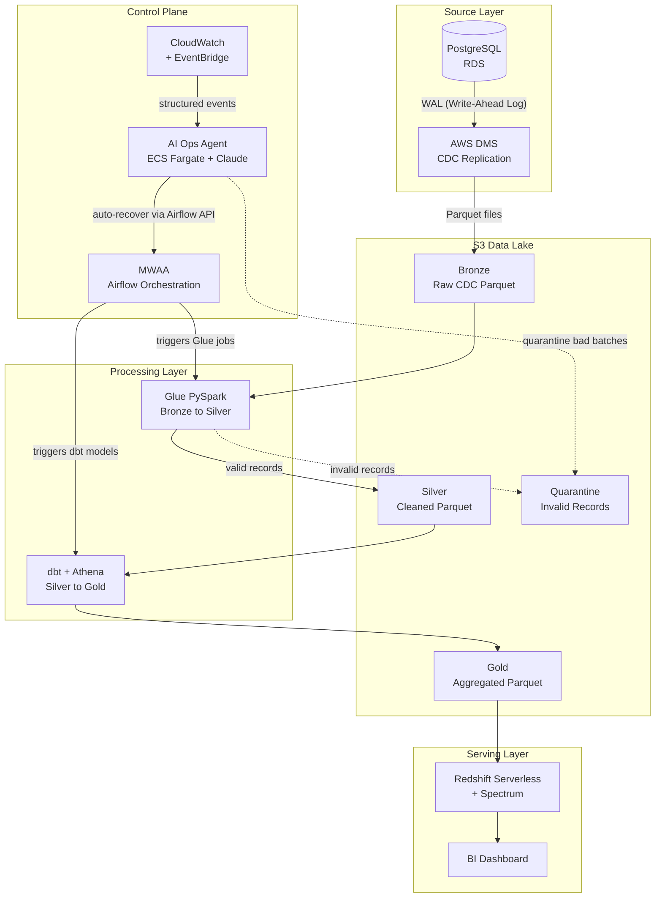
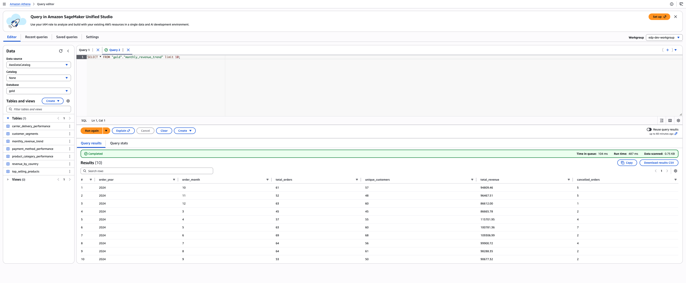

# Enterprise Data Platform (EDP)

I built this platform as a full production-grade data engineering implementation on AWS (Amazon Web Services). It takes raw data from a database, moves it through a series of cleaning and transformation steps, and makes it available to business analysts through a dashboard, the same way it works inside real companies.

This is not a simplified demo. It covers the actual stack that data engineers use at work: Terraform (an infrastructure-as-code tool) for infrastructure, multiple AWS services, distributed data processing with Spark, SQL transformations with dbt (data build tool), orchestration with Airflow, and an AI agent to monitor and recover the pipeline when things go wrong.

This README covers everything: what the platform does, how each piece works, and the exact commands to deploy and run it in sequence from scratch.

---

## Contents

1. [What this platform does](#what-this-platform-does)
2. [Architecture diagram](#architecture-diagram)
3. [How data moves through the system](#how-data-moves-through-the-system)
4. [The source data model](#the-source-data-model)
5. [How data is stored in S3](#how-data-is-stored-in-s3)
6. [The data lake layers](#the-data-lake-layers-medallion-architecture)
7. [Business questions this platform answers](#business-questions-this-platform-answers)
8. [The AI Operations Agent](#the-ai-operations-agent)
9. [Tools and technologies](#tools-and-technologies)
10. [Repository layout](#repository-layout)
11. [AWS accounts](#aws-accounts)
12. [Network layout](#network-layout)
13. [Terraform module map](#terraform-module-map)
14. [Prerequisites](#prerequisites)
15. [Build phases overview](#build-phases-overview)
16. [Deploying and running the platform](#deploying-and-running-the-platform)
17. [Running the simulator locally vs in AWS](#running-the-simulator-locally-vs-in-aws)
18. [The Glue PySpark jobs](#the-glue-pyspark-jobs)
19. [The dbt analytics layer](#the-dbt-analytics-layer)
20. [Concepts explained simply](#concepts-explained-simply)
21. [Security](#security)
22. [Costs](#costs)
23. [Naming convention](#naming-convention)
24. [Troubleshooting reference](#troubleshooting-reference)
25. [CI/CD pipelines](#cicd-pipelines)
26. [Build status](#build-status)
27. [Claude Code authentication reference](#claude-code-authentication-reference)

---

## What this platform does

My data source is a PostgreSQL database. Think of it like a live application database where records are being inserted, updated, and deleted constantly throughout the day.

The problem with using that database directly for analytics is that it was not designed for it. Running heavy queries against a production database slows the application down, and the raw data is messy and hard to work with.

This platform fixes that by doing the following:

1. **Capturing every database change** in real time using a technique called CDC (Change Data Capture), so inserts, updates, and deletes are all tracked
2. **Storing the raw captured data** into an immutable Bronze layer in S3 (Simple Storage Service, Amazon's cloud file storage), so the original data is never modified or lost
3. **Cleaning, validating, and modelling** the raw data with Apache Spark (PySpark), applying CDC operations correctly, and producing a star schema of fact and dimension tables in a Silver layer
4. **Writing any records that fail validation** to a Quarantine area inside Silver instead of silently dropping them, so data quality problems are visible and fixable
5. **Answering specific business questions** in a Gold layer by running SQL aggregation models written in dbt (data build tool), using Athena as the query engine against the Silver facts and dimensions
6. **Making the Gold data available** through Redshift Serverless so BI (Business Intelligence) tools like Tableau, Power BI, or QuickSight can connect and build dashboards
7. **Running the whole pipeline automatically** on a schedule using Apache Airflow
8. **Logging everything** to CloudWatch so I can see what is happening at any point
9. **Monitoring the pipeline with an AI agent** that watches every layer at once, figures out the real cause of failures, and automatically recovers the pipeline when common problems occur

---

## Architecture diagram



---

## How data moves through the system

```
Step 1:  A change happens in the PostgreSQL database (insert, update, or delete)

Step 2:  AWS DMS reads that change from PostgreSQL's internal WAL (Write-Ahead Log)
         and writes it as a Parquet file to the Bronze S3 bucket.
         Each file contains the row data, the operation type (I/U/D), and a timestamp.

Step 3:  Airflow detects it is time to run the pipeline and triggers the Glue job.

Step 4:  The Glue PySpark job reads Bronze.
         It reconciles all CDC operations into current state (so an order
         that went through five status updates appears exactly once with
         its latest status), validates each record, and models the data
         into a star schema:
           - Valid records are written to Silver as dim_customer,
             dim_product, fact_orders, and fact_order_items.
           - Records that fail validation are written to a Quarantine
             area inside Silver so nothing is silently lost.

Step 5:  Airflow detects the Glue job finished and triggers dbt.

Step 6:  dbt runs SQL aggregation models using Athena as the query engine.
         It reads the Silver fact and dimension tables and produces four
         Gold tables, each answering a specific business question:
         daily revenue, product performance, customer behaviour, and
         order fulfilment health.

Step 7:  Redshift Serverless uses Spectrum to read Gold directly from S3.
         No data loading required — Spectrum queries S3 as if it were a Redshift table.

Step 8:  BI tools connect to Redshift and analysts build dashboards.

Step 9:  Every step above writes logs to CloudWatch.
         EventBridge converts log patterns into structured events.

Step 10: The AI Operations Agent receives all EventBridge events in real time.
         For any failure it diagnoses the root cause, takes the right action,
         and sends a plain-English incident report via SNS (Simple Notification Service).
         This runs continuously alongside all other steps.
```

---

## The source data model

This is an important distinction that is easy to get wrong.

The star schema (with a central fact table surrounded by dimension tables) is the **output** of the platform. It is what the Gold layer looks like after all the transformations are done. It is not what the source database looks like.

The source system is an OLTP (Online Transaction Processing) database. OLTP databases are designed for fast writes from a live application. They are normalized, which means data is split into small, focused tables to avoid duplication and make writes fast.

The job of this platform is to read that normalized OLTP data, clean it up, and reshape it into the star schema format that analysts and dashboards need.

### The OLTP source tables (what PostgreSQL contains)

```
customers
  customer_id    VARCHAR  PRIMARY KEY
  first_name     VARCHAR
  last_name      VARCHAR
  email          VARCHAR  UNIQUE
  country        VARCHAR
  phone          VARCHAR
  signup_date    DATE
  updated_at     TIMESTAMP

products
  product_id     VARCHAR  PRIMARY KEY
  name           VARCHAR
  category       VARCHAR
  brand          VARCHAR
  unit_price     DECIMAL(10,2)
  stock_qty      INTEGER
  updated_at     TIMESTAMP

orders
  order_id       VARCHAR  PRIMARY KEY
  customer_id    VARCHAR  REFERENCES customers
  order_date     DATE
  order_status   VARCHAR  -- pending, confirmed, shipped, delivered, cancelled
  updated_at     TIMESTAMP

order_items
  order_item_id  VARCHAR  PRIMARY KEY
  order_id       VARCHAR  REFERENCES orders
  product_id     VARCHAR  REFERENCES products
  quantity       INTEGER
  unit_price     DECIMAL(10,2)
  line_total     DECIMAL(10,2)
  updated_at     TIMESTAMP

payments
  payment_id     VARCHAR  PRIMARY KEY
  order_id       VARCHAR  REFERENCES orders
  method         VARCHAR  -- card, paypal, bank_transfer
  amount         DECIMAL(10,2)
  status         VARCHAR  -- pending, completed, failed, refunded
  payment_date   TIMESTAMP
  updated_at     TIMESTAMP

shipments
  shipment_id      VARCHAR  PRIMARY KEY
  order_id         VARCHAR  REFERENCES orders
  carrier          VARCHAR  -- DHL, FedEx, UPS
  delivery_status  VARCHAR  -- processing, shipped, in_transit, delivered
  shipped_date     TIMESTAMP
  delivered_date   TIMESTAMP
  updated_at       TIMESTAMP
```

Every table has an `updated_at` column. This is standard practice in production systems and makes CDC more reliable because DMS can always see exactly when each row last changed.

### What DMS captures from these tables

DMS reads every INSERT, UPDATE, and DELETE from PostgreSQL's WAL and writes one Bronze file per batch of operations. A single order going from `pending` to `confirmed` to `shipped` produces three separate Bronze records for that row.

### How Glue builds the star schema in Silver

The six normalized OLTP tables from PostgreSQL get modelled into four Silver tables. Glue reconciles all CDC operations first (so each entity appears exactly once with its latest state), then reshapes the data.

**Dimension tables** (one row per entity, current state):

```
dim_customer
  customer_id, first_name, last_name, email, country, phone,
  signup_date, updated_at

dim_product
  product_id, name, category, brand, unit_price, stock_qty,
  updated_at
```

**Fact tables** (one row per event):

```
fact_orders
  order_id, customer_id, order_date, order_status,
  payment_method, payment_status, payment_amount,
  carrier, delivery_status, shipped_date, delivered_date,
  updated_at

fact_order_items
  order_item_id, order_id, customer_id, product_id,
  quantity, unit_price, line_total,
  order_date, order_status,
  updated_at
```

`fact_orders` denormalizes the orders, payments, and shipments tables into a single row per order. `fact_order_items` is the grain-level fact, one row per line item, with the order context included so analysts don't need to JOIN back to `fact_orders` for common queries.

### How dbt builds Gold from Silver

dbt reads the Silver fact and dimension tables through Athena and runs pure aggregation SQL. No JOINs are needed at the Gold layer because Silver already did the modelling. For example:

```sql
-- Gold: agg_daily_revenue
SELECT
    order_date,
    COUNT(DISTINCT order_id)   AS order_count,
    COUNT(DISTINCT customer_id) AS unique_customers,
    SUM(payment_amount)         AS total_revenue,
    AVG(payment_amount)         AS avg_order_value
FROM silver.fact_orders
WHERE payment_status = 'completed'
GROUP BY order_date
ORDER BY order_date
```

---

## How data is stored in S3


### File format: Parquet everywhere

All data in this platform is stored as Parquet files. Parquet is a columnar file format, meaning data is organized by column rather than by row.

This matters because analytics queries typically read only a few columns from large tables. A query asking for `order_total` and `order_date` only needs those two columns. Parquet reads just those columns from disk and skips everything else. A CSV (Comma-Separated Values) file forces the query engine to read every column even if only two are needed.

Parquet also stores min and max statistics for each block of rows. Query engines use these to skip entire blocks that cannot possibly match the query's filters. This is called predicate pushdown.

**Compression by layer:**

- **Bronze:** Parquet with GZIP compression. Bronze is written once and rarely read directly. GZIP produces the smallest files, which minimizes S3 storage costs.
- **Silver and Gold:** Parquet with Snappy compression. Snappy is faster to decompress than GZIP, which matters here because Glue and Athena read these files frequently.

### Partitioning strategy

Partitioning means organizing files into subfolders so query engines can skip entire folders when they are not needed.

**Fact tables are partitioned by year and month:**

```
silver/
  order_items/
    year=2024/month=01/part-00000.parquet
    year=2024/month=02/part-00000.parquet
  payments/
    year=2024/month=01/part-00000.parquet
  shipments/
    year=2024/month=01/part-00000.parquet
```

**Dimension tables are not partitioned:**

Customers, products, and orders are reference data. Partitioning them by date would create hundreds of tiny files, which makes queries slower. The Glue job writes these as a single file per table representing the full current state.

```
silver/
  customers/part-00000.parquet
  products/part-00000.parquet
  orders/part-00000.parquet
```

In dev, I partition by `year/month` only. In prod with high data volumes, I partition by `year/month/day`.

---

## The data lake layers (Medallion Architecture)

### Bronze: raw and immutable

Everything that comes out of DMS lands here exactly as it arrived. I never modify Bronze data. If I find a bug in my Glue transformation code six months from now, I can re-process everything from Bronze without losing any original data. Bronze is the source of truth for the whole platform.

DMS writes two types of files to Bronze:
- `LOAD00000001.parquet` — the full snapshot of all existing rows at task start
- `YYYY/MM/DD/YYYYMMDD-*.parquet` — ongoing CDC change files, one batch per minute

### Silver: star schema

This is the output of the Glue PySpark jobs. Glue reads Bronze, reconciles all CDC operations into current state (resolving every insert, update, and delete into a single accurate row per entity), validates each record, and models the data into a star schema of four tables: `dim_customer`, `dim_product`, `fact_orders`, and `fact_order_items`.

Silver is the layer dbt reads from. It contains no raw CDC rows, no intermediate states, and no duplicates. It's the clean, modelled, business-ready version of the source data.

Records that fail validation during Silver processing are written to a Quarantine area (described below) instead of being silently dropped.

### Gold: business answers

This is what analysts actually query. dbt reads the Silver fact and dimension tables through Athena and runs four pure aggregation models, each producing a pre-computed answer to a specific business question. Gold tables are compact and fast — dashboards query them without scanning large fact tables.

The four Gold tables and what they answer are described in the next section.

### Quarantine: Silver validation failures

Any record that fails validation during Silver processing ends up here instead of being silently dropped. Silent data loss is much worse than a visible quality problem. With Quarantine I can see exactly which records failed, why they failed, and fix the problem at the source. The Quarantine area lives alongside the Silver tables so it's clear these are Silver's rejected outputs, not something separate.

### Athena results

Athena writes query result files here whenever it runs a SQL query. This is the designated output location for the Athena workgroup.

---

## Business questions this platform answers

The Gold layer exists to answer four specific business questions. These are the questions I designed the pipeline to support, and everything in Silver is modelled to make them fast and straightforward to compute.

---

### Question 1: How is revenue performing day by day?

**Gold table:** `agg_daily_revenue`

E-commerce businesses live and die by daily revenue trends. This table gives a complete picture of each day's performance — total revenue, number of orders, number of unique customers who ordered, and average order value. Comparing today to yesterday or last week is a single filter on this table.

```sql
-- dbt model: agg_daily_revenue
SELECT
    order_date,
    COUNT(DISTINCT order_id)    AS order_count,
    COUNT(DISTINCT customer_id) AS unique_customers,
    SUM(payment_amount)         AS total_revenue,
    AVG(payment_amount)         AS avg_order_value
FROM silver.fact_orders
WHERE payment_status = 'completed'
GROUP BY order_date
ORDER BY order_date
```

---

### Question 2: Which products and categories drive the most revenue?

**Gold table:** `agg_product_performance`

Not all products are equal. This table ranks products and categories by revenue, units sold, and number of orders. It makes it easy to see which products are worth promoting, which categories are growing, and which slow movers might need attention.

```sql
-- dbt model: agg_product_performance
SELECT
    p.product_id,
    p.name           AS product_name,
    p.category,
    p.brand,
    SUM(fi.quantity)    AS units_sold,
    SUM(fi.line_total)  AS total_revenue,
    COUNT(DISTINCT fi.order_id) AS order_count,
    AVG(fi.unit_price)  AS avg_selling_price
FROM silver.fact_order_items fi
JOIN silver.dim_product p ON fi.product_id = p.product_id
GROUP BY p.product_id, p.name, p.category, p.brand
ORDER BY total_revenue DESC
```

---

### Question 3: How are customers behaving — are they coming back?

**Gold table:** `agg_customer_behaviour`

Acquiring a new customer costs more than retaining an existing one. This table shows each customer's total spend, number of orders, average order value, and how recently they ordered. It identifies high-value customers, first-time buyers, and customers who haven't ordered in a while.

```sql
-- dbt model: agg_customer_behaviour
SELECT
    c.customer_id,
    c.first_name,
    c.last_name,
    c.country,
    COUNT(DISTINCT o.order_id)  AS total_orders,
    SUM(o.payment_amount)       AS lifetime_revenue,
    AVG(o.payment_amount)       AS avg_order_value,
    MIN(o.order_date)           AS first_order_date,
    MAX(o.order_date)           AS last_order_date
FROM silver.fact_orders o
JOIN silver.dim_customer c ON o.customer_id = c.customer_id
WHERE o.payment_status = 'completed'
GROUP BY c.customer_id, c.first_name, c.last_name, c.country
ORDER BY lifetime_revenue DESC
```

---

### Question 4: How healthy is order fulfilment?

**Gold table:** `agg_fulfilment_health`

Customers expect fast, reliable delivery. This table tracks fulfilment performance by carrier: how many orders each carrier handled, what percentage were delivered, and the average number of days between shipping and delivery. It highlights which carriers are reliable and where delays are happening.

```sql
-- dbt model: agg_fulfilment_health
SELECT
    carrier,
    COUNT(DISTINCT order_id)                                AS total_orders,
    SUM(CASE WHEN delivery_status = 'delivered' THEN 1 ELSE 0 END) AS delivered_orders,
    ROUND(
        100.0 * SUM(CASE WHEN delivery_status = 'delivered' THEN 1 ELSE 0 END)
        / COUNT(DISTINCT order_id), 1
    )                                                       AS delivery_rate_pct,
    AVG(
        DATEDIFF('day', CAST(shipped_date AS DATE), CAST(delivered_date AS DATE))
    )                                                       AS avg_delivery_days
FROM silver.fact_orders
WHERE shipped_date IS NOT NULL
GROUP BY carrier
ORDER BY total_orders DESC
```

---

## The AI Operations Agent

When data moves through five separate services and something goes wrong, the failure often shows up in a different place than where it started. Here is a real example:

```
DMS replication lag spikes
  and Glue reads empty Bronze files
    and Silver never gets updated
      and dbt runs on stale Silver data
        and Gold aggregations are wrong
          and the dashboard shows incorrect numbers
```

CloudWatch fires an alarm in DMS. Airflow retries the Glue task. But neither of them knows the Glue failure and the DMS alarm are related. An engineer looking at these alerts in isolation would probably start debugging Glue first, which is the wrong place.

The AI Operations Agent solves this. It watches every layer at once and reasons across all of them before deciding what to do.

### How it works

The agent is a Python application running as an ECS (Elastic Container Service) Fargate container. It subscribes to EventBridge rules that fire whenever something notable happens in DMS, Glue, Athena, Airflow, or Redshift.

When an event fires, the agent calls the AWS SDK (Software Development Kit) across multiple services simultaneously to get the full picture before taking any action:

```
Event received: Glue job failed

Agent checks simultaneously:
  - DMS: what is the current replication lag?
  - S3: how many files actually landed in Bronze for this time window?
  - CloudWatch: has this happened before in the last 24 hours?
  - Glue: what did the last 5 job runs look like?

Conclusion: Bronze had zero files because DMS paused 47 minutes ago.
            The Glue job did not fail because of a code bug.
            Root cause is a DMS health issue.

Action: Pause downstream Glue jobs to stop them running pointlessly.
        Alert specifically on DMS, not Glue.
        Schedule a Glue retry for when DMS recovers.
```

### What the agent does in each scenario

| Situation | What the agent does |
|---|---|
| DMS lag is the root cause | Pauses downstream Glue jobs to prevent empty runs |
| A bad Bronze file caused Glue to fail | Moves the bad file to Quarantine, re-triggers Glue on the rest |
| dbt ran on incomplete Silver data | Delays dbt, schedules a backfill once Silver catches up |
| Transient network error in Glue | Triggers a single retry through the Airflow REST API |
| Unknown failure pattern | Escalates with full context, does not attempt auto-recovery |

Every incident produces a plain-English report sent via SNS:

```
INCIDENT REPORT - 2024-03-15 02:17 UTC
Root cause: DMS task edp-dev-replication paused (lag: 47 min)
Impact: Bronze partition 2024-03-15/orders has 0 files
Action taken: Glue job paused until DMS recovers
Action taken: Glue retry scheduled for 03:00 UTC
Manual action needed: Check DMS task — may need RDS WAL retention increase
Confidence: HIGH
```

### What the agent does not do

The agent is deliberately limited to operations and recovery. It does not modify Terraform infrastructure, change Glue code or dbt models, or attempt auto-recovery on anything it cannot explain with high confidence.

---

## Tools and technologies

| Tool | What it is | How I use it |
|---|---|---|
| Terraform | Infrastructure-as-Code tool | Creates all AWS resources from code |
| AWS S3 | Cloud file storage | Holds all data lake layers |
| PostgreSQL on RDS | Managed relational database | The data source |
| AWS DMS | Managed database migration service | Captures CDC events and writes to Bronze |
| AWS Glue | Managed Spark service | Runs PySpark jobs for Bronze to Silver |
| Apache Spark (PySpark) | Distributed data processing engine | The runtime inside Glue jobs |
| dbt | SQL transformation framework | Runs SQL models for Silver to Gold |
| Amazon Athena | Serverless SQL query engine | Executes dbt SQL against S3 data |
| Redshift Serverless | Serverless data warehouse | Serves analyst queries |
| Redshift Spectrum | Redshift feature | Queries Gold S3 data as external tables |
| Amazon MWAA | Managed Airflow service | Orchestrates and schedules the pipeline |
| Apache Airflow | Workflow orchestration engine | DAGs define task order |
| AWS KMS | Encryption key management | Encrypts all data at rest |
| AWS IAM | Permission control | Controls what each service is allowed to do |
| AWS Glue Catalog | Metadata catalog | Stores table schemas for Bronze, Silver, Gold |
| CloudWatch and EventBridge | Monitoring and event routing | Logs and structured events from every layer |
| ECS Fargate | Serverless container runtime | Runs the AI Operations Agent |
| Claude (Anthropic) | Large language model | Powers the agent's cross-service reasoning |
| VPC | Private AWS network | Isolates all compute from the public internet |
| AWS SSM Session Manager | Secure remote access | Port-forwarding tunnel to private RDS, no SSH keys |

---

## Repository layout

```
enterprise-data-platform/
│
├── README.md                              (this file)
│
├── terraform-bootstrap/                   BUILD STEP 1
│   Creates S3 buckets and DynamoDB tables for Terraform remote state.
│   Run this once per AWS account before anything else.
│
├── terraform-platform-infra-live/         BUILD STEPS 2 to 8
│   All AWS infrastructure, organized as Terraform modules.
│   VPC, S3 buckets, RDS, DMS, Glue, Redshift, MWAA, and ECS all live here.
│
├── platform-glue-jobs/                    BUILD STEP 9
│   PySpark code that runs inside AWS Glue.
│   Handles Bronze to Silver transformation and quarantine routing.
│
├── platform-dbt-analytics/                BUILD STEP 10
│   dbt SQL models that transform Silver to Gold.
│   Uses Athena as the query engine.
│
├── platform-orchestration-mwaa-airflow/   BUILD STEP 11
│   Airflow DAGs that orchestrate the full pipeline.
│   Controls when Glue runs, when dbt runs, and what happens on failure.
│
├── platform-cdc-simulator/                BUILD STEP 12
│   Python script that generates synthetic PostgreSQL changes for testing.
│   Connects to RDS via an SSM tunnel from your local machine.
│
├── platform-ops-agent/                    BUILD STEP 13
│   The AI Operations Agent.
│   Python app that monitors the pipeline and recovers from failures.
│
└── platform-docs/
    Additional diagrams and architecture notes.
```

---

## AWS accounts

I run this across three separate AWS accounts:

| Account | Purpose | CLI profile |
|---|---|---|
| dev | Where I build and test. Safe to break. | dev-admin |
| staging | Used only to confirm staging deploys correctly, then destroyed | staging-admin |
| prod | Used only to confirm prod deploys correctly, then destroyed | prod-admin |

Separate accounts are the strongest isolation AWS offers. A mistake in dev cannot touch prod.

My active development only happens in dev. I spin up staging and prod occasionally to confirm the Terraform modules deploy cleanly, then destroy them to keep costs near zero.

---

## Network layout

Each environment gets its own IP address range so they never overlap. CIDR (Classless Inter-Domain Routing) is the notation used to describe these ranges:

| Environment | VPC CIDR | Private Subnet A | Private Subnet B |
|---|---|---|---|
| dev | 10.10.0.0/16 | 10.10.16.0/20 | 10.10.32.0/20 |
| staging | 10.20.0.0/16 | 10.20.16.0/20 | 10.20.32.0/20 |
| prod | 10.30.0.0/16 | 10.30.16.0/20 | 10.30.32.0/20 |

All compute (RDS, DMS, Glue, Redshift, MWAA) runs in private subnets with no direct internet access. The only public-subnet resource is the bastion EC2 instance used as an SSM tunnel relay, and it has no open inbound ports.


---

## Terraform module map

Inside `terraform-platform-infra-live`, the infrastructure is split into modules. Each module has one responsibility.

```
modules/
├── networking/     VPC, subnets, route tables, S3 VPC endpoint, SSM VPC endpoints
├── data-lake/      All 5 S3 data lake buckets (bronze, silver, gold, quarantine, athena-results)
├── iam-metadata/   KMS key, IAM roles, Glue Catalog databases, DMS service roles
├── ingestion/      RDS PostgreSQL, DMS replication instance, endpoints, and task
├── processing/     Glue security config, Glue VPC connection, Athena workgroup
├── serving/        Redshift Serverless namespace and workgroup
└── orchestration/  MWAA environment, DAGs S3 bucket, CloudWatch log groups
```

The modules depend on each other in this order:

```
networking
  └── data-lake
        └── iam-metadata
              ├── ingestion
              ├── processing
              ├── serving
              └── orchestration
```


---

## Prerequisites

Install these tools before running anything:

```bash
# Terraform
brew install terraform

# AWS CLI (Command Line Interface)
brew install awscli

# AWS Session Manager plugin (required for SSM port-forwarding tunnels)
brew install --cask session-manager-plugin

# PostgreSQL client (for connecting to RDS via the SSM tunnel)
brew install libpq
echo 'export PATH="/opt/homebrew/opt/libpq/bin:$PATH"' >> ~/.zshrc
source ~/.zshrc

# Python 3.11 via pyenv (for the CDC simulator)
brew install pyenv
pyenv install 3.11.8
```

**AWS SSO (Single Sign-On) profile setup** in `~/.aws/config`:

```ini
[profile dev-admin]
sso_start_url  = https://your-org.awsapps.com/start
sso_region     = eu-central-1
sso_account_id = 158311564771
sso_role_name  = AdministratorAccess
region         = eu-central-1
```

Log in before running any AWS or Terraform commands:

```bash
aws sso login --profile dev-admin
```

---

## Build phases overview

When I first looked at everything this platform needs, it felt like too much to take on at once. The thing that made it manageable was realizing there is a strict logical order. You cannot fill a bucket that does not exist yet. You cannot run a Spark job against a database that has not been created. Every piece has a prerequisite.

### Phase 1: Infrastructure with Terraform (Steps 1 to 8)

**Step 1 — Remote state storage:** Before Terraform can work reliably, it needs a place to store `terraform.tfstate`. I store this in an S3 bucket with a DynamoDB (Amazon's NoSQL key-value database) table handling the locking. This runs once per AWS account before anything else, from `terraform-bootstrap`.

**Step 2 — Networking:** Creates the VPC (Virtual Private Cloud), subnets, route tables, and an S3 Gateway Endpoint so services inside the VPC talk to S3 without touching the public internet. The SSM (Systems Manager) Interface Endpoints that allow the bastion EC2 to register without internet access are defined in the networking module but kept commented out — they only need to be active when the bastion is running, because Interface Endpoints charge per AZ per hour even when nothing is using them. Nothing else can exist without a network.

**Step 3 — Data lake storage:** Creates five S3 buckets: Bronze, Silver, Gold, Quarantine, and Athena results. Empty at this point, but they must exist before any service that writes to them can be configured.

**Step 4 — Permissions and metadata:** Creates the KMS (Key Management Service) encryption key that encrypts all data at rest across the platform. Creates IAM (Identity and Access Management) roles for every service: Glue, Airflow, Redshift, DMS, and ECS. Also creates three Glue Data Catalog databases (Bronze, Silver, Gold) as schema registries that Glue and Athena both use.

**Step 5 — Data source and CDC:** Creates the RDS (Relational Database Service) PostgreSQL database and the DMS replication instance and task. DMS connects to PostgreSQL, reads its WAL, and converts changes into Parquet files in the Bronze S3 bucket. Requires a manual RDS reboot after first apply to activate logical replication.

**Step 6 — Processing configuration:** Creates the Glue security configuration and the Athena workgroup. These are settings containers. The actual PySpark code and dbt SQL models come in Phase 2.

**Step 7 — Serving layer:** Creates the Redshift Serverless namespace and workgroup. Empty at this point but ready to query Gold S3 data via Spectrum once data flows.

**Step 8 — Orchestration:** Creates the MWAA environment and ECS cluster for the AI Operations Agent.

### Phase 2: Application code (Steps 9 to 13)

**Step 9 — PySpark transformation jobs** (`platform-glue-jobs`): Reads Bronze, reconciles CDC operations into current state, validates records, and models the data into a Silver star schema: `dim_customer`, `dim_product`, `fact_orders`, `fact_order_items`. Validation failures go to Quarantine inside Silver.

**Step 10 — SQL aggregation models** (`platform-dbt-analytics`): dbt reads the Silver fact and dimension tables through Athena and produces four Gold aggregation tables answering the four business questions: daily revenue, product performance, customer behaviour, and fulfilment health.

**Step 11 — Airflow DAGs** (`platform-orchestration-mwaa-airflow`): DAGs (Directed Acyclic Graphs) that orchestrate the full sequence: ingest check, Glue, dbt, Redshift load.

**Step 12 — CDC simulator** (`platform-cdc-simulator`): Python script that generates realistic PostgreSQL activity for testing the pipeline. Not a production component — a real application replaces it in production.

**Step 13 — AI Operations Agent** (`platform-ops-agent`): Python ECS application that monitors all pipeline services and handles cross-service incident recovery.

### Phase 3: End-to-end validation (Steps 14 to 15)

**Step 14:** Run the CDC simulator to generate data, trigger the Airflow DAG, and watch data move from PostgreSQL all the way to a queryable result in Redshift.

**Step 15:** Deploy to staging and prod to confirm the Terraform modules work correctly in those environments, then destroy both.

---

## Deploying and running the platform

This section explains every step in the order you run them, including what each step does and why it's needed. It covers a fresh deploy, loading data into the Bronze S3 (Simple Storage Service) bucket, and the safe teardown at the end.

You need four terminals. Open them before starting.

- **Terminal 1** — all setup commands and AWS CLI commands
- **Terminal 2** — SSM (Systems Manager) tunnel (must stay open the whole session)
- **Terminal 3** — CDC (Change Data Capture) simulator (runs continuously)
- **Terminal 4** — optional psql session for checking RDS data directly

If this is a re-run after a previous teardown, the ingestion module and bastion EC2 are commented out in the Terraform config. Jump to [Re-enabling ingestion after a teardown](#re-enabling-ingestion-after-a-teardown) at the bottom of this section first, then come back to Step 1.

---

### Step 1: Log in to AWS SSO

AWS SSO (Single Sign-On) is how I authenticate with AWS. Instead of a permanent access key (which is a security risk if leaked), SSO issues short-lived temporary credentials that expire automatically. The `dev-admin` profile is configured in `~/.aws/config` and points to the dev AWS account.

In Terminal 1:

```bash
aws sso login --profile dev-admin
```

If the session is already active this returns immediately. If it opens a browser, approve the login. Every AWS CLI command in this guide needs `--profile dev-admin` appended so it uses these credentials.


---

### Step 2: Set passwords

The platform needs two passwords: one for the RDS PostgreSQL database and one for Redshift Serverless. Hardcoding passwords in Terraform files is a security risk — if the file is committed to Git, the password is exposed. Instead, Terraform reads them from environment variables at runtime.

The `TF_VAR_` prefix is Terraform's convention for environment variable injection. `TF_VAR_db_password` maps to `var.db_password` in Terraform automatically.

In Terminal 1:

```bash
export TF_VAR_db_password="YourSecurePassword123!"
export TF_VAR_redshift_admin_password="AnotherSecurePassword456!"
```

Use the same values each time. After `make apply`, Terraform stores both passwords in SSM Parameter Store as encrypted secrets. The CDC simulator and future pipeline tools fetch them from SSM at runtime — they never touch these files.

---

### Step 3: Set up remote state (run once per AWS account, ever)

Terraform needs to track what it has created in AWS. It does this in a file called `terraform.tfstate`. By default that file lives on your laptop, which means if you switch machines or two people work on the same project, they have conflicting state.

Remote state solves this by storing `terraform.tfstate` in an S3 bucket instead of locally. A DynamoDB (Amazon's NoSQL database) table handles locking — if two Terraform runs start at the same time, one of them waits rather than both writing conflicting state.

This step creates that S3 bucket and DynamoDB table. It only needs to run once, ever, per AWS account. If the bucket already exists, skip this step.

```bash
cd terraform-bootstrap/environments/dev
terraform init
terraform apply
```


---

### Step 4: Init the main infrastructure

`terraform init` does two things: it downloads the provider plugins Terraform needs (in this case the AWS provider), and it connects to the remote state backend (the S3 bucket from Step 3) so subsequent commands read and write state from there.

In Terminal 1:

```bash
cd terraform-platform-infra-live
make init dev
```

You should see "Terraform has been successfully initialized" at the end.

---

### Step 5: Plan

Before Terraform creates anything, `terraform plan` shows you exactly what it intends to do. It compares what's in the Terraform code with what already exists in AWS (using the remote state), then outputs a list of resources it will create, modify, or destroy. Nothing is touched during a plan — it's read-only.

```bash
make plan dev
```

You should see roughly 83 resources to add and 0 to destroy. Read through it to confirm nothing looks unexpected before continuing.

---

### Step 6: Apply

`terraform apply` creates everything defined in the Terraform modules. Here's what gets built and why each piece exists:

- **VPC (Virtual Private Cloud)** — an isolated private network inside AWS. Nothing outside can reach resources in this VPC unless I explicitly allow it.
- **Subnets** — segments of the VPC. RDS and DMS live in private subnets (no internet access). The bastion EC2 lives in a public subnet so SSM can reach it.
- **S3 buckets** — five buckets for Bronze, Silver, Gold, Quarantine, and Athena results. All encrypted, all versioned.
- **KMS (Key Management Service) key** — one encryption key used across all services. If the key is deleted or access is revoked, the data becomes unreadable.
- **IAM (Identity and Access Management) roles** — each service gets its own role with only the permissions it needs. Glue can read S3 but not touch RDS. DMS can write to S3 but not query Redshift. This is least-privilege access.
- **RDS PostgreSQL** — the source database that simulates a live application database. DMS reads from this.
- **DMS replication instance and task** — the engine that watches RDS for changes and copies them to S3 Bronze as Parquet files.
- **Bastion EC2** — a small virtual machine in the public subnet used purely as a relay. Your Mac connects to it via SSM, and it forwards the connection to RDS.
- **Glue config and Athena workgroup** — configuration containers for Phase 2. No jobs run yet, but the settings (encryption, VPC connection) are ready.
- **Redshift Serverless** — the analytical query engine for Phase 3. Empty for now but ready.

```bash
make apply dev
```

Takes 10 to 15 minutes. The DMS replication instance alone takes 5 to 7 minutes to provision. When it finishes, check the outputs:

```bash
cd environments/dev
terraform output
```

Note the `bastion_instance_id`, `rds_endpoint`, and `ssm_tunnel_command` values. You need them in the steps below.

---

### Step 7: Reboot RDS to activate logical replication

This step is specific to how PostgreSQL CDC works. DMS reads database changes from PostgreSQL's WAL (Write-Ahead Log) — an internal journal that records every insert, update, and delete. To use the WAL for CDC, PostgreSQL needs `logical_replication` enabled.

The Terraform code sets this in the RDS parameter group with `apply_method = pending-reboot`. That means the setting is queued but won't take effect until the database restarts. Without the reboot, DMS can connect to RDS but won't capture any changes.

In Terminal 1:

```bash
aws rds reboot-db-instance \
  --db-instance-identifier edp-dev-source-db \
  --profile dev-admin --region eu-central-1

# This command waits silently until RDS is accepting connections again (~2 minutes)
aws rds wait db-instance-available \
  --db-instance-identifier edp-dev-source-db \
  --profile dev-admin --region eu-central-1

echo "RDS is ready"
```

---

### Step 8: Open the SSM tunnel (Terminal 2 — keep open)

RDS is in a private subnet with no internet access. There's no public IP, no open port 5432, no way to connect to it directly from your Mac. This is intentional — a database exposed to the internet is a security risk.

The SSM tunnel is the secure solution. Here's exactly what it does:

1. Your Mac connects to the bastion EC2 over HTTPS using the AWS SSM service (no SSH keys needed, no firewall ports to open)
2. You tell it to forward `localhost:5433` on your Mac to `<rds-endpoint>:5432` via the bastion
3. From that point on, any connection to `localhost:5433` on your Mac silently travels: `Mac → HTTPS → SSM → bastion → RDS`

The bastion never stores data. It's just a relay inside the VPC that can reach RDS because they're in the same network.

Copy the `ssm_tunnel_command` from the Terraform output and run it in Terminal 2:

```bash
aws ssm start-session \
  --target <bastion_instance_id> \
  --document-name AWS-StartPortForwardingSessionToRemoteHost \
  --parameters 'host=<rds_endpoint>,portNumber=5432,localPortNumber=5433' \
  --profile dev-admin --region eu-central-1
```

Wait for `Port 5433 forwarded` to appear. **Do not close Terminal 2** — the tunnel is a live process and closing it immediately drops the connection to RDS.

If you see `TargetNotConnected`, the SSM agent on the bastion is still starting up. Wait 2 to 3 minutes and retry. You can check whether it has registered with AWS:

```bash
aws ssm describe-instance-information \
  --query 'InstanceInformationList[*].{ID:InstanceId,Status:PingStatus}' \
  --output table --profile dev-admin --region eu-central-1
```

The instance must show `Online` before the tunnel will open.

---

### Step 9: Set up the CDC simulator

The CDC simulator is the Python application in `platform-cdc-simulator`. It pretends to be a real e-commerce application by writing customers, products, orders, payments, and shipments to the RDS database. This gives DMS something realistic to capture.

`make setup` creates an isolated Python virtual environment and installs the dependencies listed in `requirements.txt`. This only needs to run once per machine.

In Terminal 1:

```bash
cd platform-cdc-simulator
make setup
```

---

### Step 10: Create the schema

The RDS database was created empty by Terraform. Before any data can be inserted, the tables need to exist. `make schema` runs the DDL (Data Definition Language) SQL that creates the six tables: customers, products, orders, order_items, payments, and shipments.

It also sets `REPLICA IDENTITY FULL` on each table, which tells PostgreSQL to include the full row (not just the primary key) in the WAL log for updates and deletes. DMS needs this to correctly capture what changed.

```bash
make schema ENV=dev
```

The `ENV=dev` flag tells the Makefile to fetch the RDS password from SSM Parameter Store instead of a local `.env` file. No `.env` editing needed for AWS mode.

---

### Step 11: Seed historical data

`make seed` populates the tables with realistic starting data: 500 customers, 200 products, and 2000 historical orders with their associated payments and shipments. This represents data that already existed before the CDC pipeline started — the kind of data a real application would have built up over months.

```bash
SEED_HISTORICAL_ORDERS=200 make seed ENV=dev
```

`SEED_HISTORICAL_ORDERS=200` overrides the default count of 2000. Each INSERT travels: `Mac → SSM → bastion → RDS`, which adds about 50ms per query. 200 orders takes roughly 1 to 2 minutes. 2000 orders takes over 15 minutes — not worth it in dev.

Wait for the seeder to finish printing before moving on.

---

### Step 12: Run the live simulator (Terminal 3 — keep running)

`make seed` was a one-time bulk insert of historical data. `make simulate` is different — it runs a continuous loop that generates ongoing activity: new orders arrive, existing orders progress through statuses (pending → confirmed → shipped → delivered), payments are processed, shipments are created.

This is what makes the CDC pipeline interesting. DMS doesn't just copy a static snapshot — it captures a live stream of changes as they happen.

In Terminal 3:

```bash
cd platform-cdc-simulator
make simulate ENV=dev
```

Leave this running. DMS will pick up these changes every ~60 seconds and write new Parquet files to Bronze S3. To stop it later, press `Ctrl+C`.

---

### Step 13: Verify RDS data (Terminal 4, optional)

If you want to confirm the data is actually in RDS before waiting for DMS, connect directly via the tunnel:

```bash
psql -h localhost -p 5433 -U postgres -d ecommerce
```

Inside psql:

```sql
SELECT status, COUNT(*) FROM orders GROUP BY status ORDER BY COUNT(*) DESC;
SELECT COUNT(*) FROM customers;
SELECT COUNT(*) FROM order_items;
\q
```

You should see hundreds of rows and a mix of order statuses. If the simulator is running, the counts increase each time you check.

---

### Step 14: Start the DMS replication task

The DMS task was created by Terraform but it doesn't start automatically. Starting it triggers a two-phase process:

1. **Full load** — DMS reads every existing row from all six tables and writes them as Parquet files to Bronze S3. One `LOAD00000001.parquet` file per table. This is the historical snapshot.
2. **CDC mode** — once the full load is done, DMS switches to watching the WAL in real time and writing new Parquet files every ~60 seconds as changes come in. These are the date-stamped files.

**Important:** DMS remembers whether it has run before. The `start-replication-task-type` flag tells it what to do:

- `start-replication` — use this the very first time only
- `reload-target` — use this on any subsequent run (fresh full load, discards previous state)
- `resume-processing` — use this if the task was interrupted mid-run and you want it to continue from where it stopped

Get the task ARN and start it:

```bash
TASK_ARN=$(aws dms describe-replication-tasks \
  --filters Name=replication-task-id,Values=edp-dev-cdc-task \
  --query 'ReplicationTasks[0].ReplicationTaskArn' \
  --output text --profile dev-admin --region eu-central-1)

# First time ever:
aws dms start-replication-task \
  --replication-task-arn $TASK_ARN \
  --start-replication-task-type start-replication \
  --profile dev-admin --region eu-central-1

# Any time after that (re-runs after a destroy and re-apply):
aws dms start-replication-task \
  --replication-task-arn $TASK_ARN \
  --start-replication-task-type reload-target \
  --profile dev-admin --region eu-central-1
```

If you're not sure which to use, try `start-replication`. If AWS returns an error saying it's only valid for tasks running for the first time, use `reload-target` instead.

---

### Step 15: Monitor DMS and verify Bronze S3

Poll this command every 30 seconds or so until the status changes:

```bash
aws dms describe-replication-tasks \
  --filters Name=replication-task-id,Values=edp-dev-cdc-task \
  --query 'ReplicationTasks[0].{Status:Status,PercentComplete:ReplicationTaskStats.FullLoadProgressPercent,TablesLoaded:ReplicationTaskStats.TablesLoaded,TablesErrored:ReplicationTaskStats.TablesErrored}' \
  --output table --profile dev-admin --region eu-central-1
```

Status moves through: `starting` → `full-load` → `running`. You want `PercentComplete = 100`, `TablesLoaded = 6`, and `TablesErrored = 0`. Once status is `running`, DMS is in live CDC mode and will write new files every minute as the simulator runs.

Then confirm the files are actually in S3:

```bash
# Replace <account-id> with your AWS account ID (visible in the Terraform outputs)
aws s3 ls s3://edp-dev-<account-id>-bronze/raw/ --recursive \
  --profile dev-admin --region eu-central-1
```

You'll see two types of files per table, and this is the important distinction:

```
raw/public/orders/LOAD00000001.parquet           <- the full load snapshot (all rows at start time)
raw/public/orders/2026/03/11/20260311-*.parquet  <- live CDC batches (~1 file per minute)
```

The `LOAD` file is a point-in-time snapshot. The date-stamped files are the ongoing changes. The Glue PySpark jobs in Phase 2 need to handle both correctly — applying INSERTs, UPDATEs, and DELETEs from the CDC files on top of the snapshot.

Six tables will have files: customers, order_items, orders, payments, products, shipments. When they all appear, Phase 1 is complete.

---

### Step 16: Tear down

I don't leave AWS resources running between sessions. RDS costs ~$0.02/hr and DMS costs ~$0.10/hr, so even an overnight session adds unnecessary cost. Tearing down means destroying all the compute resources while keeping the Bronze S3 data intact for Phase 2.

Stop the simulator in Terminal 3 (`Ctrl+C`), then close the tunnel in Terminal 2 (`Ctrl+C`).

In Terminal 1:

```bash
cd terraform-platform-infra-live
make destroy dev
```

Terraform destroys everything: RDS, DMS replication instance, bastion EC2, Redshift, VPC, subnets, IAM roles, Glue config, and Athena workgroup. The Bronze S3 bucket has `force_destroy = false` set in the Terraform code, which means Terraform refuses to delete a non-empty bucket. Destroy will fail on that bucket at the very end with:

```
Error: deleting S3 Bucket (edp-dev-158311564771-bronze): BucketNotEmpty
```

This is intentional and correct. Your CDC data is safe. Everything else is gone and you're no longer being charged.

---

### Re-enabling ingestion after a teardown

After each teardown, comment out the ingestion module and bastion in these three files. This prevents Terraform from recreating those expensive resources next time you run `make apply` without intending to (for example, when deploying just the Glue jobs in Phase 2).

**`environments/dev/main.tf`** — comment out:
- The entire `module "ingestion" { ... }` block
- Everything from the bastion comment header down to and including `aws_security_group_rule.rds_ingress_bastion`

**`environments/dev/variables.tf`** — comment out:
- The five ingestion variables: `db_password`, `db_instance_class`, `dms_instance_class`, `multi_az`, `deletion_protection`

**`environments/dev/outputs.tf`** — comment out:
- The four outputs: `rds_endpoint`, `bastion_instance_id`, `ssm_tunnel_command`, `simulator_env_block`

When you need to re-run the full ingestion (to regenerate Bronze data), uncomment all of the above and go back to Step 1.

---

## Running the simulator locally vs in AWS

The CDC simulator in `platform-cdc-simulator` can run against two different databases: a local PostgreSQL container on your Mac, or the RDS PostgreSQL instance in AWS. The simulator code is identical in both cases — only the connection details change. The Makefile handles the switch automatically based on whether you pass `ENV=dev` or not.

Here's when to use each mode and what the difference actually means for the data pipeline.

---

### Local Docker mode

Use this when you want to develop and test the simulator itself, run unit or integration tests, or just experiment with the schema and data without spending money on AWS.

The data you generate stays in a local PostgreSQL container on your Mac. DMS is not involved. Nothing goes to S3. This mode is purely for working on the simulator code.

```bash
cd platform-cdc-simulator

# Start a local PostgreSQL container on port 5432
make docker-up

# Create the schema (tables, triggers, replica identity)
make schema

# Seed historical data (customers, products, historical orders)
make seed

# Run the live simulator in a continuous loop
make simulate
```

No `ENV=` flag means the Makefile reads connection details from the `.env` file, which points at `localhost:5432` (the Docker container). The default password is `localpass`.

To stop:

```bash
# Stop the simulator: Ctrl+C in the terminal running make simulate

# Stop and remove the Docker container (data is preserved in a Docker volume)
make docker-down

# To also wipe the data and start fresh next time:
docker volume rm platform-cdc-simulator_postgres_data
```

---

### AWS cloud mode

Use this when you want real CDC data flowing into S3 Bronze — the actual pipeline input that the Glue PySpark jobs will read in Phase 2.

The data you generate goes into RDS. DMS watches RDS and copies it to S3 Bronze as Parquet files. This is what the rest of the pipeline depends on. You need the full AWS infrastructure deployed (Steps 1 to 6 in the deployment section) and the SSM tunnel open (Step 8) before running these commands.

```bash
cd platform-cdc-simulator

# Create the schema in RDS
make schema ENV=dev

# Seed historical data into RDS
make seed ENV=dev

# Run the live simulator against RDS
make simulate ENV=dev
```

The `ENV=dev` flag tells the Makefile to fetch the RDS password from SSM Parameter Store instead of the `.env` file, and to connect via `localhost:5433` (the SSM tunnel) instead of `localhost:5432` (Docker).

---

### What actually changes between the two modes

Nothing in the simulator code changes. The same Python files run in both modes. The only difference is where the database lives:

| | Local Docker | AWS Cloud |
|---|---|---|
| Database | PostgreSQL in Docker on your Mac | RDS PostgreSQL in a private VPC subnet |
| Port | `localhost:5432` | `localhost:5433` (via SSM tunnel) |
| Password source | `.env` file (`localpass`) | SSM Parameter Store |
| Data destination | Local Docker volume | S3 Bronze bucket via DMS |
| Cost | Free | ~$0.12/hr (RDS + DMS) |
| DMS involved | No | Yes |
| Needs tunnel | No | Yes |
| Makefile flag | None | `ENV=dev` |

The local mode is for developing and testing the simulator. The AWS mode is for feeding the actual data pipeline.

---

## The Glue PySpark jobs

### What this phase does

Bronze is raw and immutable. DMS (Database Migration Service) writes every insert, update, and delete from PostgreSQL as separate Parquet files in the Bronze S3 (Simple Storage Service) bucket, and nothing in Bronze ever changes. That's intentional: Bronze is an audit log, not a working dataset.

Silver is what analysts actually build on. This phase reads the Bronze Parquet files, reconciles the CDC (Change Data Capture) operations to find the current state of each record, validates every row against data quality rules, and writes a clean star schema back to S3. The output is six tables: two dimensions and four facts. They contain no CDC metadata, no duplicate rows, and no invalid data.

Rows that fail validation don't get silently dropped. They go to a dedicated Quarantine bucket with a column that names every rule they failed, so data quality problems are visible and fixable rather than buried.


---

### Why PySpark and AWS Glue

Apache Spark is a distributed processing engine. It breaks a large dataset into partitions, processes each partition in parallel across a cluster of machines, and combines the results. The same code runs on one machine with a small dataset or on a thousand machines with petabytes — you don't rewrite anything.

PySpark (Python API for Apache Spark) is the Python interface to Spark. You write Python, but the execution engine underneath is the JVM (Java Virtual Machine)-based Spark runtime. This means you get Python's readability and ecosystem while Spark handles the distributed execution.

AWS Glue is a managed Spark service. You give it a Python script, tell it how many workers to use, and it starts a Spark cluster, runs your job, and shuts the cluster down. There is no cluster to provision, no SSH keys, no capacity planning. The cluster is ephemeral: it exists for the duration of one job run and then disappears.

The reason this combination works well for this platform is that the same code runs locally in Docker and in AWS without any changes. The only thing that differs between environments is the file paths: `file://` locally, `s3://` in AWS. Everything else, the CDC reconciliation, the validation, the schema definitions, is identical.

---

### The repository layout

```
platform-glue-jobs/
├── Makefile                    # Developer task runner: setup, run, test, deploy
├── docker-compose.yml          # AWS Glue 4.0 container for local job execution
├── requirements.txt            # Runtime deps: pyspark, pyarrow (for generate_bronze.py)
├── requirements-dev.txt        # Dev deps: pytest, ruff, mypy, faker, pandas
│
├── jobs/                       # One script per Silver table — these are the Glue jobs
│   ├── dim_customer.py         # Customers dimension: reconcile + validate + write Silver
│   ├── dim_product.py          # Products dimension: reconcile + validate + write Silver
│   ├── fact_orders.py          # Orders fact: reconcile + partition by order_year/month
│   ├── fact_order_items.py     # Order line items: join to orders for date, broadcast join
│   ├── fact_payments.py        # Payments fact: reconcile + partition by payment_year/month
│   └── fact_shipments.py       # Shipments fact: derives delivery_days, partition by shipped
│
├── lib/                        # Shared utilities imported by every job
│   ├── schemas.py              # Explicit Spark schemas for all 6 Bronze tables
│   ├── cdc.py                  # reconcile(): window function to find latest row per PK
│   ├── validation.py           # validate(): rules engine, writes quarantine, returns clean df
│   ├── paths.py                # Paths dataclass: resolves bronze_table/silver_table paths
│   └── job_utils.py            # init_job/commit_job: graceful no-ops in local Docker
│
└── scripts/
    └── generate_bronze.py      # Generates 6 test Parquet files that mirror real DMS output
```

---

### How a Glue job works: the anatomy of one job

Every job follows the same pattern. Here it is walked through using `dim_customer.py`.

**1. getResolvedOptions**

The first thing every job does is read its command-line arguments. `getResolvedOptions` is an AWS Glue utility that reads from `sys.argv` and returns a plain Python dict. The four arguments are: `JOB_NAME` (the Glue job name, used for registration), `BRONZE_PATH` (root path of the Bronze bucket), `SILVER_PATH` (root path of the Silver bucket), and `QUARANTINE_PATH` (root path of the Quarantine bucket).

This is what makes the code environment-agnostic. The paths come in from outside. The job itself never has a hardcoded S3 bucket name or file path anywhere.

**2. SparkContext and GlueContext**

```python
sc = SparkContext()
glueContext = GlueContext(sc)
spark = glueContext.spark_session
job = Job(glueContext)
```

`SparkContext` starts the Spark engine. `GlueContext` wraps it with AWS Glue-specific features. `spark_session` is the entry point for all DataFrame operations. `Job` is the Glue job handle used in the next step.

**3. init_job and commit_job**

```python
init_job(job, args["JOB_NAME"], args)
# ... all the work happens here ...
commit_job(job)
```

In AWS, `job.init()` registers the run with the Glue service so it appears in the console with a start time, status, and metrics. `job.commit()` saves the job bookmark and marks the run as complete.

Locally in Docker, the Glue service endpoint doesn't exist. These calls would fail with a connection error and kill the job before it did any work. The `init_job` and `commit_job` helpers in `lib/job_utils.py` catch that exception and print a warning instead, so the Spark transformations run normally either way.

**4. spark.read.schema().parquet()**

```python
bronze_df = spark.read.schema(CUSTOMERS_SCHEMA).parquet(paths.bronze_table("customers"))
```

This reads all Parquet files under the `customers/` directory in Bronze. Passing an explicit schema via `.schema()` is important for two reasons. First, it's faster: without a schema, Spark does a full scan of every file just to figure out the column types before doing any actual work. Second, it's safer: the schema in `lib/schemas.py` is the source of truth for what DMS actually writes, including the precise types (`int32` for PostgreSQL INTEGER, `decimal128(10,2)` for NUMERIC, `string` for `_dms_timestamp`).

**5. reconcile()**

```python
current_df = reconcile(bronze_df, pk_col="customer_id")
```

This is where the CDC history is collapsed into current state. More detail in the next section.

**6. select()**

```python
dim_df = current_df.select(
    "customer_id", "first_name", "last_name", "email", "country", "phone", "signup_date",
)
```

This chooses the Silver columns and discards everything else. For `dim_customer`, `updated_at` is dropped here. It's a technical audit column from PostgreSQL that tells the source system when the row was last modified. That information is already captured at the Bronze layer by `_dms_timestamp`. The Silver dimension table is about the business attributes of a customer, not internal change tracking.

**7. validate()**

```python
clean_df = validate(dim_df, RULES, paths.quarantine_root, "dim_customer")
```

This applies data quality rules, writes invalid rows to Quarantine, and returns only the clean rows.

**8. write.mode("overwrite").parquet()**

```python
clean_df.write.mode("overwrite").parquet(silver_path)
```

Overwrite mode replaces the previous run's output. Each job does full CDC reconciliation on every run, so the output is always a complete current snapshot. There is no concept of incrementally appending to Silver.

---

### CDC reconciliation: how we find the current state of each record

When DMS copies a table it writes two kinds of files. The first is a full-load file called `LOAD00000001.parquet`. This is a snapshot of the entire table at the moment the DMS task started. Every row has `Op='I'` because the DMS endpoint is configured with `include_op_for_full_load=true`.

After the full load, DMS writes ongoing CDC files as rows change in PostgreSQL. These are date-partitioned files under `raw/public/<table>/YYYY/MM/DD/`. Each file is a mix of `Op='I'` (new rows), `Op='U'` (updated rows), and `Op='D'` (deleted rows).

The problem is straightforward: if a customer updates their email address three times, you have four rows for the same `customer_id` in Bronze: the original `I` from the full load, and three `U` rows from the CDC files. Without reconciliation you'd have four versions of that customer. The Silver dimension table needs exactly one row per customer, reflecting the current state.

CDC reconciliation solves this with a window function. Here is the full `reconcile()` function from `lib/cdc.py`:

```python
def reconcile(df: DataFrame, pk_col: str) -> DataFrame:
    window = Window.partitionBy(pk_col).orderBy(F.col("_dms_timestamp").desc())

    current = (
        df
        .withColumn("_row_num", F.row_number().over(window))
        .filter(F.col("_row_num") == 1)
        .drop("_row_num")
        .filter(F.col("Op") != "D")
        .drop("Op", "_dms_timestamp")
    )

    return current
```

The window partitions all rows by primary key and orders them by `_dms_timestamp` descending, so the most recent event gets `row_number=1`. Filtering to `_row_num == 1` keeps only the latest event for each primary key. Then any row where the latest operation was `'D'` is discarded: those records were deleted in PostgreSQL and should not appear in Silver. Finally, the CDC metadata columns `Op` and `_dms_timestamp` are dropped because downstream Silver tables don't need them.

The result is identical to what you'd get from `SELECT * FROM customers` on the live PostgreSQL at the time the most recent CDC file was written.

---

### Data validation and the Quarantine layer

After CDC reconciliation, every job runs its DataFrame through `validate()` before writing to Silver. The function takes a dict of named rules. Each rule is a Spark SQL boolean expression, the same syntax you'd use in a `WHERE` clause. A row passes if the expression evaluates to true.

The function adds one boolean check column per rule, then splits the DataFrame:

- Rows where all checks pass are returned as the clean DataFrame. The caller writes these to Silver.
- Rows where any check fails are written to the Quarantine bucket with an extra `_validation_errors` column that names every rule the row failed, then discarded from the return value.

Why this matters: without validation, a null `customer_id` or a negative price would flow into Silver and then into Gold aggregations. A `SUM(amount)` that includes nulls returns null. A revenue figure that includes negative prices is wrong. The pipeline would produce incorrect answers silently. The Quarantine layer makes the problem visible: a data engineer can inspect it, find the root cause in the source system, and re-run the job once the source is fixed.

The performance design is deliberate. `validate()` calls `annotated.cache()` once after adding the check columns. Writing the invalid rows to Quarantine is the first action that materialises the cache. When the caller writes the clean rows to Silver, Spark reuses the cached data instead of re-reading Bronze and re-running the CDC window function from scratch. Without the cache, every write action would independently trigger the full plan, meaning Bronze would be scanned twice and the window function computed twice. The cache eliminates that.

---

### The six Silver tables

**dim_customer**

Reads the Bronze `customers` table, reconciles CDC to get the current state of every customer, and writes a flat dimension table. The `updated_at` column is dropped because it's a technical audit timestamp from PostgreSQL. The business columns (name, email, country, phone, signup date) are what matter in the dimension.

**dim_product**

Reads the Bronze `products` table and writes a product dimension. The interesting design decision here is `stock_qty`: this column changes constantly as orders arrive and inventory is updated. CDC reconciliation ensures the Silver table always reflects the current stock level, not the level at the time of the initial full load. This makes Silver the correct source for "how many units do we have right now" queries.

**fact_orders**

Reads the Bronze `orders` table and writes the orders fact table, partitioned by `order_year` and `order_month`. Partitioning lets dbt and Athena scan only the months they need. A query for "revenue this month" reads one partition directory instead of the entire table. The partition columns are integers, which sort and compare correctly in Hive-style partition filtering.

**fact_order_items**

Reads Bronze `order_items` and also reads Bronze `orders` to get `order_date`. The `order_items` table doesn't have its own date, so the job joins to orders to derive the partition columns. The join uses `F.broadcast(current_orders_df)`: `current_orders_df` is small (one row per order, no history) so broadcasting it to every executor avoids a shuffle of the larger `order_items` side. Glue 4.0 has Adaptive Query Execution which may do this automatically, but an explicit broadcast hint makes the intent clear regardless of AQE thresholds.

Orphaned items are also handled here. When an order is deleted in PostgreSQL, DMS writes `Op='D'` for that `order_id`. CDC reconciliation removes it from `current_orders_df`. Any `order_item` that references a deleted order then gets `order_date=null` from the left join, which means `order_year=null` and `order_month=null`. A Parquet file partitioned with null values lands in `__HIVE_DEFAULT_PARTITION__`, which is invisible to Athena partition filtering and unqueryable by dbt. The validation rules `order_year_not_null` and `order_month_not_null` catch these rows and send them to Quarantine.

**fact_payments**

Reads Bronze `payments` and writes a payments fact partitioned by `payment_year` and `payment_month`. The `amount` column is the primary driver of all revenue aggregations in the Gold layer. Payment status transitions (`pending` to `completed` or `failed`) are handled correctly by CDC reconciliation, which always keeps the most recent status.

**fact_shipments**

Reads Bronze `shipments` and writes a shipments fact partitioned by `shipped_year` and `shipped_month`. The job pre-computes `delivery_days = datediff(delivered_date, shipped_date)` as an integer column. This is a design choice: instead of storing the raw timestamp pair and computing the difference in every Gold query, the difference is computed once during the Bronze-to-Silver transformation. Every downstream query that asks "what was the average delivery time for DHL last month" just calls `AVG(delivery_days)` with a filter. `delivery_days` is null for shipments that haven't been delivered yet, which is correct. A validation rule ensures the value is non-negative when present, catching any source system data entry errors where `delivered_date < shipped_date`.

---

### Explicit schemas: why they matter

The Bronze Parquet files written by DMS use specific physical types that map to the PostgreSQL column types they came from. A PostgreSQL `INTEGER` column becomes Parquet `INT32`. A PostgreSQL `NUMERIC(10,2)` column becomes Parquet `decimal128(10,2)`. The `_dms_timestamp` column is written as a plain `string`, not as a Parquet timestamp type, in the format `'YYYY-MM-DD HH:MM:SS.ffffff'`.

If you let Spark infer the schema from the Parquet files, it does an extra full scan of every file in the directory before processing begins. For a directory with hundreds of CDC files, that's a full additional read of the entire table just to determine column types. With an explicit schema you skip that entirely.

Explicit schemas also prevent silent type mismatches. If DMS ever writes a column with a different physical type due to a schema change in PostgreSQL, the job will fail immediately with a clear error rather than silently coercing types and producing wrong results. All six schemas live in `lib/schemas.py` and are the single source of truth for what Bronze contains.

---

### Local development workflow

The full local development loop works without any AWS credentials. Everything runs in Docker using the same AWS Glue 4.0 image as production.

```bash
# One-time setup
make setup        # creates .venv, installs Python dependencies
make pull         # pulls the AWS Glue 4.0 Docker image (~3 GB, one time only)

# Every development session
make generate-bronze   # generates 6 test Parquet files in data/bronze/ that mirror real DMS output
make run-all           # runs all 6 Silver jobs inside the Glue Docker container

# After jobs finish, inspect performance
make spark-ui          # starts Spark History Server at http://localhost:18080

# Code quality
make test        # runs the test suite
make lint        # runs ruff linter
make typecheck   # runs mypy type checker
```

`make setup` creates a `.venv` and installs the host-side Python tools (pytest, ruff, mypy, pandas, faker, pyarrow). These are used for the test suite, the linter, the type checker, and the `generate_bronze.py` script. They don't run inside Docker.

`make pull` downloads the `amazon/aws-glue-libs:glue_libs_4.0.0_image_01` image. This is a 3 GB image that contains Spark 3.3, Python 3.10, Hadoop, and all the AWS Glue JARs pre-configured. You only need to pull it once.

`make generate-bronze` runs `scripts/generate_bronze.py` on the host to create six Parquet files under `data/bronze/raw/public/`. Each file mirrors what real DMS output looks like: `Op='I'` on every row, `_dms_timestamp` as a plain string, integer columns as `int32`, decimal columns as `decimal128(10,2)`.

`make run-all` runs all six Silver jobs in dependency order: dimension tables first, then fact tables. `fact_order_items` depends on the orders Bronze data which is also read by `fact_orders`, so the ordering doesn't create a blocking dependency, but running dimensions first is conventional. Each job runs in its own container invocation via `docker compose run --rm glue`.

`make spark-ui` starts a second container running the Spark History Server. The event logs from completed jobs are written to `./spark-events` on the host (mounted into the container at `/tmp/spark-events`). The History Server reads those logs and serves the Spark UI at `http://localhost:18080`.

The Docker container uses the same AWS Glue 4.0 image as production. "It works locally" always means "it works in AWS".

---

### Why the jobs run slowly locally

Each job takes 30 to 60 seconds to produce output from 150 rows of test data. That's not a bug.

The slowness is Spark startup overhead, not data processing time. Every job invocation starts a fresh JVM, loads all the Glue JARs from the 3 GB Docker image into memory, initialises a full SparkContext, and sets up the Spark History Server's event log writer. All of that happens before a single row is read. The actual data processing, reading 150 rows from a Parquet file, running a window function, filtering, writing output, takes milliseconds.

In AWS this overhead is a one-time cost per job run. Glue G.1X workers are billed in 1 DPU (Data Processing Unit)-minute increments. Against millions of rows the startup overhead is a trivial fraction of total runtime and cost.

There's also the 200 shuffle partitions. Spark defaults to `spark.sql.shuffle.partitions=200` for any operation that needs to redistribute data across the cluster: `GROUP BY`, `ORDER BY`, `JOIN`, and window functions. With 150 rows of test data, 198 of those 200 partitions are empty. Spark still creates them. Locally that means 200 tasks spin up and almost all of them do nothing. In AWS, Glue 4.0 has Adaptive Query Execution (AQE) enabled by default, which coalesces empty partitions automatically so you don't pay for wasted shuffle tasks against real data.

---

### Deploying to AWS

The deployment workflow packages the shared library, uploads everything to S3, and creates or updates the Glue job definitions.

```bash
# Set your account ID (required once per terminal session)
export AWS_ACCOUNT_ID=$(aws sts get-caller-identity --query Account --output text --profile dev-admin)

# Deploy: packages lib/, uploads scripts and lib.zip to S3, creates/updates Glue job definitions
make deploy ENV=dev

# Trigger all 6 jobs in AWS
make trigger-all ENV=dev

# Check status (run again after 2-3 minutes)
make status-all ENV=dev
```

Here is what `make deploy` does step by step:

**Step 1: Package lib/ into lib.zip.** The `--extra-py-files` argument in a Glue job definition accepts `.py` files or `.zip` files, not directory paths. `lib/` is a Python package directory with five modules. Zipping it preserves the package structure so that `from lib.cdc import reconcile` resolves correctly inside Glue workers.

**Step 2: Upload job scripts to S3.** The six job scripts are synced to `s3://edp-dev-{account_id}-glue-scripts/glue-scripts/`. Only `.py` files are uploaded.

**Step 3: Upload lib.zip to S3.** `lib.zip` is uploaded to `s3://edp-dev-{account_id}-glue-scripts/glue-scripts/lib.zip`.

**Step 4: Create or update each Glue job definition.** For each of the six jobs, `aws glue create-job` is attempted. If the job already exists, that call returns an error and the Makefile falls through to `aws glue update-job`. The job definition sets the script location, the `--extra-py-files` path, the Bronze/Silver/Quarantine S3 paths, the Glue version (4.0), the worker type (G.1X), and enables Spark UI event logging.

The code is identical between local and AWS. The only difference is the path parameters: `file://` locally, `s3://` in AWS.

---

### Inspecting Spark performance

There are two ways to look at Spark performance depending on whether you're running locally or in AWS.

**Locally:** After running jobs with `make run-all`, start the Spark History Server with `make spark-ui`. Open `http://localhost:18080` in a browser. The UI shows the DAG (Directed Acyclic Graph) of stages for each job run, individual task durations, shuffle read and write sizes, and any partition skew. The DAG view is the fastest way to find a bottleneck: a wide stage with many tasks taking unequal time usually means skewed data, and a stage that takes most of the total runtime is the one worth optimising.

**In AWS:** In the AWS Glue console, open a job, click on a completed run, and click the "Spark UI" tab. AWS hosts the History Server for you directly using the event logs written to `s3://edp-dev-{account_id}-glue-scripts/spark-logs/`. The same DAG and stage views are available. Spark UI is enabled via `--enable-spark-ui` in the job definition, and event logs are written automatically to the `spark-logs/` prefix in the glue-scripts bucket.

---

### The Terraform change: adding the glue-scripts S3 bucket

The Glue jobs needed a dedicated home for their scripts and library zip. The athena-results bucket already existed in the data-lake module, but mixing Glue scripts with Athena query results would make the bucket layout confusing and harder to manage with IAM policies.

The `data-lake` Terraform module was updated to add a sixth bucket: `edp-{env}-{account_id}-glue-scripts`. This bucket holds the job scripts, the `lib.zip` package, and the Spark event logs. It follows the same naming convention as the other five buckets and has the same encryption and versioning settings.

The IAM Glue role in the `iam-metadata` module was also updated to grant `s3:GetObject` on the new bucket. Without this, Glue workers would be able to start but would fail immediately when trying to load the job script or `lib.zip` from S3 at runtime. The Makefile's `GLUE_SCRIPTS_BUCKET` variable was updated to point to the new bucket name.

---

## The dbt analytics layer

### What this phase does

By the time data reaches Silver, it's clean, typed, and deduplicated. But it's still raw fact data: one row per order, one row per payment, one row per shipment. A business analyst can't open that and answer "which country generates the most revenue?" without writing SQL aggregations from scratch.

The dbt (data build tool) layer takes Silver data and transforms it into Gold: a set of pre-aggregated tables where each table answers exactly one business question. You run `SELECT *` on a Gold table and the answer is right there, already calculated, already rounded, ready to connect to a dashboard.

This phase lives in the `platform-dbt-analytics` repository.

### What dbt is and why I use it

dbt is a transformation tool for SQL. Instead of writing a Python script that runs SQL and manages table creation manually, I write SQL `SELECT` statements and dbt handles the rest: it figures out the correct order to run them (based on which models reference which), creates the tables or views in the database, runs data quality tests, and generates documentation.

The key concept is that in dbt, a "model" is just a SQL file with a `SELECT` statement. dbt wraps that in a `CREATE TABLE AS` or `CREATE VIEW AS` automatically. This means I focus entirely on the business logic in SQL rather than on plumbing.

dbt does not move data or run compute itself. It compiles SQL and sends it to the database engine (DuckDB (Duck Database) locally, Athena in AWS) which does the actual work.

### Why Docker for both local development and CI

In the Glue phase, Docker gave me a full local Spark runtime so jobs ran offline. For dbt, there is no local Athena to run against. But Docker still makes sense for a different reason: it guarantees that the exact same dbt version, Python version, and adapter versions run on my laptop, on every other developer's laptop, and in GitHub Actions (CI). Without Docker, different installs can produce different results and "works on my machine" becomes a real problem.

The trick is that local development does not use Athena at all. I use DuckDB instead, which is an embedded analytics database that can read Parquet files directly from the local filesystem. DuckDB speaks standard SQL that is compatible with Athena, so the same model SQL works in both places.

The setup is:
- **Local:** Docker container running dbt with DuckDB, reading Silver Parquet files from `platform-glue-jobs/data/silver/`
- **AWS:** Same Docker container, same dbt, but connecting to Athena and reading from S3

### The repository layout

```
platform-dbt-analytics/
├── Dockerfile                    <- Python 3.11 image with dbt-core, dbt-duckdb, dbt-athena-community
├── docker-compose.yml            <- two services: dbt-local (DuckDB) and dbt-aws (Athena)
├── Makefile                      <- all commands live here
├── requirements.txt              <- pinned: dbt-core 1.8.7, dbt-duckdb 1.8.4, dbt-athena-community 1.8.3
├── dbt_project.yml               <- project config: materialization strategy, schema names
├── packages.yml                  <- dbt_utils and dbt_expectations packages
├── profiles/
│   └── profiles.yml              <- connection config for local (DuckDB) and dev/staging/prod (Athena)
├── models/
│   ├── staging/                  <- light cleaning of Silver sources, one model per table
│   ├── intermediate/             <- joins across staging models, reusable building blocks
│   └── marts/                   <- Gold tables, one per business question
│       ├── finance/
│       ├── customer/
│       ├── product/
│       └── operations/
├── macros/
│   ├── generate_schema_name.sql  <- controls which schema each layer writes to
│   └── safe_divide.sql           <- null-safe division (avoids divide-by-zero errors)
├── tests/
│   └── generic/
│       └── assert_positive_value.sql  <- custom data test for numeric columns
└── .github/workflows/ci.yml      <- CI: build image, run models, run tests (all against DuckDB)
```

### How the three-layer model architecture works

dbt projects are structured in layers. Each layer has a single responsibility.

**Staging layer** (`models/staging/`)

Staging models sit directly on top of the Silver Parquet sources. Each model does only light work: selecting the columns I want, renaming a column for clarity, lowercasing a string for consistency. No joins, no aggregations, no business logic. The job of staging is to give downstream models a stable, clean interface so that if the Silver schema ever changes, I only need to fix it in one staging model rather than everywhere.

There is one staging model per Silver table:
- `stg_customers` — customer records
- `stg_products` — product catalogue
- `stg_orders` — order headers
- `stg_order_items` — order line items
- `stg_payments` — payment transactions
- `stg_shipments` — shipment records

Staging models are materialized as **views** (no data stored, the SQL runs on every query).

**Intermediate layer** (`models/intermediate/`)

Intermediate models join staging models together to create richer datasets that multiple Gold models can reuse. Instead of repeating the same join logic in five different Gold models, I write it once here.

There are two intermediate models:
- `int_orders_enriched` — joins orders with customers, payments, and shipments. One row per order with all the context attached.
- `int_product_sales` — joins order items with products. One row per line item with product name, category, and brand attached.

Intermediate models are also materialized as **views** so no physical table is created.

**Marts layer** (`models/marts/`)

Marts are the Gold tables. Each one is a pre-aggregated answer to a specific business question. They are materialized as **tables** so the aggregation is computed once and stored. Dashboards and Redshift Serverless query these tables directly.

### The seven Gold tables and what business question each answers

**`revenue_by_country`** (`marts/finance/`)

Business question: "Which countries generate the most revenue?"

This table has one row per country. It filters to completed payments only and shows total orders, total customers, total revenue, and average order value. The rows are ordered from highest revenue to lowest so the top markets are visible immediately.

```sql
SELECT * FROM gold.revenue_by_country;
-- country | total_orders | total_customers | total_revenue | avg_order_value
-- Germany |          28  |            12   |     14823.50  |          529.41
-- France  |          21  |             9   |     10234.00  |          487.33
-- ...
```

**`monthly_revenue_trend`** (`marts/finance/`)

Business question: "How is revenue trending month over month?"

One row per year-month combination. Covers all orders (not just paid ones) so cancelled orders are visible alongside revenue. This lets the business see both growth and cancellation rate over time.

```sql
SELECT * FROM gold.monthly_revenue_trend;
-- order_year | order_month | total_orders | unique_customers | total_revenue | cancelled_orders
--       2023 |           1 |           12 |               9  |       5821.00 |                1
--       2023 |           2 |           14 |              11  |       7102.50 |                2
-- ...
```

**`payment_method_performance`** (`marts/finance/`)

Business question: "Which payment methods succeed and which fail?"

One row per payment method. Shows the number of successful, failed, and refunded transactions, the success rate as a percentage, total amount processed, and revenue actually captured (completed transactions only). This is the table a finance team looks at to decide whether to drop an underperforming payment method.

```sql
SELECT * FROM gold.payment_method_performance;
-- payment_method | total_transactions | successful | failed | success_rate_pct | total_processed | revenue_captured
-- credit_card    |                 58 |         48 |      4 |            82.76 |        31421.00 |         26100.00
-- paypal         |                 37 |         32 |      2 |            86.49 |        19200.00 |         16800.00
-- ...
```

**`customer_segments`** (`marts/customer/`)

Business question: "How are customers segmented by value and purchase behaviour?"

One row per customer. Each customer gets two classification labels. The `segment` column is based on total lifetime spend: VIP (500 or more), Regular (200 to 499), Low Value (1 to 199), or Never Ordered (no purchases). The `order_frequency_band` is based on total order count: Loyal (4 or more), Occasional (2 to 3), One-Time (1), or No Orders. Rows are ordered by lifetime value descending.

```sql
SELECT * FROM gold.customer_segments;
-- customer_id | first_name | country | total_orders | lifetime_value | segment | order_frequency_band
--           5 | Emma       | Germany |            7 |         921.50 | VIP     | Loyal
--          12 | Carlos     | Spain   |            3 |         412.00 | Regular | Occasional
-- ...
```

**`product_category_performance`** (`marts/product/`)

Business question: "Which product categories and brands drive the most revenue?"

One row per category-brand combination. Shows how many distinct products each brand has, total units sold, total revenue, and average revenue per unit. Useful for deciding where to expand or cut inventory.

```sql
SELECT * FROM gold.product_category_performance;
-- category     | brand      | total_orders | products_in_category | total_units_sold | total_revenue | avg_revenue_per_unit
-- Electronics  | TechPro    |           41 |                    3 |               88 |      21400.00 |               243.18
-- Clothing     | StyleCo    |           35 |                    2 |               70 |      12600.00 |               180.00
-- ...
```

**`top_selling_products`** (`marts/product/`)

Business question: "Which specific products sell the most?"

One row per product, ranked by total revenue. Includes the product name, category, brand, units sold, total revenue, average revenue per unit, and a `revenue_rank` column (1 = highest revenue). A sales team can look at this table to see their best sellers instantly.

```sql
SELECT * FROM gold.top_selling_products;
-- revenue_rank | product_name          | category    | total_units_sold | total_revenue
--            1 | TechPro Pro Electonic |Electronics  |               18 |       5400.00
--            2 | NovaTech Max Electonic| Electronics |               15 |       4800.00
-- ...
```

**`carrier_delivery_performance`** (`marts/operations/`)

Business question: "How do shipping carriers compare on speed and reliability?"

One row per carrier. Shows total shipments, how many were delivered vs failed, delivery success rate as a percentage, average delivery days, fastest delivery, and slowest delivery. An operations team uses this to decide which carriers to prioritise and whether to renegotiate contracts.

```sql
SELECT * FROM gold.carrier_delivery_performance;
-- carrier   | total_shipments | delivered | failed | delivery_success_rate_pct | avg_delivery_days
-- DHL       |              28 |        24 |      2 |                     85.71 |              3.80
-- FedEx     |              22 |        19 |      1 |                     86.36 |              4.10
-- ...
```

### How sources are defined so local and AWS both work

The Silver sources are defined once in `models/staging/_sources.yml`. There is a trick that makes both DuckDB and Athena work from the same file.

For DuckDB, each source table has a `meta.external_location` property that tells dbt-duckdb to call `read_parquet()` on a local path:

```yaml
- name: customers
  meta:
    external_location: "read_parquet('/data/silver/dim_customer/**/*.parquet', hive_partitioning=true)"
```

For Athena, that property is ignored. Instead, dbt-athena looks at the `database` and `schema` keys on the source and finds the table in the Glue Data Catalog:

```yaml
sources:
  - name: silver
    database: "{{ env_var('DBT_SILVER_DATABASE', 'edp_dev_silver') }}"
    schema:   "{{ env_var('DBT_SILVER_SCHEMA',   'edp_dev_silver') }}"
```

One file, two targets. Switching between them is just a matter of which profile you use.

### The materialization strategy and schema names

```
staging     -> view    -> schema: silver   (reads from Silver source, no physical storage)
intermediate -> view   -> schema: main     (joins, no physical storage)
marts       -> table   -> schema: gold     (pre-aggregated, stored permanently)
```

The `generate_schema_name` macro controls this. By default dbt would prefix the schema name with the target schema (e.g. `main_silver`). My macro overrides this to use the custom name exactly as written, so models land in `silver`, `gold`, or `main` cleanly.

### The Makefile commands

All commands run inside Docker. You never need Python or dbt installed directly on your machine.

```bash
# Build the Docker image (one time after cloning or changing requirements.txt)
make setup

# Run all 15 models locally against DuckDB
make run-local

# Run all 91 data quality tests locally against DuckDB
make test-local

# Generate and serve the dbt documentation site at http://localhost:8080
make docs-local

# Open an interactive DuckDB Python shell to query the Gold tables directly
make query

# Deploy to AWS Athena (dev environment)
make deploy ENV=dev

# Run tests against AWS Athena (dev environment)
make test-aws ENV=dev

# Remove compiled artifacts and the local DuckDB database file
make clean
```

### Local development workflow step by step

This is the full sequence from a clean checkout to working Gold tables on your local machine.

**Step 1: Generate Bronze test data**

The local Silver Parquet files are produced by the Glue jobs. If they don't exist yet, generate them first (from the `platform-glue-jobs` directory):

```bash
cd platform-glue-jobs
make setup             # install host Python tools into .venv
make generate-bronze   # create test Parquet files in data/bronze/
make run-all           # run all 6 Glue jobs locally, produce data/silver/
```

After this, `platform-glue-jobs/data/silver/` contains six directories of Parquet files.

**Step 2: Build the dbt Docker image**

```bash
cd platform-dbt-analytics
make setup
```

This runs `docker compose build` to create the `edp-dbt:local` image. It installs dbt-core, dbt-duckdb, and dbt-athena-community into a Python 3.11 container. You only need to do this once, or again if `requirements.txt` changes.

**Step 3: Run the models**

```bash
make run-local
```

dbt reads `profiles/profiles.yml`, connects to a DuckDB database at `/tmp/edp_analytics.duckdb`, and runs all 15 models in the correct dependency order. The Silver Parquet files mounted at `/data/silver/` inside the container are read by DuckDB's `read_parquet()` function via the `meta.external_location` definitions in `_sources.yml`.

The output shows each model, what it created (view or table), and how long it took:

```
1 of 15 OK created sql view model silver.stg_customers ............. [OK in 0.14s]
...
15 of 15 OK created sql table model gold.revenue_by_country ........ [OK in 0.30s]
Completed successfully. PASS=15 WARN=0 ERROR=0 SKIP=0 TOTAL=15
```

**Step 4: Run the data quality tests**

```bash
make test-local
```

This runs 91 tests against the models just built. Tests include: `not_null` on every primary key column, `unique` on every primary key column, `accepted_values` checks on status columns, `relationships` checks that foreign keys match primary keys in the referenced table, and `assert_positive_value` on monetary and quantity columns.

**Step 5: Query the Gold tables**

```bash
make query
```

This opens an interactive Python session inside the Docker container with a DuckDB connection already open. Run any SQL you want:

```python
conn.sql("SELECT * FROM gold.revenue_by_country").show()
conn.sql("SELECT * FROM gold.customer_segments WHERE segment = 'VIP'").show()
conn.sql("SELECT * FROM gold.carrier_delivery_performance").show()
```

Type `exit()` or press `Ctrl+D` to leave.

**Step 6: View the documentation**

```bash
make docs-local
```

This generates the dbt documentation site and serves it at `http://localhost:8080`. The docs show every model, every column, every test, and an interactive lineage graph that shows how data flows from sources through staging, intermediate, and into the Gold tables.

### Deploying to AWS (Athena)

Before running dbt against AWS, the following must be true:

1. Terraform is applied (`make apply dev`) — this creates the `edp_dev_silver` and `edp_dev_gold` Glue Catalog databases and the Athena workgroup
2. The CDC simulator has run and Bronze data is in S3
3. The Glue PySpark jobs have run and Silver Parquet files are in `s3://edp-dev-{account_id}-silver/`
4. A Glue Crawler has been run to register the Silver tables in the Glue Catalog (see below)

**Step 1: Register Silver tables in the Glue Catalog**

The Glue jobs write Parquet files directly to S3 but do not register them in the catalog automatically. A Glue Crawler scans the Silver bucket and creates the table definitions. This only needs to run once after the first Glue job run, or after any schema change.

```bash
# Create the crawler (first time only)
aws glue create-crawler \
  --name edp-dev-silver-crawler \
  --role edp-dev-glue-role \
  --database-name edp_dev_silver \
  --targets '{"S3Targets":[{"Path":"s3://edp-dev-{account_id}-silver/"}]}' \
  --profile dev-admin

# Run it
aws glue start-crawler --name edp-dev-silver-crawler --profile dev-admin

# Wait for it to finish (state changes from RUNNING to READY)
aws glue get-crawler --name edp-dev-silver-crawler --profile dev-admin \
  --query 'Crawler.State' --output text
```

This registers six tables in `edp_dev_silver`: `dim_customer`, `dim_product`, `fact_orders`, `fact_order_items`, `fact_payments`, `fact_shipments`. The `_sources.yml` `identifier` fields map these catalog names to the logical source names that staging models use.

**Step 2: Run dbt against Athena**

```bash
make deploy ENV=dev
```

The `ATHENA_RESULTS_BUCKET` defaults to `edp-dev-{account_id}-athena-results` in `docker-compose.yml`. No environment variables need to be exported manually for a standard dev run. The container mounts `~/.aws` from the host so the `dev-admin` profile is available.

dbt sends SQL to Athena, which reads the Silver Glue Catalog tables and writes Gold tables back to S3, registering them in `edp_dev_gold`. All 15 models run: 6 staging views, 2 intermediate views, and 7 Gold tables.

**Step 3: Run tests against AWS**

```bash
make test-aws ENV=dev
```

Runs all 91 data quality tests against the real Gold tables in Athena. Tests verify the actual data in S3, not the local DuckDB fixture.



### What changes between local and AWS

Nothing in the model SQL changes. The only difference is the profile used:

| Setting | Local (DuckDB) | AWS (Athena) |
|---|---|---|
| Engine | DuckDB reads local Parquet | Athena queries S3 via Glue Catalog |
| Silver source | `read_parquet('data/silver/...')` via `DBT_SILVER_PATH` | Glue Catalog tables in `edp_dev_silver` (registered by crawler) |
| Gold output | DuckDB file at `/tmp/edp_analytics.duckdb` | S3 Parquet + Glue Catalog in `edp_dev_gold` |
| AWS credentials | Not needed | `~/.aws` profile `dev-admin` |
| Cost | Free | Athena charges per byte scanned |

### Data quality tests

The test suite has 91 tests across all 15 models. Here is what each test type does:

**`not_null`** — checks that a column has no null values. Applied to every primary key and every non-nullable column. If a primary key is null, something upstream broke.

**`unique`** — checks that a column has no duplicate values. Applied to every primary key. If an order ID appears twice in `stg_orders`, the CDC reconciliation in Glue failed.

**`accepted_values`** — checks that every value in a column is in a predefined list. Applied to status columns like `order_status`, `payment_status`, and `delivery_status`. If an unexpected value appears, it means the source system added a new status that the pipeline doesn't know about yet.

**`relationships`** — checks that every value in a foreign key column exists in the referenced table. For example, every `customer_id` in `stg_orders` must exist in `stg_customers`. This catches orphaned records.

**`assert_positive_value`** — a custom generic test that checks numeric columns are greater than zero. Applied to `unit_price`, `quantity`, `line_total`, `amount`, and performance metrics. A negative price or zero quantity indicates corrupt data.

### The packages used

**dbt_utils** (by dbt Labs): a collection of utility macros and tests. Used here for helper functions across the project.

**dbt_expectations** (by Calogica): a test library inspired by the Great Expectations framework. Adds tests like `expect_column_values_to_be_between`, `expect_table_row_count_to_be_between`, and more. Available for future test additions without writing custom SQL.

### The macros

**`safe_divide(numerator, denominator)`** — wraps any division in `nullif(denominator, 0)` so that dividing by zero returns null instead of throwing an error. Used in every Gold model that calculates a rate or average. For example:

```sql
round(sum(line_total) / nullif(sum(quantity), 0), 2) as avg_revenue_per_unit
```

If a product somehow had zero quantity sold in a period (which shouldn't happen but could due to data issues), this returns null instead of crashing the query.

**`generate_schema_name(custom_schema_name, node)`** — overrides dbt's default schema naming so that the custom schema name is used exactly as written. Without this override, dbt would prefix everything with the target schema name, turning `gold` into `main_gold` in DuckDB. With the override, models land cleanly in `silver`, `gold`, or `main`.

### The CI pipeline

Every push to the `platform-dbt-analytics` repository triggers a GitHub Actions workflow defined in `.github/workflows/ci.yml`. The workflow has two jobs:

**Job 1 — Build Docker image**

Builds the dbt Docker image and caches it using GitHub Actions cache so downstream jobs do not rebuild from scratch on every push.

**Job 2 — dbt local (DuckDB)**

Runs after the image is built. Steps:

1. Checkout the repository
2. Install dbt dependencies (`pip install -r requirements.txt`)
3. Run `dbt deps` to download dbt packages (dbt-utils)
4. Run `dbt run --target local` against DuckDB — compiles and executes all 15 models
5. Run `dbt test --target local` — runs all 91 data quality tests
6. Run `dbt docs generate` — confirms documentation compiles without errors
7. Upload dbt artifacts (manifest.json, run_results.json, catalog.json) as a downloadable GitHub Actions artifact

No AWS credentials are needed. The Silver data comes from six small Parquet fixture files committed directly to the repository at `data/silver/`. Each file contains one valid row per table with the correct schema and status values, enough to prove every model compiles and every test passes.

The `DBT_SILVER_PATH` environment variable controls where DuckDB looks for the Parquet files. In CI it is set to `data/silver` (relative to the project root). In Docker locally it defaults to `/data/silver` (the container mount path). This means the same `_sources.yml` works in both environments without any changes.

**What CI does and does not validate**

CI catches: broken SQL, wrong column names, missing joins, incorrect model dependencies, and failing data quality tests. It catches these on every push, before anything reaches AWS.

CI does not run against real AWS data. The Athena target is run manually using `make deploy ENV=dev` after applying Terraform and running the Glue jobs. The full end-to-end AWS run has been verified: all 15 models pass against real Silver data in Athena with real rows in every Gold table.

**Current CI status: all steps passing green (verified). AWS end-to-end: verified, 15/15 models, 0 errors.**

---

## Concepts explained simply

### What is CDC (Change Data Capture)?

CDC is a way of tracking every change that happens to a database without copying the whole thing each time.

PostgreSQL keeps an internal journal called the WAL (Write-Ahead Log) that records every insert, update, and delete before it is applied. AWS DMS reads this journal and converts those entries into Parquet files. This is much cheaper than dumping the whole database repeatedly and it captures changes in near real time.

### What is an SSM tunnel?

SSM (Systems Manager) Session Manager lets you connect to an EC2 instance and forward a local port to another host — all over HTTPS, with no SSH keys and no open firewall ports.

The bastion EC2 is the relay. When you run `aws ssm start-session` with the port-forwarding document, AWS creates an encrypted WebSocket connection from your machine to the bastion. The bastion then forwards that traffic to RDS on port 5432. From your Mac, it looks like RDS is sitting on `localhost:5433`. You connect with psql normally and the traffic travels: `Mac:5433 → SSM → bastion → RDS:5432`.

### What is a DAG (Directed Acyclic Graph)?

A DAG is how Airflow represents a pipeline. The name means a set of tasks where each depends on the ones before it, and there are no circular dependencies. My main pipeline DAG looks like this:

```
check_dms_health -> trigger_glue -> wait_for_glue -> trigger_dbt -> verify_gold -> notify_success
```

Airflow runs each task in order, handles retries on failure, and shows the status of every run in a web UI.

### What is Terraform state?

When Terraform creates an S3 bucket, it writes a record of that to a file called `terraform.tfstate`. This file is how Terraform knows what already exists so it does not try to create the same thing again. I store this file in S3 (remote state) so it is shared across sessions and protected. A DynamoDB table prevents two Terraform runs from happening at the same time and corrupting the file.

### What is a Terraform module?

A module is reusable Terraform code. Instead of writing the same S3 bucket configuration three times for dev, staging, and prod, I write it once in a module and call it three times with different inputs:

```hcl
module "data_lake" {
  source      = "../../modules/data-lake"
  environment = "dev"
}
```

### What is Parquet?

Parquet is a file format designed for analytics. Unlike a CSV file which stores data row by row, Parquet stores data column by column. A query asking for `revenue` and `order_date` only reads those two columns from disk and skips everything else. This makes queries much faster and much cheaper on Athena, which charges per byte scanned.

### What is an AI agent?

An AI agent is a program that uses a language model to make decisions, not just to generate text.

In a normal program, I would write explicit if/else logic for every possible failure scenario. But the number of ways a five-hop data pipeline can fail is too large to cover exhaustively. An agent lets me describe a situation in natural language, have the model reason about it, and then execute whatever action the model recommends. This is useful for cross-service diagnosis because the model can reason about the relationship between a DMS lag event and a Glue failure in the same way a senior engineer would.

---

## Security

Every service follows least privilege — each one can only access exactly what it needs.

| Control | Where it applies |
|---|---|
| KMS encryption at rest | All S3 buckets, RDS, DMS, SSM Parameter Store |
| Dedicated IAM roles | Glue, MWAA, Redshift, DMS, and ECS each have their own role |
| Private subnets only | All compute runs with no direct internet access |
| S3 public access blocked | All five data lake buckets |
| S3 versioning enabled | All buckets keep previous file versions for recovery |
| RDS deletion protection | Enabled in staging and prod |
| No static access keys | All authentication uses temporary SSO credentials |
| AI agent scope limited | Can only write to Quarantine S3 and call the Airflow API |
| SSM tunnel for RDS access | No port 5432 open anywhere — access via SSM port-forwarding only |

---

## Costs

I keep costs low by destroying dev at the end of each session. The two most expensive always-on services are MWAA at about $0.49 per hour and RDS. When not actively working, those are gone.

For local DAG development I run Airflow on my machine instead of in MWAA. I only spin MWAA up when I need to test it in the cloud or record a demo.

A typical 3 to 4 hour dev session without MWAA costs under $0.50. Staging and prod are spun up occasionally to confirm deployments, then destroyed. Each validation run costs under $5.

| Service | How it charges |
|---|---|
| Redshift Serverless | Per RPU (Redshift Processing Unit) hour, scales to zero when not in use |
| AWS Glue | Per DPU (Data Processing Unit) hour, only charged when jobs are running |
| Athena | Per TB (terabyte) of data scanned |
| MWAA | Per environment-hour while running |
| DMS | Per replication instance-hour |
| S3 | Per GB stored plus per request |
| ECS Fargate | Per vCPU and memory-hour while running |
| Claude API | Per token, only charged during incident analysis |

---

## Naming convention

S3 bucket names include the AWS account ID because S3 names are globally unique across all accounts. Including the account ID prevents name collisions:

```
edp-dev-123456789012-bronze
edp-dev-123456789012-silver
edp-dev-123456789012-gold
```

Everything else uses a shorter pattern:

```
edp-dev-glue-role
edp-dev-dms-replication-instance
```

The pattern is always: prefix, environment, then the resource name. EDP stands for Enterprise Data Platform.

---

## Troubleshooting reference

### SSM session fails with "TargetNotConnected"

The SSM agent on the bastion has not registered with AWS yet. Wait 2 to 3 minutes after apply. The `user_data` script installs and starts the SSM agent, but it takes time after first boot.

Check registration:

```bash
aws ssm describe-instance-information \
  --query 'InstanceInformationList[*].{ID:InstanceId,Status:PingStatus,IP:IPAddress}' \
  --output table --profile dev-admin --region eu-central-1
```

Status must be `Online`. If the instance doesn't appear at all, check that:
- The bastion IAM role has `AmazonSSMManagedInstanceCore` attached
- The VPC has SSM Interface Endpoints (ssm, ssmmessages, ec2messages) with `private_dns_enabled = true`
- The `AWSSystemsManagerDefaultEC2InstanceManagementRole` service role exists in IAM (created by the iam-metadata module)

### DMS connection test fails with "no encryption" or "no pg_hba.conf entry"

The DMS source endpoint must use `ssl_mode = "require"`. RDS PostgreSQL rejects unencrypted connections by default. Check `modules/ingestion/main.tf` for the `ssl_mode` field in the `aws_dms_endpoint` resource.

### DMS task fails to start with "InvalidResourceStateFault"

The endpoint connection tests must both show `successful` before the task can start. Run the connection tests and wait for both to pass. The task cannot start with a pending or failed connection test.

### RDS logical replication not working (DMS captures nothing after full load)

RDS needs a reboot after the first Terraform apply to activate `rds.logical_replication = 1`. Run Step 5 (the reboot command) and wait for the instance to become available before starting the DMS task.

### Seeding is very slow over the SSM tunnel

Each INSERT round-trips through SSM: `Mac → HTTPS → bastion → RDS → back`. That's about 50ms per query. For 2,000 historical orders that's over a minute just in network latency, plus actual query time. Always use a low count in dev:

```bash
SEED_HISTORICAL_ORDERS=200 make seed ENV=dev
```

### psql command not found

```bash
brew install libpq
export PATH="/opt/homebrew/opt/libpq/bin:$PATH"
```

### Terraform asks for db_password when running plan

The ingestion variables are commented out in `environments/dev/variables.tf`. If you're re-enabling ingestion, uncomment them. If you're not using ingestion, the module block and variables should both stay commented out.

### S3 Bronze bucket shows "BucketNotEmpty" error during destroy

This is intentional. `force_destroy = false` on the Bronze bucket protects the CDC data from being deleted when you run `make destroy dev`. The error at the end of destroy is expected — everything else is gone and the Bronze data is safe.

---

## CI/CD pipelines

Every repo that has deployable code has two GitHub Actions workflows: a CI workflow that runs on every pull request and push to main, and a deploy workflow that triggers automatically after CI passes.

AWS authentication uses OIDC (OpenID Connect) so no long-lived access keys are stored anywhere. GitHub exchanges a short-lived token for temporary AWS credentials at runtime by assuming the `edp-{env}-github-actions-role` IAM (Identity and Access Management) role.

The promotion path is: dev deploys automatically on every merge to main, staging and prod require a manual `workflow_dispatch` trigger.

| Repo | CI | Deploy |
|---|---|---|
| terraform-bootstrap | fmt check + validate across all 3 environments | n/a (one-time setup) |
| terraform-platform-infra-live | fmt check + validate across all 3 environments | OIDC + terraform init/plan/apply |
| platform-cdc-simulator | ruff lint + mypy + unit tests + integration tests + Docker build | Docker image push to registry |
| platform-glue-jobs | ruff lint + mypy + unit tests + all 6 Silver jobs run in AWS Glue Docker image | S3 upload + Glue job create/update |
| platform-dbt-analytics | dbt deps + run + test against DuckDB (local Silver Parquet) | dbt run + test against Athena |

The Glue integration tests are the most important. All 6 Silver PySpark jobs run inside the real `amazon/aws-glue-libs:glue_libs_4.0.0_image_01` Docker image on every CI run, which means the actual Spark logic is proven before any deployment happens. The Docker image is cached between runs using GitHub Actions cache so subsequent runs take around 30 seconds instead of 2-3 minutes.

---

## Build status

| Component | Status |
|---|---|
| Terraform remote state (bootstrap) | Done |
| VPC and networking | Done |
| S3 data lake (all 6 buckets, including glue-scripts) | Done |
| KMS key, IAM roles, Glue Catalog | Done |
| RDS PostgreSQL and DMS CDC | Done |
| Glue config, Athena workgroup, and Silver Glue Crawler | Done |
| Redshift Serverless | Done |
| MWAA orchestration environment | Done |
| CDC simulator (Phase 1 complete, Bronze data in S3) | Done |
| Glue PySpark jobs (Bronze to Silver) | Done |
| dbt models (Silver to Gold, 7 Gold tables) | Done |
| dbt CI pipeline (DuckDB, all 91 tests passing) | Done |
| dbt run against AWS Athena (end-to-end, 15/15 models) | Done |
| CI/CD pipelines (all 5 repos, OIDC auth, Glue Docker tests) | Done |
| Airflow DAG (edp_pipeline), local Docker validation | Done |
| MWAA deployment and DAG upload to AWS | Done |
| MWAA end-to-end AWS DAG validation | In progress |
| AI Operations Agent | Planned |

---

## Claude Code authentication reference

I use Claude Code as my AI coding assistant throughout this project.

### The two modes

| Mode | How it works | Limits | Billing |
|---|---|---|---|
| Claude Pro | Logged in with Anthropic account | Yes, resets on a rolling window | Covered by subscription |
| API Key | Authenticated with an API key | None | Pay per token |

For intensive sessions with long Terraform plans and multi-file work, the Pro limit can be reached quickly. API key mode removes the cap entirely.

### How to tell which mode I am in

The banner at the top of the session shows it:

```
Sonnet 4.6 · Claude Pro · your-email@...     <- Pro mode
Sonnet 4.6 · API Usage Billing               <- API key mode
```

Or check from the terminal:

```bash
claude auth status
```

### Switching to API key mode

```bash
# Exit the current session (Ctrl+C or close terminal)
claude auth logout
export ANTHROPIC_API_KEY="sk-ant-..."
claude
# Inside the session:
/login
# Select API key when prompted
```

### Switching back to Pro mode

```bash
/logout                # inside the session
claude auth logout     # from the terminal
claude auth login
claude
```

### Making the API key permanent

```bash
echo 'export ANTHROPIC_API_KEY="sk-ant-..."' >> ~/.zshrc
source ~/.zshrc
```

Never paste an API key into a chat, commit it to Git, or include it in a screenshot. If one gets exposed, go to the Anthropic Console, revoke it immediately, and generate a new one.
