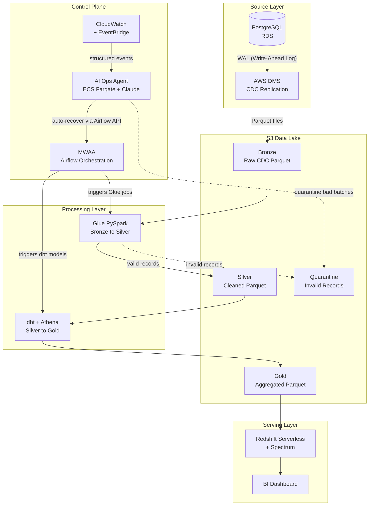

# Enterprise Data Platform (EDP)

I built this platform to demonstrate a full production-grade data engineering pipeline on AWS (Amazon Web Services). It takes raw data from a PostgreSQL database, captures every change in real time, moves it through three transformation layers, and delivers business-ready aggregations to analysts through a dashboard. The same way it works inside real companies.

This is not a simplified demo. Every decision here — encryption, IAM (Identity and Access Management) roles, VPC (Virtual Private Cloud) isolation, error handling, testing, CI/CD — mirrors what a real engineering team would build. Each repository has its own detailed README explaining what it does, how to run it, and the reasoning behind every key decision.

---

## Architecture



---

## How data moves through the system

```
Step 1:  A change happens in the PostgreSQL source database (insert, update, or delete).

Step 2:  AWS DMS (Database Migration Service) reads that change from PostgreSQL's
         WAL (Write-Ahead Log) and writes it as a Parquet file to the Bronze S3 bucket.
         Each file records the row data, the operation type (I/U/D), and a timestamp.

Step 3:  MWAA (Amazon Managed Workflows for Apache Airflow) triggers the Glue jobs
         on schedule.

Step 4:  Six AWS Glue PySpark jobs read Bronze. Each job reconciles all CDC
         (Change Data Capture) operations into current state (so a row that was
         updated five times appears exactly once with its latest values), validates
         every record, and writes the results to Silver as a star schema.
         Records that fail validation go to a Quarantine bucket, not the bin.

Step 5:  MWAA triggers dbt (data build tool) after all Glue jobs succeed.

Step 6:  dbt runs SQL models using Athena as the query engine. It reads the Silver
         fact and dimension tables and produces seven Gold aggregation tables that
         answer specific business questions.

Step 7:  Redshift Serverless uses Spectrum to query Gold directly from S3.
         No data loading required.

Step 8:  BI tools connect to Redshift and analysts build dashboards.

Step 9:  The AI Operations Agent watches every layer continuously. For any failure
         it diagnoses the root cause across all services, takes the right recovery
         action, and sends a plain-English incident report via SNS
         (Simple Notification Service).
```

---

## The source data model

The source is a simulated e-commerce PostgreSQL OLTP (Online Transaction Processing) database with six tables: `customers`, `products`, `orders`, `order_items`, `payments`, and `shipments`. Every table has an `updated_at` column so DMS can reliably track when each row last changed.

The Glue PySpark jobs reshape this normalized data into a star schema in Silver:

**Dimension tables** (one row per entity, current state): `dim_customer`, `dim_product`

**Fact tables** (one row per event): `fact_orders`, `fact_order_items`, `fact_payments`, `fact_shipments`

dbt then reads Silver and produces seven Gold aggregation tables answering specific business questions:

| Gold table | Business question |
|---|---|
| `monthly_revenue_trend` | How is revenue trending month by month? |
| `revenue_by_country` | Which countries drive the most revenue? |
| `payment_method_performance` | How are different payment methods performing? |
| `product_category_performance` | Which product categories drive the most sales? |
| `top_selling_products` | Which specific products are selling best? |
| `customer_segments` | How are customers segmented by value and behaviour? |
| `carrier_delivery_performance` | How is each carrier performing on delivery? |

---

## The AI Operations Agent

The platform adds an AI (Artificial Intelligence) Operations Agent that monitors every layer simultaneously. The problem it solves: when Glue fails because DMS paused 45 minutes earlier, AWS fires separate alerts for each service. Neither alert tells you the real cause. An engineer would start debugging Glue, which is the wrong place.

The agent watches all services at once, reasons across them using the Claude API, and acts on the root cause rather than the symptom. It can pause downstream jobs to prevent wasted runs, quarantine bad S3 batches, trigger Airflow retries, and post plain-English incident reports to SNS. It does not touch infrastructure or application code.

---

## Tools and technologies

| Tool | What it is | How I use it |
|---|---|---|
| Terraform | Infrastructure-as-Code tool | Creates all AWS resources from code |
| AWS S3 (Simple Storage Service) | Cloud file storage | Holds all data lake layers |
| PostgreSQL on RDS (Relational Database Service) | Managed relational database | The data source |
| AWS DMS | Managed database migration service | Captures CDC events and writes to Bronze |
| AWS Glue | Managed Spark service | Runs PySpark jobs for Bronze to Silver |
| Apache Spark / PySpark | Distributed data processing engine | The runtime inside Glue jobs |
| dbt | SQL transformation framework | Runs SQL models for Silver to Gold |
| Amazon Athena | Serverless SQL query engine | Executes dbt SQL against S3 data |
| Redshift Serverless | Serverless data warehouse | Serves analyst queries |
| Amazon MWAA | Managed Airflow service | Orchestrates and schedules the pipeline |
| AWS KMS (Key Management Service) | Encryption key management | Encrypts all data at rest |
| AWS IAM | Permission control | Least-privilege roles for every service |
| AWS Glue Catalog | Metadata catalog | Stores table schemas for Bronze, Silver, Gold |
| CloudWatch and EventBridge | Monitoring and event routing | Logs and structured events across all layers |
| ECS (Elastic Container Service) Fargate | Serverless container runtime | Runs the AI Operations Agent |
| Claude API (Anthropic) | Large language model | Powers the agent's cross-service reasoning |
| VPC | Private AWS network | Isolates all compute from the public internet |
| AWS SSM (Systems Manager) Session Manager | Secure remote access | Port-forwarding tunnel to private RDS |

---

## Repositories

### [terraform-bootstrap](https://github.com/enterprise-data-platform-emeka/terraform-bootstrap)

Before any AWS infrastructure can be created with Terraform, Terraform itself needs somewhere to store its state. This repository creates the S3 (Simple Storage Service) buckets and DynamoDB tables that hold Terraform remote state for all three environments (dev, staging, prod). It runs once per AWS account and never changes after that.

---

### [terraform-platform-infra-live](https://github.com/enterprise-data-platform-emeka/terraform-platform-infra-live)

All AWS infrastructure for the platform, organized as seven Terraform modules with a strict dependency order. Networking creates the VPC. Data-lake creates the S3 buckets. IAM-metadata creates the KMS key and IAM roles. Ingestion creates RDS and DMS. Processing creates Glue configuration and Athena. Serving creates Redshift Serverless. Orchestration creates the MWAA environment. Everything runs from a single `make apply dev` command.

---

### [platform-cdc-simulator](https://github.com/enterprise-data-platform-emeka/platform-cdc-simulator)

A Python simulator that generates realistic e-commerce OLTP traffic against the PostgreSQL database so DMS has something to capture during testing. It creates the schema, seeds reference data (customers and products), then simulates a continuous stream of orders, payments, and shipments. Runs locally against Docker or against AWS RDS via an SSM tunnel.

---

### [platform-glue-jobs](https://github.com/enterprise-data-platform-emeka/platform-glue-jobs)

Six AWS Glue PySpark jobs that transform Bronze CDC data into the Silver star schema. The core challenge here is CDC reconciliation: DMS writes every insert, update, and delete as a separate file, so a single order can appear dozens of times across Bronze. Each job resolves all operations into a single current-state row per entity, validates it, and routes it to Silver or Quarantine. Jobs run identically in local Docker and AWS.

---

### [platform-dbt-analytics](https://github.com/enterprise-data-platform-emeka/platform-dbt-analytics)

dbt models that transform Silver into the Gold analytics layer using Athena as the query engine. Fifteen models across three layers: staging views that clean and rename Silver columns, intermediate views that join related tables, and seven mart tables that answer specific business questions. All models are tested with dbt's built-in test framework. Runs locally against DuckDB for fast iteration and against AWS Athena for production.

---

### [platform-orchestration-mwaa-airflow](https://github.com/enterprise-data-platform-emeka/platform-orchestration-mwaa-airflow)

The Airflow DAG (Directed Acyclic Graph) that chains the full pipeline together on a daily schedule. Six Glue jobs run in parallel, then a Glue Crawler updates the catalog, then dbt runs and tests. Includes a local Docker runner using the aws-mwaa-local-runner image so the full DAG can be tested before deploying to MWAA.

---

### platform-ops-agent *(in development)*

The AI Operations Agent. An ECS Fargate task that subscribes to CloudWatch EventBridge events from every layer of the pipeline, uses the Claude API to reason about cross-service failures, takes recovery actions via the AWS SDK (Software Development Kit) and Airflow REST API, and reports incidents via SNS. Built last because it monitors everything else.

---

## Build order

Each step depends on the previous. Do not skip steps.

| Step | Repository | What it does |
|---|---|---|
| 1 | terraform-bootstrap | Create remote state infrastructure |
| 2–8 | terraform-platform-infra-live | Create all AWS platform infrastructure |
| 9 | platform-cdc-simulator | Simulate source data for testing |
| 10 | platform-glue-jobs | Build and deploy Bronze → Silver jobs |
| 11 | platform-dbt-analytics | Build and deploy Silver → Gold models |
| 12 | platform-orchestration-mwaa-airflow | Deploy the orchestration DAG |
| 13 | platform-ops-agent | Deploy the AI Operations Agent |

---

## Prerequisites

- AWS accounts for dev, staging, and prod with IAM Identity Center (SSO) configured
- AWS CLI with profiles `dev-admin`, `staging-admin`, `prod-admin`
- Terraform >= 1.6.0
- Python 3.11.8 (managed with pyenv)
- Docker Desktop
- GitHub CLI (`gh`)

---

## Security

All data at rest is encrypted with a customer-managed KMS key. All S3 buckets block public access. RDS runs in private subnets with no public endpoint. DMS communicates with RDS within the VPC, never over the internet. Every service role follows least-privilege IAM. No credentials are hardcoded anywhere: passwords are stored in SSM (Systems Manager) Parameter Store as SecureString values and fetched at runtime.

---

## Cost

This platform uses a test-and-destroy workflow. Infrastructure is created, tested, and destroyed within a single session. A typical 2-3 hour test session costs around $0.50 to $1.00. The main costs are DMS (~$0.10/hr) and RDS (~$0.02/hr). Redshift Serverless auto-pauses when idle. MWAA on mw1.small runs ~$0.07/hr. Nothing is left running overnight.
