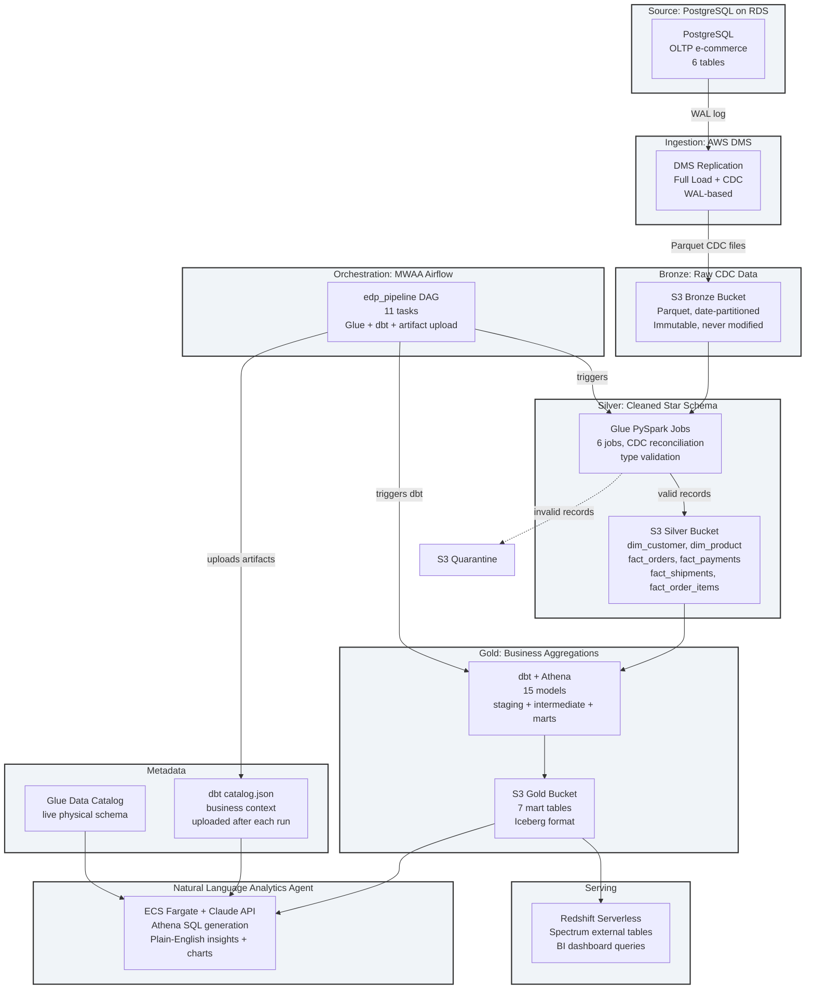
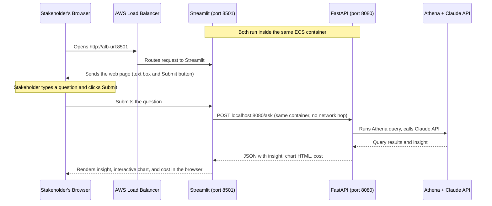

# Enterprise Data Platform: Complete Build Guide

This guide explains what I built, why I built it this way, and how to reproduce it from scratch. I wrote it for someone who is learning data engineering and wants to understand a real production-grade pipeline, not just a tutorial demo.

By the end, you'll understand how raw database changes flow through Bronze, Silver, and Gold layers and end up answering plain-English questions through an AI (Artificial Intelligence) analytics agent in a browser.

---

## Table of contents

1. [What this platform does](#what-this-platform-does)
2. [Architecture overview](#architecture-overview)
3. [Prerequisites: what you need before you start](#prerequisites-what-you-need-before-you-start)
4. [Repository structure](#repository-structure)
5. [Module 1: terraform-bootstrap](#module-1-terraform-bootstrap)
6. [Module 2: terraform-platform-infra-live](#module-2-terraform-platform-infra-live)
7. [Module 3: platform-cdc-simulator](#module-3-platform-cdc-simulator)
8. [Module 4: platform-glue-jobs](#module-4-platform-glue-jobs)
9. [Module 5: platform-dbt-analytics](#module-5-platform-dbt-analytics)
10. [Module 6: platform-orchestration-mwaa-airflow](#module-6-platform-orchestration-mwaa-airflow)
11. [Module 7: platform-analytics-agent](#module-7-platform-analytics-agent)
12. [Running a complete test session](#running-a-complete-test-session)
13. [Data flow](#data-flow)
14. [Key design decisions](#key-design-decisions)

---

## What this platform does

This is a production-grade AWS (Amazon Web Services) data engineering platform built around an e-commerce business. It takes raw database events (orders, payments, shipments) and transforms them into business insights that non-technical stakeholders can query in plain English.

The full journey:
1. A PostgreSQL database records every order, customer, payment, and shipment
2. AWS DMS (Database Migration Service) captures every INSERT, UPDATE, and DELETE in real time and lands them in S3 (Simple Storage Service) as Parquet files
3. AWS Glue PySpark jobs clean the raw data and produce a star schema
4. dbt SQL models aggregate the clean data into business-ready tables
5. A Natural Language analytics agent accepts plain-English questions, generates SQL, runs it against Athena, and returns a plain-English insight with a chart

Every component is production-grade: encrypted at rest and in transit, running inside a private VPC (Virtual Private Cloud), with IAM (Identity and Access Management) roles scoped to least privilege.

---

## Architecture overview



---

## Prerequisites: what you need before you start

### AWS account

You need an AWS account. This platform creates real resources and costs real money, but because everything is destroyed after each test session, a typical 2-3 hour session costs $1.50-$2.50 total.

Set up AWS SSO (Single Sign-On) with three permission sets: `dev-admin`, `staging-admin`, `prod-admin`. These are the profile names used throughout the project.

You also need to enable GitHub Actions OIDC (OpenID Connect) access to AWS. The `terraform-bootstrap` module creates the IAM roles for this automatically.

### Tools to install

```bash
# Terraform (infrastructure as code)
brew install tfenv
tfenv install 1.7.0
tfenv use 1.7.0

# AWS CLI
brew install awscli
aws configure sso   # follow prompts to set up dev-admin, staging-admin, prod-admin profiles

# Python (managed with pyenv so each repo can pin its own version)
brew install pyenv
pyenv install 3.11.8

# Docker Desktop (for local development)
# Download from https://www.docker.com/products/docker-desktop/

# dbt (data build tool) with Athena adapter
pip install dbt-athena-community

# Makefile support (already on macOS)
# git, GitHub CLI
brew install gh
```

### GitHub setup

Each module in this platform lives in a separate GitHub repository under the `enterprise-data-platform-emeka` organisation. Create the repositories before running any CI/CD:

| Repository | Purpose |
|---|---|
| `terraform-bootstrap` | Remote state infrastructure |
| `terraform-platform-infra-live` | All AWS infrastructure |
| `platform-cdc-simulator` | PostgreSQL OLTP traffic generator |
| `platform-glue-jobs` | PySpark Bronze-to-Silver jobs |
| `platform-dbt-analytics` | dbt Silver-to-Gold models |
| `platform-orchestration-mwaa-airflow` | Airflow DAG and MWAA deployment |
| `platform-analytics-agent` | FastAPI + Streamlit analytics agent |
| `platform-teardown` | GitHub Actions destroy workflow |

---

## Repository structure

```
enterprise-data-platform/           ← monorepo root (local only)
├── CLAUDE.md                       ← project rules, auto-loaded by Claude Code
├── README.md                       ← project overview
├── terraform-bootstrap/            ← Module 1: remote state
├── terraform-platform-infra-live/  ← Module 2: all AWS infrastructure
├── platform-cdc-simulator/         ← Module 3: PostgreSQL simulator
├── platform-glue-jobs/             ← Module 4: PySpark jobs
├── platform-dbt-analytics/         ← Module 5: dbt models
├── platform-orchestration-mwaa-airflow/ ← Module 6: Airflow DAG
├── platform-analytics-agent/       ← Module 7: analytics agent
└── platform-docs/                  ← this documentation
```

Each subdirectory is an independent git repository pushed to GitHub. The monorepo root is local only.

---

## Module 1: terraform-bootstrap

**What it does:** Creates the S3 bucket and DynamoDB table that Terraform uses to store its state remotely. This must exist before any other module can run.

**Why remote state?** Terraform keeps a record of every resource it manages in a "state file". By default this file is local, which means only one person can run Terraform and the file gets lost if the laptop dies. Remote state in S3 solves both problems: it's shared, it's versioned, and a DynamoDB lock table prevents two people running `terraform apply` at the same time.

**Structure:**
```
terraform-bootstrap/
├── main.tf          ← S3 bucket + DynamoDB table per AWS account
├── variables.tf
├── outputs.tf
└── .github/workflows/ci.yml   ← validates terraform fmt and syntax on every PR
```

**How to deploy:**
```bash
cd terraform-bootstrap
aws sso login --profile dev-admin
terraform init
terraform apply -var="profile=dev-admin"
```

Run this once per AWS account. You get one S3 bucket (e.g. `edp-dev-158311564771-tfstate`) and one DynamoDB table (`edp-dev-tfstate-lock`).

---

## Module 2: terraform-platform-infra-live

**What it does:** Creates every AWS resource the platform needs. Seven modules, applied in dependency order.

**Module dependency order:**
```
networking → data-lake → iam-metadata → ingestion / processing / serving / orchestration
```

**The seven modules:**

| Module | What it creates |
|---|---|
| networking | VPC with public and private subnets, Internet Gateway, route tables, S3 Gateway VPC Endpoint, SSM Interface Endpoints |
| data-lake | 5 S3 buckets: bronze, silver, gold, quarantine, athena-results |
| iam-metadata | KMS (Key Management Service) key, Glue Catalog databases, IAM roles for every service |
| ingestion | RDS (Relational Database Service) PostgreSQL, DMS replication instance, DMS task |
| processing | Glue security configuration, Glue VPC connection, Athena workgroup |
| serving | Redshift Serverless namespace and workgroup |
| orchestration | MWAA (Amazon Managed Workflows for Apache Airflow) environment, DAGs S3 bucket |

**Structure:**
```
terraform-platform-infra-live/
├── Makefile
├── modules/
│   ├── networking/
│   ├── data-lake/
│   ├── iam-metadata/
│   ├── ingestion/
│   ├── processing/
│   ├── serving/
│   ├── orchestration/
│   └── analytics-agent/
└── environments/
    ├── dev/
    │   ├── backend.tf      ← points to the bootstrap S3 bucket
    │   ├── main.tf         ← wires all 7 modules together
    │   ├── variables.tf
    │   └── providers.tf
    ├── staging/
    └── prod/
```

Each module has exactly three files: `main.tf`, `variables.tf`, `outputs.tf`. Outputs from one module become inputs to the next.

**How to deploy:**
```bash
cd terraform-platform-infra-live
aws sso login --profile dev-admin

export TF_VAR_db_password="choose-a-strong-password"
export TF_VAR_redshift_admin_password="choose-another-strong-password"

make init dev
make plan dev     # review before applying
make apply dev    # ~20-30 min because MWAA takes time
```

**After apply, two manual steps:**

RDS needs to be rebooted once to activate logical replication (needed by DMS for CDC):
```bash
aws rds reboot-db-instance \
  --db-instance-identifier edp-dev-postgres \
  --profile dev-admin \
  --region eu-central-1
```

Wait for it to return to "available", then start the DMS task:
```bash
aws dms start-replication-task \
  --replication-task-arn <arn-from-terraform-output> \
  --start-replication-task-type reload-target \
  --profile dev-admin \
  --region eu-central-1
```

**Naming conventions:**
- S3 buckets: `edp-{env}-{account_id}-{resource}` (account ID is part of the name because S3 bucket names are global)
- Everything else: `edp-{env}-{resource}`
- Glue Catalog databases: underscores, not hyphens: `edp_dev_bronze`, `edp_dev_silver`, `edp_dev_gold`

**Non-obvious things that will break apply if you get wrong:**
- AWS security group `description` fields only accept ASCII characters. Never use em dashes or any special Unicode. You get an `InvalidParameterValue` error.
- DMS uses two IAM roles with AWS-required fixed names: `dms-vpc-role` and `dms-cloudwatch-logs-role`. If these already exist in the account from a previous project, import them before applying: `terraform import module.iam_metadata.aws_iam_role.dms_vpc dms-vpc-role`
- MWAA: do not set `kms_key` on the environment resource. The SQS queue MWAA uses for its Celery workers uses an AWS-managed key, not the platform KMS key. Setting `kms_key` causes a permission error.
- MWAA: the DAGs bucket must use `AES256` encryption (SSE-S3), not a customer-managed KMS key.
- SSM endpoints are required in the private subnets. Without three Interface Endpoints (`ssm`, `ssmmessages`, `ec2messages`) with `private_dns_enabled = true`, the bastion EC2 instance will fail to register with SSM silently, even with correct IAM permissions and a public IP.

**Destroy:**
```bash
make destroy dev
```

This deletes everything except the S3 data lake buckets (bronze, silver, gold, quarantine, athena-results). The buckets stay so the next `make apply dev` picks them back up without re-importing.

---

## Module 3: platform-cdc-simulator

**What it does:** Generates realistic PostgreSQL OLTP (Online Transaction Processing) traffic to feed into DMS during testing. It simulates an e-commerce company with customers, products, orders, order items, payments, and shipments.

**Why a simulator?** DMS needs a running source database with real transactions to replicate. Rather than manually inserting rows during testing, the simulator generates thousands of realistic events in a loop, including updates and deletions, which exercises the full CDC (Change Data Capture) reconciliation logic in the Glue jobs.

**Structure:**
```
platform-cdc-simulator/
├── main.py                 ← CLI: validates all config upfront, clean error messages
├── simulator/
│   ├── exceptions.py       ← named exception hierarchy (never raise bare Exception)
│   ├── config.py           ← frozen dataclasses, ENVIRONMENT-driven record limits
│   ├── db.py               ← DatabaseManager: retry on connection errors
│   ├── schema.py           ← DDL: creates tables, sets REPLICA IDENTITY FULL
│   ├── models.py           ← dataclasses with generate() factory methods
│   ├── seed.py             ← Seeder: loads reference data (customers, products)
│   └── simulate.py         ← Simulator: generates orders and downstream events
└── tests/                  ← unit tests for every module
```

**REPLICA IDENTITY FULL** is set on every table. This tells PostgreSQL to include all column values (not just changed ones) in the WAL record for every UPDATE. DMS needs this to write complete Parquet rows to Bronze.

**Local dev:**
```bash
cd platform-cdc-simulator
make docker-up   # starts local Postgres in Docker
make schema      # creates tables and triggers
make seed        # loads customers and products
make simulate    # starts generating orders (Ctrl+C to stop)
make docker-down # stops Postgres
```

**Against AWS (requires SSM tunnel):**

Open the SSM tunnel in a separate terminal:
```bash
aws ssm start-session \
  --target <bastion-instance-id> \
  --document-name AWS-StartPortForwardingSession \
  --parameters 'host=<rds-endpoint>,portNumber=5432,localPortNumber=5433' \
  --profile dev-admin \
  --region eu-central-1
```

Leave that terminal running. In another terminal:
```bash
cd platform-cdc-simulator
make schema ENV=dev   # connects via localhost:5433 → RDS
make seed ENV=dev
make simulate ENV=dev
```

The Makefile fetches the RDS password from SSM Parameter Store automatically when `ENV=dev` is set. No `.env` file editing needed.

**Python patterns used throughout this project:**
- Named exception hierarchy: `SimulatorError > DatabaseConnectionError, SeedError, SimulationError`
- Frozen dataclasses for config: immutable after construction, all env vars validated at startup
- Never catch `Exception` broadly. Only catch what you expect, let everything else crash loudly
- `DatabaseConnectionError` is the only retried error. All others crash the process

---

## Module 4: platform-glue-jobs

**What it does:** Six PySpark jobs that read Bronze and produce Silver. Each job handles one source table.

**The core problem these jobs solve:** DMS writes one Parquet record per database operation. If a customer's address changes three times, Bronze has three records: one INSERT and two UPDATEs. Silver should have exactly one record: the current state of that customer. The jobs reconcile these CDC records into a single authoritative row per entity.

**Jobs:**
- `jobs/customers.py` → `dim_customer`
- `jobs/products.py` → `dim_product`
- `jobs/orders.py` → `fact_orders`
- `jobs/order_items.py` → `fact_order_items`
- `jobs/payments.py` → `fact_payments`
- `jobs/shipments.py` → `fact_shipments`

**Structure:**
```
platform-glue-jobs/
├── jobs/           ← one .py file per source table
├── lib/
│   ├── schemas.py  ← expected column definitions per table
│   ├── paths.py    ← S3 path builders for Bronze and Silver
│   └── logging.py  ← structured logging setup
└── tests/
```

**What each job does:**
1. Reads Bronze Parquet files using the Glue Catalog (the catalog was created by `iam-metadata` Terraform module)
2. Filters to the `op` (operation) column: `I` (insert), `U` (update), `D` (delete)
3. For each entity key, keeps only the latest non-deleted record
4. Validates types and required fields. Invalid records go to Quarantine with an error reason.
5. Writes Silver as Parquet, partitioned by date, Snappy compressed
6. Registers the output table in the Glue Catalog (`edp_dev_silver`)

**Running locally (unit tests only):**
```bash
cd platform-glue-jobs
make setup
make test
```

Glue jobs can't run locally because they depend on the Glue runtime. Integration testing happens in AWS.

---

## Module 5: platform-dbt-analytics

**What it does:** dbt (data build tool) SQL models that read Silver via Athena and write Gold. Fifteen models in three layers.

**Why three layers?**
- Staging models rename and cast columns. One staging model per Silver table, no business logic.
- Intermediate models join fact and dimension tables. No aggregations yet.
- Mart models aggregate into the seven Gold tables that answer specific business questions.

**Gold tables (7):**
- `monthly_revenue_trend` — total revenue by month
- `product_performance` — sales by product
- `customer_acquisition` — new customers by cohort
- `order_fulfilment_rate` — on-time delivery metrics
- `payment_method_breakdown` — revenue by payment method
- `geographic_revenue` — revenue by customer region
- `inventory_velocity` — product sell-through rate

**Structure:**
```
platform-dbt-analytics/
├── models/
│   ├── sources.yml         ← points at Silver Glue Catalog
│   ├── staging/            ← stg_* models, one per Silver table
│   ├── intermediate/       ← int_* models, joins only
│   └── marts/              ← 7 Gold mart tables
├── dbt_project.yml
└── profiles.yml            ← Athena connection config
```

**Local dev (DuckDB, no AWS needed):**
```bash
cd platform-dbt-analytics
dbt deps              # install dbt packages
dbt run --target local
dbt test --target local
```

**Against AWS Athena:**
```bash
dbt run --target dev
dbt test --target dev
```

After every successful `dbt test`, the MWAA DAG uploads `target/manifest.json` and `target/catalog.json` to S3. The Analytics Agent reads these at startup to understand the business meaning of every Gold column.

**Why Iceberg format for Gold tables?**

All mart models are materialized as Apache Iceberg tables in S3. Iceberg supports schema evolution (add a column without rewriting all existing files) and time travel (roll back to a previous version if a bad dbt run produces wrong results). Standard Parquet/Hive doesn't support either.

---

## Module 6: platform-orchestration-mwaa-airflow

**What it does:** Schedules the entire pipeline using an Airflow DAG (Directed Acyclic Graph) running on MWAA. The DAG runs the 6 Glue jobs in parallel, waits for all of them, runs the Glue Crawler, runs dbt, runs dbt tests, and uploads the dbt artifacts for the Analytics Agent.

**DAG task order:**
```
silver_dim_customer    |
silver_dim_product     |
silver_fact_orders     +---> silver_complete -> run_silver_crawler -> gold_dbt_run -> gold_dbt_test -> upload_dbt_artifacts -> pipeline_complete
silver_fact_payments   |
silver_fact_shipments  |
silver_fact_order_items|
```

**Why MWAA instead of running Airflow yourself?**

MWAA is more expensive than running Airflow on ECS Fargate, but it eliminates managing the Airflow web server, scheduler, workers, metadata database, and version upgrades. The platform already has enough infrastructure complexity. MWAA handles all of that for you.

**Artifact ownership — this is important to understand:**

Three types of artifacts feed MWAA, and each is owned by a different team/repo:

| Artifact | Owner | How updates work |
|---|---|---|
| Python packages (`requirements.txt`) | Terraform | Change the file in `modules/orchestration/requirements.txt` and run `terraform apply`. MWAA updates itself (~35 min). |
| DAG files | `platform-orchestration-mwaa-airflow` | CI uploads the DAG to S3. MWAA picks it up within seconds. No MWAA update triggered. |
| dbt project | `platform-dbt-analytics` | CI syncs the dbt project to S3. The DAG downloads it at task execution time. No MWAA update triggered. |

This separation means a dbt model change takes effect on the next DAG run with no MWAA environment updates. Python package changes go through Terraform because they're infrastructure.

**Structure:**
```
platform-orchestration-mwaa-airflow/
├── dags/
│   └── edp_pipeline.py     ← the DAG
├── docker-compose.yml      ← local Airflow for testing
├── requirements.txt        ← local dev only (mirrors Terraform requirements.txt)
└── Makefile
```

**Local testing:**
```bash
cd platform-orchestration-mwaa-airflow
make up    # starts local Airflow at http://localhost:8080
make down  # stops it
```

**Non-obvious things that cause DAG failures:**
- `GlueJobOperator`: always set `verbose=False`. The verbose mode reads CloudWatch logs which the MWAA IAM role can't access. The task dies with AccessDenied immediately.
- `GlueJobOperator`: do not set `num_of_dpus`. It conflicts with `WorkerType` and `NumberOfWorkers`.
- `BashOperator` (for dbt): always set `append_env=True`. Without it, your `env=` dictionary replaces the entire worker environment, and dbt can't find Python.
- dbt in MWAA: the plugins directory is read-only. Copy the dbt project to `/tmp/dbt_workspace` before running. Also run `dbt deps` before `dbt run` because `dbt_packages/` is not in the plugins zip.
- `import os` must be at the top of the DAG file (module level), not inside the `with DAG` block. MWAA validates imports differently than local Airflow.

---

## Module 7: platform-analytics-agent

**What it does:** Accepts plain-English questions about the Gold data and returns an insight, a chart, and the SQL it generated.

**Why this is harder than it looks:**

The Glue Data Catalog knows column names and types. It doesn't know that `gross_revenue` means "total order value before discounts, in EUR, excluding cancelled orders." That context lives in dbt's `schema.yml` column descriptions, compiled into `catalog.json`.

The agent merges both sources at startup: physical schema from Glue, business meaning from dbt artifacts. Without dbt context, the agent might query the right column but interpret it incorrectly. With it, the agent understands both the shape and the meaning of the data.

**How it works per question:**
1. Load all 7 Gold schemas (~2,500 tokens) into the system prompt at startup
2. Call 1: question + full schema → SQL + assumptions list
3. Validate SQL: SELECT only, Gold DB only, LIMIT always present, no DDL keywords
4. Execute via Athena. Record bytes scanned and USD cost.
5. Validate result: check for negative values where impossible, unexpected NULLs
6. Call 2: question + SQL + result → 2-3 sentence plain-English insight
7. Generate a Plotly chart appropriate to the data shape
8. Write a structured JSON audit record to S3

**Structure:**
```
platform-analytics-agent/
├── agent/
│   ├── main.py             ← FastAPI app with /ask and /health endpoints
│   ├── config.py           ← frozen dataclass config, fail fast on missing env vars
│   ├── exceptions.py       ← named exception hierarchy
│   ├── prompts.py          ← all Claude prompts
│   ├── claude_client.py    ← Claude API client with retry
│   ├── schema.py           ← load_all_schemas() merges Glue + dbt catalog
│   ├── validator.py        ← SQL guardrails
│   ├── generator.py        ← SQL generation with 3-attempt correction loop
│   ├── executor.py         ← Athena SDK: execute, poll, read results
│   ├── cost.py             ← bytes scanned → USD conversion
│   ├── result_validator.py ← numeric bounds, null checks
│   ├── insight.py          ← final Claude call for plain-English summary
│   ├── charts.py           ← matplotlib PNG and Plotly HTML
│   └── audit.py            ← structured JSON audit log to S3
├── ui/                     ← Phase 13: Streamlit browser UI
│   └── app.py
├── entrypoint.sh           ← starts FastAPI (port 8080) + Streamlit (port 8501)
├── Dockerfile
├── requirements.txt
└── Makefile
```

**Local dev:**
```bash
cd platform-analytics-agent
make setup    # creates venv, installs requirements
make test     # unit tests (mocked AWS and Claude)
make run      # starts FastAPI at http://localhost:8080
```

**Test the API:**
```bash
curl -X POST http://localhost:8080/ask \
  -H "Content-Type: application/json" \
  -d '{"question": "What were total sales last month?", "session_id": "test-001"}'
```

**Streamlit UI (Phase 13):**

The Streamlit UI is a browser interface for non-technical stakeholders. They open a URL, type a question, and see the insight and chart without any command-line access.

Both FastAPI and Streamlit run in the same ECS (Elastic Container Service) container. The `entrypoint.sh` script starts FastAPI in the background on port 8080, then starts Streamlit in the foreground on port 8501. When Streamlit needs to answer a question, it calls `localhost:8080/ask` — that's an internal call inside the container, not visible to the stakeholder. The stakeholder's browser only ever touches the ALB (Application Load Balancer) DNS address.



**ECS Fargate deployment:**

The agent runs as an ECS Fargate task behind an ALB. The ALB has two listener rules: port 80 routes to FastAPI, port 8501 routes to Streamlit. One Docker image, one ECS task definition, one ECS service.

**IAM role for the ECS task:**
- Athena: `StartQueryExecution`, `GetQueryExecution`, `GetQueryResults`
- S3: read on `{bronze_bucket}/metadata/dbt/*`, read on gold bucket, read/write on athena-results bucket, write on `{bronze_bucket}/metadata/agent-audit/*`
- Glue: `GetTable`, `GetDatabase`, `GetTables` on Gold catalog only (never Bronze or Silver)
- SSM: `GetParameter` on `/edp/{env}/anthropic_api_key`

---

## Running a complete test session

This is the sequence for a full end-to-end session in the dev environment.

**Terminal 1 — Terraform:**
```bash
cd terraform-platform-infra-live
export TF_VAR_db_password="your-db-password"
export TF_VAR_redshift_admin_password="your-redshift-password"
make init dev
make apply dev        # ~20-30 min (MWAA takes the longest)
```

After apply, note the outputs: bastion instance ID, RDS endpoint, DMS task ARN.

**Reboot RDS and start DMS:**
```bash
aws rds reboot-db-instance --db-instance-identifier edp-dev-postgres --profile dev-admin --region eu-central-1
# wait for "available" (2-3 min)
aws dms start-replication-task --replication-task-arn <arn> --start-replication-task-type reload-target --profile dev-admin --region eu-central-1
```

**Terminal 2 — SSM Tunnel (leave running):**
```bash
aws ssm start-session \
  --target <bastion-instance-id> \
  --document-name AWS-StartPortForwardingSession \
  --parameters 'host=<rds-endpoint>,portNumber=5432,localPortNumber=5433' \
  --profile dev-admin \
  --region eu-central-1
```

**Terminal 3 — Simulator:**
```bash
cd platform-cdc-simulator
make schema ENV=dev
make seed ENV=dev
make simulate ENV=dev    # generates OLTP traffic
```

**Deploy application artifacts:**
```bash
# In GitHub Actions: trigger Deploy in platform-dbt-analytics
# In GitHub Actions: trigger Deploy in platform-orchestration-mwaa-airflow
```

**Run the pipeline:**
1. Open the MWAA Airflow UI (URL is in the AWS Console under MWAA)
2. Find `edp_pipeline` and trigger it manually
3. Watch all 11 tasks go green (~6-8 minutes)

**Re-run dbt deploy** (now that Silver exists, `run-dbt` will pass):
```bash
# In GitHub Actions: trigger Deploy in platform-dbt-analytics again
```

**Test the Analytics Agent:**
```bash
curl -X POST http://<alb-dns>/ask \
  -H "Content-Type: application/json" \
  -d '{"question": "What were total sales last month?", "session_id": "test-001"}'
```

Or open `http://<alb-dns>:8501` in a browser to use the Streamlit UI.

**Destroy when done:**
```bash
cd terraform-platform-infra-live
make destroy dev
```

---

## Data flow

### Bronze: raw and immutable

DMS captures every INSERT, UPDATE, and DELETE from PostgreSQL's WAL (Write-Ahead Log) and writes it as a Parquet file to the Bronze S3 bucket. Bronze is append-only. Files are never modified or deleted. If a row is updated five times, Bronze contains five separate records with the operation type (`I`, `U`, `D`) and a timestamp on each.

This design makes Bronze a complete audit trail of every change that ever happened in the source database.

### Silver: reconciled star schema

Six Glue PySpark jobs read Bronze and produce a star schema in Silver. The core challenge is CDC reconciliation: because Bronze has multiple records per entity (one per operation), the jobs collapse them into a single current-state row per entity. An order that was inserted and then updated twice appears in Silver exactly once, with its latest values.

Each job also validates every record. Records that fail validation go to the Quarantine bucket with an error reason. They never reach Silver, but they're never discarded.

### Gold: business-ready aggregations

dbt reads Silver via Athena and produces seven mart tables that each answer a specific business question. All are materialized as Apache Iceberg tables in S3.

### Serving: Redshift Spectrum

Redshift Serverless queries Gold directly from S3 via Spectrum external tables. No data is copied into Redshift. Analysts write SQL against Redshift and get results from S3. This keeps storage costs low and means Redshift always queries the latest Gold data.

### Analytics Agent: natural language access

The NL Analytics Agent accepts plain-English questions, translates them to Athena SQL using Claude, executes the query, and returns a plain-English insight with a chart. It combines the physical schema from the Glue Catalog with business context from dbt artifacts to understand both what each column contains and what it means.

---

## Key design decisions

### Why Medallion Architecture

Medallion (Bronze/Silver/Gold) separates concerns clearly. Bronze preserves the raw source forever. Silver is the cleaned, queryable layer that everything downstream depends on. Gold is optimised for specific business questions. Each layer can fail independently: a bad Silver job doesn't corrupt Bronze, and a bad dbt run doesn't corrupt Silver. Recovery is simpler when layers are isolated.

### Why DMS for CDC instead of Debezium or Kafka

DMS is a managed AWS service. It handles replication slot management, WAL reading, and Parquet serialisation without any infrastructure to run. Debezium requires a Kafka cluster and a Kafka Connect worker: two more things to operate. For a platform where the goal is demonstrating data engineering capability, DMS is the right trade-off.

### Why Glue PySpark instead of Lambda or Fargate for transformation

Glue integrates directly with the Glue Catalog so tables are registered automatically. It handles large datasets with distributed Spark. And it runs serverlessly with no cluster to manage. Lambda has a 15-minute timeout and 10 GB memory limit, which is impractical for CDC reconciliation across large Bronze datasets.

### Why Athena for dbt instead of Redshift

dbt transformations run against Athena because the data lives in S3 and Athena queries it directly without any loading step. Redshift is reserved for the serving layer where analysts run complex analytical queries that benefit from its query planner.

### Why Iceberg for Gold tables

Iceberg gives Gold tables schema evolution without rewriting existing Parquet files. When a dbt model adds a column, Iceberg handles it. It also gives time travel: if a bad dbt run produces incorrect results, I can roll back to the previous snapshot. Standard Hive-format Parquet doesn't support either.

### Why MWAA instead of self-managed Airflow on ECS

MWAA is more expensive than running Airflow yourself on ECS Fargate, but it eliminates managing the Airflow web server, scheduler, workers, metadata database, and upgrades. The platform already has significant infrastructure complexity. The goal is demonstrating data engineering, not Airflow cluster management.

### Why an NL Analytics Agent instead of an Ops monitoring agent

The monitoring problem is already well-solved by native AWS services: CloudWatch Alarms, EventBridge rules, and SNS (Simple Notification Service) notifications cover failure detection and alerting. Building another alerting layer on top demonstrates AWS proficiency but not something genuinely novel.

The NL Analytics Agent solves a problem no AWS service natively addresses for Athena: translating plain-English questions into partition-aware SQL queries against a dbt-documented Gold layer. The combination of live Glue Catalog metadata, dbt business-context artifacts, Claude API reasoning, and Athena-specific cost guardrails is a design that doesn't exist off the shelf.

### Why the Analytics Agent reads dbt artifacts instead of just the Glue Catalog

The Glue Catalog knows column names and types. It doesn't know that `gross_revenue` means "total order value before discounts, in EUR, excluding cancelled orders." That context lives in dbt's `schema.yml` column descriptions, compiled into `catalog.json` after each run.

Without dbt artifacts, the agent sees: `gross_revenue DOUBLE`. With them, it sees: `gross_revenue: total order value in EUR before discounts and returns, excludes orders with status = cancelled`. That context is the difference between a plausible SQL query and a correct one.

### Why Streamlit for the UI instead of React

Streamlit turns Python code into a web page. No HTML, CSS, or JavaScript required. The entire UI is Python, which fits naturally into a Python project. For a browser interface that exists to let non-technical stakeholders submit questions and see results, Streamlit is faster to build and maintain than a React app talking to a separate API. Both FastAPI and Streamlit run in the same ECS container and are started together by `entrypoint.sh`.
