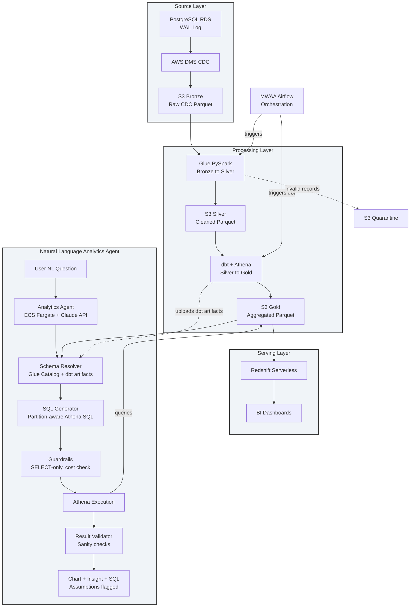
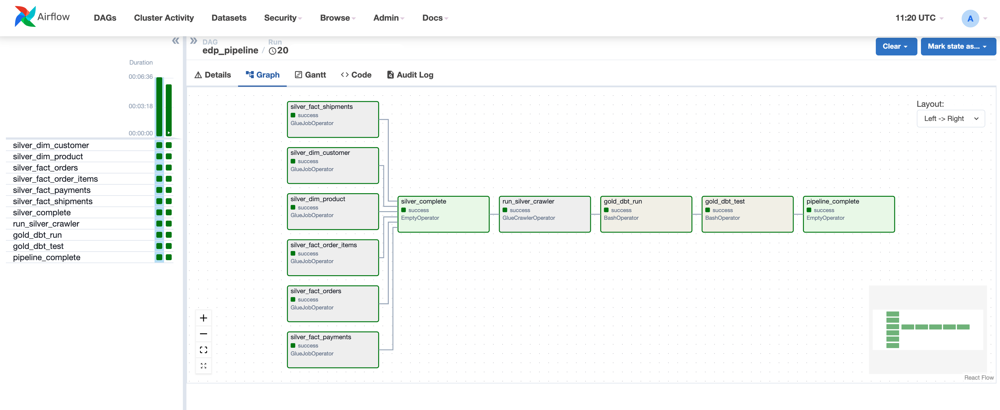

# Enterprise Data Platform (EDP)

I built this platform to demonstrate a full production-grade data engineering pipeline on AWS (Amazon Web Services). It takes raw data from a PostgreSQL database, captures every change in real time, moves it through three transformation layers, and delivers business-ready aggregations to analysts. The same way it works inside real companies.

This is not a simplified demo. Every decision here (encryption, IAM (Identity and Access Management) roles, VPC (Virtual Private Cloud) isolation, error handling, testing, CI/CD) mirrors what a real engineering team would build. Each repository has its own detailed README explaining what it does, how to run it, and the reasoning behind every key decision.

---

## Architecture



---

## How data moves through the system

```
Step 1:  A change happens in the PostgreSQL source database (insert, update, or delete).

Step 2:  AWS DMS (Database Migration Service) reads that change from PostgreSQL's
         WAL (Write-Ahead Log) and writes it as a Parquet file to the Bronze S3 bucket.
         Each file records the row data, the operation type (I/U/D), and a timestamp.

Step 3:  MWAA (Amazon Managed Workflows for Apache Airflow) triggers the Glue jobs
         on schedule.

Step 4:  Six AWS Glue PySpark jobs read Bronze. Each job reconciles all CDC
         (Change Data Capture) operations into current state (so a row that was
         updated five times appears exactly once with its latest values), validates
         every record, and writes the results to Silver as a star schema.
         Records that fail validation go to a Quarantine bucket, not the bin.

Step 5:  MWAA triggers dbt (data build tool) after all Glue jobs succeed.

Step 6:  dbt runs SQL models using Athena as the query engine. It reads the Silver
         fact and dimension tables and produces seven Gold aggregation tables that
         answer specific business questions.

Step 7:  After each successful dbt run, the pipeline uploads dbt schema artifacts
         (manifest.json and catalog.json) to S3. The Analytics Agent reads these
         artifacts to understand the business meaning behind every column, not just
         the column name.

Step 8:  Redshift Serverless uses Spectrum to query Gold directly from S3.
         No data loading required.

Step 9:  BI tools connect to Redshift and analysts build dashboards.

Step 10: The Natural Language Analytics Agent accepts plain-English questions from
         users, resolves the correct Gold table from the dbt-enriched schema catalog,
         generates partition-aware Athena SQL, checks the estimated scan cost before
         executing, validates the results, produces a chart, and returns a plain-English
         insight alongside the SQL it ran and every assumption it made.
```

---

## The source data model

The source is a simulated e-commerce PostgreSQL OLTP (Online Transaction Processing) database with six tables: `customers`, `products`, `orders`, `order_items`, `payments`, and `shipments`. Every table has an `updated_at` column so DMS can reliably track when each row last changed.

The Glue PySpark jobs reshape this normalized data into a star schema in Silver:

**Dimension tables** (one row per entity, current state): `dim_customer`, `dim_product`

**Fact tables** (one row per event): `fact_orders`, `fact_order_items`, `fact_payments`, `fact_shipments`

dbt then reads Silver and produces seven Gold aggregation tables answering specific business questions:

| Gold table | Business question |
|---|---|
| `monthly_revenue_trend` | How is revenue trending month by month? |
| `revenue_by_country` | Which countries drive the most revenue? |
| `payment_method_performance` | How are different payment methods performing? |
| `product_category_performance` | Which product categories drive the most sales? |
| `top_selling_products` | Which specific products are selling best? |
| `customer_segments` | How are customers segmented by value and behaviour? |
| `carrier_delivery_performance` | How is each carrier performing on delivery? |

---

## The Natural Language Analytics Agent

The platform's final layer is an AI (Artificial Intelligence) agent that lets users query the Gold data layer in plain English without writing SQL.

The problem it solves: the Gold layer holds carefully curated, business-ready data, but getting value from it still requires an analyst who can write Athena SQL, knows the table and column names, and understands the partition structure well enough not to run expensive full-table scans. The analytics agent removes that barrier entirely.

A user asks: "Show me monthly transaction volume for Berlin over the last 12 months." The agent resolves the correct Gold table from the dbt (data build tool) schema catalog, reads the partition structure from the Glue Catalog (Glue Data Catalog), generates an Athena SQL query with a partition filter to minimise scan cost, checks the estimated bytes scanned before executing, validates the result for obvious anomalies, produces a time-series chart, and returns a plain-English summary. It also flags every assumption it made (for example, "'transactions' interpreted as completed orders only") so the user can catch misinterpretations before acting on the insight.

What makes this genuinely different from commercial natural language (NL) query products: Athena is a serverless query engine over S3 (Simple Storage Service), not a managed warehouse. The cost model is pay-per-byte-scanned, not per compute hour. A missing partition filter on a large table doesn't just run slowly — it costs real money. The agent reasons about S3 partition structures when generating SQL, which no off-the-shelf NL product does for Athena. It also combines two sources of schema metadata: the physical schema from the Glue Catalog (column names, types, partition keys) and the business context from dbt artifacts (column descriptions, model documentation, accepted values). Most text-to-SQL systems only see column names. This agent sees the business meaning behind every column.

---

## Tools and technologies

| Tool | What it is | How I use it |
|---|---|---|
| Terraform | Infrastructure-as-Code tool | Creates all AWS resources from code |
| AWS S3 (Simple Storage Service) | Cloud file storage | Holds all data lake layers and dbt schema artifacts |
| PostgreSQL on RDS (Relational Database Service) | Managed relational database | The data source |
| AWS DMS | Managed database migration service | Captures CDC events and writes to Bronze |
| AWS Glue | Managed Spark service | Runs PySpark jobs for Bronze to Silver |
| Apache Spark / PySpark | Distributed data processing engine | The runtime inside Glue jobs |
| AWS Glue Data Catalog | Metadata catalog | Stores live table schemas for Bronze, Silver, Gold |
| dbt | SQL transformation framework | Runs SQL models for Silver to Gold; generates schema artifacts |
| Amazon Athena | Serverless SQL query engine | Executes dbt SQL against S3 and runs analytics agent queries |
| Redshift Serverless | Serverless data warehouse | Serves analyst queries via Spectrum over Gold |
| Amazon MWAA | Managed Airflow service | Orchestrates and schedules the pipeline |
| AWS KMS (Key Management Service) | Encryption key management | Encrypts all data at rest |
| AWS IAM | Permission control | Least-privilege roles for every service |
| CloudWatch and EventBridge | Monitoring and event routing | Logs and structured events across all layers |
| ECS (Elastic Container Service) Fargate | Serverless container runtime | Runs the Natural Language Analytics Agent |
| Claude API (Anthropic) | Large language model | Powers schema interpretation, SQL generation, and insight summarisation |
| FastAPI | Python web framework | HTTP endpoint for the analytics agent |
| matplotlib and Plotly | Charting libraries | Generates charts from query results |
| sqlparse | SQL parsing library | Validates generated SQL before execution |
| VPC | Private AWS network | Isolates all compute from the public internet |
| AWS SSM (Systems Manager) Session Manager | Secure remote access | Port-forwarding tunnel to private RDS |

---

## Repositories

### [terraform-bootstrap](https://github.com/enterprise-data-platform-emeka/terraform-bootstrap)

Before any AWS infrastructure can be created with Terraform, Terraform itself needs somewhere to store its state. This repository creates the S3 (Simple Storage Service) buckets and DynamoDB tables that hold Terraform remote state for all three environments (dev, staging, prod). It runs once per AWS account and never changes after that.


---

### [terraform-platform-infra-live](https://github.com/enterprise-data-platform-emeka/terraform-platform-infra-live)

All AWS infrastructure for the platform, organized as seven Terraform modules with a strict dependency order. Networking creates the VPC. Data-lake creates the S3 buckets. IAM-metadata creates the KMS key and IAM roles. Ingestion creates RDS and DMS. Processing creates Glue configuration and Athena. Serving creates Redshift Serverless. Orchestration creates the MWAA environment. Everything runs from a single `make apply dev` command.


---

### [platform-cdc-simulator](https://github.com/enterprise-data-platform-emeka/platform-cdc-simulator)

A Python simulator that generates realistic e-commerce OLTP traffic against the PostgreSQL database so DMS has something to capture during testing. It creates the schema, seeds reference data (customers and products), then simulates a continuous stream of orders, payments, and shipments. Runs locally against Docker or against AWS RDS via an SSM tunnel.

---

### [platform-glue-jobs](https://github.com/enterprise-data-platform-emeka/platform-glue-jobs)

Six AWS Glue PySpark jobs that transform Bronze CDC data into the Silver star schema. The core challenge here is CDC reconciliation: DMS writes every insert, update, and delete as a separate file, so a single order can appear dozens of times across Bronze. Each job resolves all operations into a single current-state row per entity, validates it, and routes it to Silver or Quarantine. Jobs run identically in local Docker and AWS.


---

### [platform-dbt-analytics](https://github.com/enterprise-data-platform-emeka/platform-dbt-analytics)

dbt models that transform Silver into the Gold analytics layer using Athena as the query engine. Fifteen models across three layers: staging views that clean and rename Silver columns, intermediate views that join related tables, and seven mart tables that answer specific business questions. All models are tested with dbt's built-in test framework. Runs locally against DuckDB for fast iteration and against AWS Athena for production. After each successful run, the pipeline uploads dbt schema artifacts to S3 so the Analytics Agent always has current business-context metadata.


---

### [platform-orchestration-mwaa-airflow](https://github.com/enterprise-data-platform-emeka/platform-orchestration-mwaa-airflow)

The Airflow DAG (Directed Acyclic Graph) that chains the full pipeline together on a daily schedule. Six Glue jobs run in parallel, then a Glue Crawler updates the catalog, then dbt runs and tests, then dbt artifacts are uploaded to S3 for the Analytics Agent. Includes a local Docker runner using the aws-mwaa-local-runner image so the full DAG can be tested before deploying to MWAA.




---

### platform-analytics-agent *(in development)*

The Natural Language Analytics Agent. An ECS Fargate task that accepts plain-English analytical questions, resolves the correct Gold table from the dbt-enriched Glue Catalog, generates partition-aware Athena SQL, validates and cost-checks the query before executing it, produces a chart, and returns a plain-English insight alongside every assumption it made. Built last because it consumes the Gold layer that everything else produces.

---

## Build order

Each step depends on the previous. Do not skip steps.

| Step | Repository | What it does |
|---|---|---|
| 1 | terraform-bootstrap | Create remote state infrastructure |
| 2-8 | terraform-platform-infra-live | Create all AWS platform infrastructure |
| 9 | platform-cdc-simulator | Simulate source data for testing |
| 10 | platform-glue-jobs | Build and deploy Bronze to Silver jobs |
| 11 | platform-dbt-analytics | Build and deploy Silver to Gold models |
| 12 | platform-orchestration-mwaa-airflow | Deploy the orchestration DAG |
| 13 | platform-analytics-agent | Deploy the Natural Language Analytics Agent |

---

## Running the pipeline end to end

There are two ways to run the full pipeline. Both assume the AWS infrastructure is already deployed (`make apply dev` in `terraform-platform-infra-live`).

---

### Path A: Manual run

This path runs each step from your terminal. Use it when you want full control over timing, want to inspect intermediate outputs, or are debugging a specific layer.

**Step 1: Start the DMS replication task**

The DMS (Database Migration Service) task does not start automatically after a Terraform apply. Start it manually once per session.

Run in `terraform-platform-infra-live`:
```bash
aws dms start-replication-task \
  --replication-task-arn $(aws dms describe-replication-tasks \
    --filters Name=replication-task-id,Values=edp-dev-dms-task \
    --query 'ReplicationTasks[0].ReplicationTaskArn' \
    --output text \
    --profile dev-admin) \
  --start-replication-task-type reload-target \
  --profile dev-admin
```

**Step 2: Open the SSM tunnel to RDS**

RDS lives in private subnets. The simulator connects to it via an SSM (Systems Manager) port-forwarding session through the bastion EC2 instance. Keep this terminal open for the duration of the session.

Run in `terraform-platform-infra-live`:
```bash
BASTION_ID=$(aws ec2 describe-instances \
  --filters "Name=tag:Name,Values=edp-dev-bastion" "Name=instance-state-name,Values=running" \
  --query "Reservations[0].Instances[0].InstanceId" \
  --output text \
  --profile dev-admin) && \
RDS_HOST=$(aws rds describe-db-instances \
  --db-instance-identifier edp-dev-postgres \
  --query "DBInstances[0].Endpoint.Address" \
  --output text \
  --profile dev-admin) && \
aws ssm start-session \
  --target "${BASTION_ID}" \
  --document-name AWS-StartPortForwardingSessionToRemoteHost \
  --parameters "{\"host\":[\"${RDS_HOST}\"],\"portNumber\":[\"5432\"],\"localPortNumber\":[\"5432\"]}" \
  --profile dev-admin
```

**Step 3: Fetch the database password from SSM Parameter Store**

Run in `platform-cdc-simulator`:
```bash
DB_PASSWORD=$(aws ssm get-parameter \
  --name /edp/dev/db_password \
  --with-decryption \
  --query Parameter.Value \
  --output text \
  --profile dev-admin)
```

**Step 4: Run the CDC simulator**

In a new terminal, run the simulator against RDS via the tunnel. It creates the schema, seeds reference data, then simulates continuous OLTP traffic that DMS captures to Bronze S3.

Run in `platform-cdc-simulator`:
```bash
ENVIRONMENT=dev \
DB_HOST=localhost \
DB_PORT=5432 \
DB_NAME=ecommerce \
DB_USER=postgres \
DB_PASSWORD="${DB_PASSWORD}" \
python main.py simulate
```

Let it run for a few minutes so DMS captures inserts to Bronze. Press Ctrl+C when enough data has landed.

**Step 5: Trigger the Airflow DAG in the MWAA UI**

Open the MWAA web UI (find the URL in the AWS Console under MWAA or in the Terraform output), navigate to DAGs, and trigger `edp_pipeline` manually. The pipeline runs in this order:

```
silver_dim_customer  |
silver_dim_product   |
silver_fact_orders   +---> silver_complete -> run_silver_crawler -> gold_dbt_run -> gold_dbt_test -> pipeline_complete
silver_fact_payments |
silver_fact_shipments|
silver_fact_order_items
```

All six Silver Glue jobs run in parallel. The rest runs sequentially. The full pipeline takes around 6-8 minutes.

**Step 6: Verify the pipeline output**

Query the Gold tables in the Athena console (workgroup: `edp-dev-workgroup`, database: `edp_dev_gold`). Or connect to Redshift Serverless and use Spectrum to query Gold directly from S3.

**Step 7: Run the Analytics Agent**

With Gold data in place and dbt artifacts uploaded, invoke the Analytics Agent with a plain-English question:

Run in `platform-analytics-agent`:
```bash
python -m agent.main "Show monthly transaction volume for Berlin over the last 12 months"
```

The agent returns the SQL it ran, a chart PNG, a plain-English insight, and every assumption it made.

---

### Path B: GitHub Actions run

This is the standard path for this project. Infrastructure is created, the pipeline runs, then infrastructure is destroyed — all within a single session. Everything runs from GitHub Actions with no local commands needed beyond the initial Terraform apply.

**Daily build-and-destroy sequence**

| Step | What to trigger | How | Wait |
|---|---|---|---|
| 1 | `terraform-platform-infra-live` apply | Push or run `make apply dev` | ~10 min |
| 2 | `platform-dbt-analytics` deploy | Triggers automatically after CI, or run manually | ~2 min (S3 sync only, no MWAA update) |
| 3 | `platform-orchestration-mwaa-airflow` deploy | Triggers automatically after CI, or run manually | ~30 sec if requirements unchanged, ~35 min if packages changed |
| 4 | Run `edp_pipeline` DAG | Trigger manually in the MWAA Airflow UI | ~6-8 min |
| 5 | `platform-dbt-analytics` deploy (re-trigger) | Run manually from GitHub Actions | ~5 min (run-dbt now passes) |
| 6 | Test | Query Gold in Athena, run the Analytics Agent | as needed |
| 7 | `terraform-platform-infra-live` destroy | Run `make destroy dev` | ~5 min |

**Why step 2 is fast:** The dbt project is not in plugins.zip. The `platform-dbt-analytics` deploy workflow syncs the project directly to S3 (`s3://{mwaa-bucket}/dbt/platform-dbt-analytics/`). MWAA workers download it at task runtime. Changing a dbt model and pushing takes effect on the next DAG run with no MWAA environment update.

**Why step 3 only waits on first session (usually):** The 35-minute MWAA update only triggers when `requirements.txt` changes. On a daily build-and-destroy cycle, Python packages rarely change, so step 3 completes in ~30 seconds on most days.

**Step 2 on first deploy (fresh environment):** The `run-dbt` job inside the `platform-dbt-analytics` deploy workflow will fail because Silver tables don't exist yet. That is expected. Run steps 3 and 4 first to populate Silver, then re-trigger step 2 (that is step 5 in the table above).

**Triggering the DAG (step 4)**

Go to the MWAA Airflow UI (URL in the AWS Console under MWAA), navigate to DAGs, find `edp_pipeline`, and click the play button. Monitor each task as it turns green. The full run takes 6-8 minutes.

---

## Prerequisites

- AWS accounts for dev, staging, and prod with IAM Identity Center (SSO (Single Sign-On)) configured
- AWS CLI with profiles `dev-admin`, `staging-admin`, `prod-admin`
- Terraform >= 1.6.0
- Python 3.11.8 (managed with pyenv)
- Docker Desktop
- GitHub CLI (`gh`)

---

## Security

All data at rest is encrypted with a customer-managed KMS key. All S3 buckets block public access. RDS runs in private subnets with no public endpoint. DMS communicates with RDS within the VPC, never over the internet. Every service role follows least-privilege IAM. No credentials are hardcoded anywhere: passwords are stored in SSM (Systems Manager) Parameter Store as SecureString values and fetched at runtime. The Analytics Agent's IAM role is scoped to read-only Athena and Glue Catalog access on the Gold layer only. It cannot read Bronze or Silver data.

---

## Cost

This platform uses a test-and-destroy workflow. Infrastructure is created, tested, and destroyed within a single session. A typical 2-3 hour test session costs around $1.50 to $2.50. The main pipeline costs are DMS (~$0.10/hr) and RDS (~$0.02/hr). MWAA on mw1.small runs ~$0.07/hr. Adding the Analytics Agent for a session of 50 queries adds approximately $1.35 (dominated by Claude API calls at ~$0.025 per query; Athena scan cost on Gold dev data is negligible). Nothing is left running overnight.
