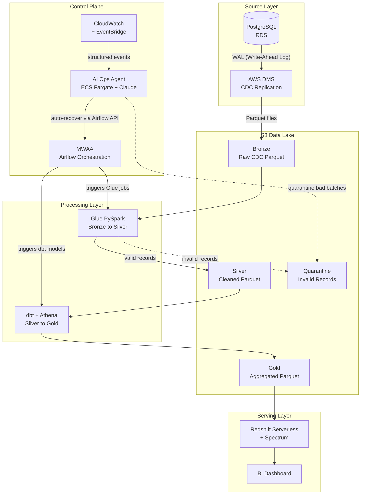

# Enterprise Data Platform (EDP)

I built this project to learn and demonstrate production-grade data engineering on AWS (Amazon Web Services). The idea is to take raw data from a database, move it through a series of cleaning and transformation steps, and make it available to business analysts through a dashboard — the same way it works inside real companies.

This is not a simplified demo. I wanted to build the actual thing that data engineers build at work, which means it uses Terraform (an infrastructure-as-code tool) for infrastructure, multiple AWS services, distributed data processing with Spark, SQL transformations with dbt (data build tool), orchestration with Airflow, and an AI agent to monitor and recover the pipeline when things go wrong.

This README covers everything: what the platform does, how each piece works, and the exact commands to deploy and run it in sequence from scratch.

---

## Contents

1. [What this platform does](#what-this-platform-does)
2. [Architecture diagram](#architecture-diagram)
3. [How data moves through the system](#how-data-moves-through-the-system)
4. [The source data model](#the-source-data-model)
5. [How data is stored in S3](#how-data-is-stored-in-s3)
6. [The data lake layers](#the-data-lake-layers-medallion-architecture)
7. [The AI Operations Agent](#the-ai-operations-agent)
8. [Tools and technologies](#tools-and-technologies)
9. [Repository layout](#repository-layout)
10. [AWS accounts](#aws-accounts)
11. [Network layout](#network-layout)
12. [Terraform module map](#terraform-module-map)
13. [Prerequisites](#prerequisites)
14. [Build phases overview](#build-phases-overview)
15. [Deploying and running the platform](#deploying-and-running-the-platform)
16. [Tearing down](#tearing-down)
17. [Runbook: regenerate Bronze data in AWS from scratch](#runbook-regenerate-bronze-data-in-aws-from-scratch)
18. [Concepts explained simply](#concepts-explained-simply)
19. [Security](#security)
20. [Costs](#costs)
21. [Naming convention](#naming-convention)
22. [Troubleshooting reference](#troubleshooting-reference)
23. [Build status](#build-status)
24. [Claude Code authentication reference](#claude-code-authentication-reference)

---

## What this platform does

My data source is a PostgreSQL database. Think of it like a live application database where records are being inserted, updated, and deleted constantly throughout the day.

The problem with using that database directly for analytics is that it was not designed for it. Running heavy queries against a production database slows the application down, and the raw data is messy and hard to work with.

This platform fixes that by doing the following:

1. **Capturing every database change** in real time using a technique called CDC (Change Data Capture), so inserts, updates, and deletes are all tracked
2. **Storing the raw captured data** into an immutable Bronze layer in S3 (Simple Storage Service, Amazon's cloud file storage), so the original data is never modified or lost
3. **Cleaning and validating** the raw data with Apache Spark, turning it into structured records in a Silver layer
4. **Sending any bad records** to a Quarantine area instead of silently dropping them, so data quality problems can be diagnosed
5. **Aggregating the clean data** into business-level summaries in a Gold layer using SQL models written in dbt (data build tool)
6. **Making the Gold data available** through Redshift Serverless so BI (Business Intelligence) tools like Tableau, Power BI, or QuickSight can connect and build dashboards
7. **Running the whole pipeline automatically** on a schedule using Apache Airflow
8. **Logging everything** to CloudWatch so I can see what is happening at any point
9. **Monitoring the pipeline with an AI agent** that watches every layer at once, figures out the real cause of failures, and automatically recovers the pipeline when common problems occur

---

## Architecture diagram



---

## How data moves through the system

```
Step 1:  A change happens in the PostgreSQL database (insert, update, or delete)

Step 2:  AWS DMS reads that change from PostgreSQL's internal WAL (Write-Ahead Log)
         and writes it as a Parquet file to the Bronze S3 bucket.
         Each file contains the row data, the operation type (I/U/D), and a timestamp.

Step 3:  Airflow detects it is time to run the pipeline and triggers the Glue job.

Step 4:  The Glue PySpark job reads Bronze.
         Each record is validated:
           - If valid, it is written to Silver.
           - If invalid, it is written to Quarantine.

Step 5:  Airflow detects the Glue job finished and triggers dbt.

Step 6:  dbt runs SQL models using Athena as the query engine.
         Silver data is aggregated into Gold summaries.

Step 7:  Redshift Serverless uses Spectrum to read Gold directly from S3.
         No data loading required — Spectrum queries S3 as if it were a Redshift table.

Step 8:  BI tools connect to Redshift and analysts build dashboards.

Step 9:  Every step above writes logs to CloudWatch.
         EventBridge converts log patterns into structured events.

Step 10: The AI Operations Agent receives all EventBridge events in real time.
         For any failure it diagnoses the root cause, takes the right action,
         and sends a plain-English incident report via SNS (Simple Notification Service).
         This runs continuously alongside all other steps.
```

---

## The source data model

This is an important distinction that is easy to get wrong.

The star schema (with a central fact table surrounded by dimension tables) is the **output** of the platform. It is what the Gold layer looks like after all the transformations are done. It is not what the source database looks like.

The source system is an OLTP (Online Transaction Processing) database. OLTP databases are designed for fast writes from a live application. They are normalized, which means data is split into small, focused tables to avoid duplication and make writes fast.

The job of this platform is to read that normalized OLTP data, clean it up, and reshape it into the star schema format that analysts and dashboards need.

### The OLTP source tables (what PostgreSQL contains)

```
customers
  customer_id    VARCHAR  PRIMARY KEY
  first_name     VARCHAR
  last_name      VARCHAR
  email          VARCHAR  UNIQUE
  country        VARCHAR
  phone          VARCHAR
  signup_date    DATE
  updated_at     TIMESTAMP

products
  product_id     VARCHAR  PRIMARY KEY
  name           VARCHAR
  category       VARCHAR
  brand          VARCHAR
  unit_price     DECIMAL(10,2)
  stock_qty      INTEGER
  updated_at     TIMESTAMP

orders
  order_id       VARCHAR  PRIMARY KEY
  customer_id    VARCHAR  REFERENCES customers
  order_date     DATE
  order_status   VARCHAR  -- pending, confirmed, shipped, delivered, cancelled
  updated_at     TIMESTAMP

order_items
  order_item_id  VARCHAR  PRIMARY KEY
  order_id       VARCHAR  REFERENCES orders
  product_id     VARCHAR  REFERENCES products
  quantity       INTEGER
  unit_price     DECIMAL(10,2)
  line_total     DECIMAL(10,2)
  updated_at     TIMESTAMP

payments
  payment_id     VARCHAR  PRIMARY KEY
  order_id       VARCHAR  REFERENCES orders
  method         VARCHAR  -- card, paypal, bank_transfer
  amount         DECIMAL(10,2)
  status         VARCHAR  -- pending, completed, failed, refunded
  payment_date   TIMESTAMP
  updated_at     TIMESTAMP

shipments
  shipment_id      VARCHAR  PRIMARY KEY
  order_id         VARCHAR  REFERENCES orders
  carrier          VARCHAR  -- DHL, FedEx, UPS
  delivery_status  VARCHAR  -- processing, shipped, in_transit, delivered
  shipped_date     TIMESTAMP
  delivered_date   TIMESTAMP
  updated_at       TIMESTAMP
```

Every table has an `updated_at` column. This is standard practice in production systems and makes CDC more reliable because DMS can always see exactly when each row last changed.

### What DMS captures from these tables

DMS reads every INSERT, UPDATE, and DELETE from PostgreSQL's WAL and writes one Bronze file per batch of operations. A single order going from `pending` to `confirmed` to `shipped` produces three separate Bronze records for that row.

### How dbt builds the star schema from Silver

The dbt Gold models JOIN the Silver tables together to produce the star schema. For example, the central fact table is built like this:

```sql
-- Gold: fact_order_items
SELECT
    oi.order_item_id,
    oi.order_id,
    o.customer_id,
    oi.product_id,
    p.payment_id,
    s.shipment_id,
    o.order_date,
    o.order_status,
    (oi.unit_price * oi.quantity) AS order_total,
    oi.quantity,
    oi.unit_price,
    oi.line_total
FROM silver.order_items oi
JOIN silver.orders    o  ON oi.order_id = o.order_id
JOIN silver.payments  p  ON o.order_id  = p.order_id
JOIN silver.shipments s  ON o.order_id  = s.order_id
```

---

## How data is stored in S3

### File format: Parquet everywhere

All data in this platform is stored as Parquet files. Parquet is a columnar file format, meaning data is organized by column rather than by row.

This matters because analytics queries typically read only a few columns from large tables. A query asking for `order_total` and `order_date` only needs those two columns. Parquet reads just those columns from disk and skips everything else. A CSV (Comma-Separated Values) file forces the query engine to read every column even if only two are needed.

Parquet also stores min and max statistics for each block of rows. Query engines use these to skip entire blocks that cannot possibly match the query's filters. This is called predicate pushdown.

**Compression by layer:**

- **Bronze:** Parquet with GZIP compression. Bronze is written once and rarely read directly. GZIP produces the smallest files, which minimizes S3 storage costs.
- **Silver and Gold:** Parquet with Snappy compression. Snappy is faster to decompress than GZIP, which matters here because Glue and Athena read these files frequently.

### Partitioning strategy

Partitioning means organizing files into subfolders so query engines can skip entire folders when they are not needed.

**Fact tables are partitioned by year and month:**

```
silver/
  order_items/
    year=2024/month=01/part-00000.parquet
    year=2024/month=02/part-00000.parquet
  payments/
    year=2024/month=01/part-00000.parquet
  shipments/
    year=2024/month=01/part-00000.parquet
```

**Dimension tables are not partitioned:**

Customers, products, and orders are reference data. Partitioning them by date would create hundreds of tiny files, which makes queries slower. The Glue job writes these as a single file per table representing the full current state.

```
silver/
  customers/part-00000.parquet
  products/part-00000.parquet
  orders/part-00000.parquet
```

In dev, I partition by `year/month` only. In prod with high data volumes, I partition by `year/month/day`.

---

## The data lake layers (Medallion Architecture)

### Bronze: raw and immutable

Everything that comes out of DMS lands here exactly as it arrived. I never modify Bronze data. If I find a bug in my Glue transformation code six months from now, I can re-process everything from Bronze without losing any original data. Bronze is the source of truth for the whole platform.

DMS writes two types of files to Bronze:
- `LOAD00000001.parquet` — the full snapshot of all existing rows at task start
- `YYYY/MM/DD/YYYYMMDD-*.parquet` — ongoing CDC change files, one batch per minute

### Silver: clean and structured

This is the output of the Glue PySpark job. It reads Bronze, validates each record, applies CDC operations correctly so the current state of each record is accurate, and writes the result here. Records that fail validation go to Quarantine instead. Silver represents the current real state of the source database.

### Gold: business-ready aggregations

This is what analysts actually query. dbt reads Silver through Athena and runs SQL models that produce things like daily revenue by product, monthly active users, and weekly order volumes. Gold is pre-aggregated so dashboards load fast.

### Quarantine: the bad records

Any record that fails Silver validation ends up here instead of being silently dropped. Silent data loss is much worse than visible data quality problems. With Quarantine I can go back, see exactly what failed, and fix the problem at the source.

### Athena results

Athena writes query result files here whenever it runs a SQL query. This is the designated output location for the Athena workgroup.

---

## The AI Operations Agent

When data moves through five separate services and something goes wrong, the failure often shows up in a different place than where it started. Here is a real example:

```
DMS replication lag spikes
  and Glue reads empty Bronze files
    and Silver never gets updated
      and dbt runs on stale Silver data
        and Gold aggregations are wrong
          and the dashboard shows incorrect numbers
```

CloudWatch fires an alarm in DMS. Airflow retries the Glue task. But neither of them knows the Glue failure and the DMS alarm are related. An engineer looking at these alerts in isolation would probably start debugging Glue first, which is the wrong place.

The AI Operations Agent solves this. It watches every layer at once and reasons across all of them before deciding what to do.

### How it works

The agent is a Python application running as an ECS (Elastic Container Service) Fargate container. It subscribes to EventBridge rules that fire whenever something notable happens in DMS, Glue, Athena, Airflow, or Redshift.

When an event fires, the agent calls the AWS SDK (Software Development Kit) across multiple services simultaneously to get the full picture before taking any action:

```
Event received: Glue job failed

Agent checks simultaneously:
  - DMS: what is the current replication lag?
  - S3: how many files actually landed in Bronze for this time window?
  - CloudWatch: has this happened before in the last 24 hours?
  - Glue: what did the last 5 job runs look like?

Conclusion: Bronze had zero files because DMS paused 47 minutes ago.
            The Glue job did not fail because of a code bug.
            Root cause is a DMS health issue.

Action: Pause downstream Glue jobs to stop them running pointlessly.
        Alert specifically on DMS, not Glue.
        Schedule a Glue retry for when DMS recovers.
```

### What the agent does in each scenario

| Situation | What the agent does |
|---|---|
| DMS lag is the root cause | Pauses downstream Glue jobs to prevent empty runs |
| A bad Bronze file caused Glue to fail | Moves the bad file to Quarantine, re-triggers Glue on the rest |
| dbt ran on incomplete Silver data | Delays dbt, schedules a backfill once Silver catches up |
| Transient network error in Glue | Triggers a single retry through the Airflow REST API |
| Unknown failure pattern | Escalates with full context, does not attempt auto-recovery |

Every incident produces a plain-English report sent via SNS:

```
INCIDENT REPORT - 2024-03-15 02:17 UTC
Root cause: DMS task edp-dev-replication paused (lag: 47 min)
Impact: Bronze partition 2024-03-15/orders has 0 files
Action taken: Glue job paused until DMS recovers
Action taken: Glue retry scheduled for 03:00 UTC
Manual action needed: Check DMS task — may need RDS WAL retention increase
Confidence: HIGH
```

### What the agent does not do

The agent is deliberately limited to operations and recovery. It does not modify Terraform infrastructure, change Glue code or dbt models, or attempt auto-recovery on anything it cannot explain with high confidence.

---

## Tools and technologies

| Tool | What it is | How I use it |
|---|---|---|
| Terraform | Infrastructure-as-Code tool | Creates all AWS resources from code |
| AWS S3 | Cloud file storage | Holds all data lake layers |
| PostgreSQL on RDS | Managed relational database | The data source |
| AWS DMS | Managed database migration service | Captures CDC events and writes to Bronze |
| AWS Glue | Managed Spark service | Runs PySpark jobs for Bronze to Silver |
| Apache Spark (PySpark) | Distributed data processing engine | The runtime inside Glue jobs |
| dbt | SQL transformation framework | Runs SQL models for Silver to Gold |
| Amazon Athena | Serverless SQL query engine | Executes dbt SQL against S3 data |
| Redshift Serverless | Serverless data warehouse | Serves analyst queries |
| Redshift Spectrum | Redshift feature | Queries Gold S3 data as external tables |
| Amazon MWAA | Managed Airflow service | Orchestrates and schedules the pipeline |
| Apache Airflow | Workflow orchestration engine | DAGs define task order |
| AWS KMS | Encryption key management | Encrypts all data at rest |
| AWS IAM | Permission control | Controls what each service is allowed to do |
| AWS Glue Catalog | Metadata catalog | Stores table schemas for Bronze, Silver, Gold |
| CloudWatch and EventBridge | Monitoring and event routing | Logs and structured events from every layer |
| ECS Fargate | Serverless container runtime | Runs the AI Operations Agent |
| Claude (Anthropic) | Large language model | Powers the agent's cross-service reasoning |
| VPC | Private AWS network | Isolates all compute from the public internet |
| AWS SSM Session Manager | Secure remote access | Port-forwarding tunnel to private RDS, no SSH keys |

---

## Repository layout

```
enterprise-data-platform/
│
├── README.md                              (this file)
│
├── terraform-bootstrap/                   BUILD STEP 1
│   Creates S3 buckets and DynamoDB tables for Terraform remote state.
│   Run this once per AWS account before anything else.
│
├── terraform-platform-infra-live/         BUILD STEPS 2 to 8
│   All AWS infrastructure, organized as Terraform modules.
│   VPC, S3 buckets, RDS, DMS, Glue, Redshift, MWAA, and ECS all live here.
│
├── platform-glue-jobs/                    BUILD STEP 9
│   PySpark code that runs inside AWS Glue.
│   Handles Bronze to Silver transformation and quarantine routing.
│
├── platform-dbt-analytics/                BUILD STEP 10
│   dbt SQL models that transform Silver to Gold.
│   Uses Athena as the query engine.
│
├── platform-orchestration-mwaa-airflow/   BUILD STEP 11
│   Airflow DAGs that orchestrate the full pipeline.
│   Controls when Glue runs, when dbt runs, and what happens on failure.
│
├── platform-cdc-simulator/                BUILD STEP 12
│   Python script that generates synthetic PostgreSQL changes for testing.
│   Connects to RDS via an SSM tunnel from your local machine.
│
├── platform-ops-agent/                    BUILD STEP 13
│   The AI Operations Agent.
│   Python app that monitors the pipeline and recovers from failures.
│
└── platform-docs/
    Additional diagrams and architecture notes.
```

---

## AWS accounts

I run this across three separate AWS accounts:

| Account | Purpose | CLI profile |
|---|---|---|
| dev | Where I build and test. Safe to break. | dev-admin |
| staging | Used only to confirm staging deploys correctly, then destroyed | staging-admin |
| prod | Used only to confirm prod deploys correctly, then destroyed | prod-admin |

Separate accounts are the strongest isolation AWS offers. A mistake in dev cannot touch prod.

My active development only happens in dev. I spin up staging and prod occasionally to confirm the Terraform modules deploy cleanly, then destroy them to keep costs near zero.

---

## Network layout

Each environment gets its own IP address range so they never overlap. CIDR (Classless Inter-Domain Routing) is the notation used to describe these ranges:

| Environment | VPC CIDR | Private Subnet A | Private Subnet B |
|---|---|---|---|
| dev | 10.10.0.0/16 | 10.10.16.0/20 | 10.10.32.0/20 |
| staging | 10.20.0.0/16 | 10.20.16.0/20 | 10.20.32.0/20 |
| prod | 10.30.0.0/16 | 10.30.16.0/20 | 10.30.32.0/20 |

All compute (RDS, DMS, Glue, Redshift, MWAA) runs in private subnets with no direct internet access. The only public-subnet resource is the bastion EC2 instance used as an SSM tunnel relay, and it has no open inbound ports.

---

## Terraform module map

Inside `terraform-platform-infra-live`, the infrastructure is split into modules. Each module has one responsibility.

```
modules/
├── networking/     VPC, subnets, route tables, S3 VPC endpoint, SSM VPC endpoints
├── data-lake/      All 5 S3 data lake buckets (bronze, silver, gold, quarantine, athena-results)
├── iam-metadata/   KMS key, IAM roles, Glue Catalog databases, DMS service roles
├── ingestion/      RDS PostgreSQL, DMS replication instance, endpoints, and task
├── processing/     Glue security config, Glue VPC connection, Athena workgroup
├── serving/        Redshift Serverless namespace and workgroup
└── orchestration/  MWAA environment, DAGs S3 bucket, CloudWatch log groups
```

The modules depend on each other in this order:

```
networking
  └── data-lake
        └── iam-metadata
              ├── ingestion
              ├── processing
              ├── serving
              └── orchestration
```

---

## Prerequisites

Install these tools before running anything:

```bash
# Terraform
brew install terraform

# AWS CLI (Command Line Interface)
brew install awscli

# AWS Session Manager plugin (required for SSM port-forwarding tunnels)
brew install --cask session-manager-plugin

# PostgreSQL client (for connecting to RDS via the SSM tunnel)
brew install libpq
echo 'export PATH="/opt/homebrew/opt/libpq/bin:$PATH"' >> ~/.zshrc
source ~/.zshrc

# Python 3.11 via pyenv (for the CDC simulator)
brew install pyenv
pyenv install 3.11.8
```

**AWS SSO (Single Sign-On) profile setup** in `~/.aws/config`:

```ini
[profile dev-admin]
sso_start_url  = https://your-org.awsapps.com/start
sso_region     = eu-central-1
sso_account_id = 158311564771
sso_role_name  = AdministratorAccess
region         = eu-central-1
```

Log in before running any AWS or Terraform commands:

```bash
aws sso login --profile dev-admin
```

---

## Build phases overview

When I first looked at everything this platform needs, it felt like too much to take on at once. The thing that made it manageable was realizing there is a strict logical order. You cannot fill a bucket that does not exist yet. You cannot run a Spark job against a database that has not been created. Every piece has a prerequisite.

### Phase 1: Infrastructure with Terraform (Steps 1 to 8)

**Step 1 — Remote state storage:** Before Terraform can work reliably, it needs a place to store `terraform.tfstate`. I store this in an S3 bucket with a DynamoDB (Amazon's NoSQL key-value database) table handling the locking. This runs once per AWS account before anything else, from `terraform-bootstrap`.

**Step 2 — Networking:** Creates the VPC (Virtual Private Cloud), subnets, route tables, and an S3 VPC Endpoint so services inside the VPC talk to S3 without touching the public internet. Also creates SSM (Systems Manager) Interface Endpoints so the bastion EC2 can register with SSM without internet access. Nothing else can exist without a network.

**Step 3 — Data lake storage:** Creates five S3 buckets: Bronze, Silver, Gold, Quarantine, and Athena results. Empty at this point, but they must exist before any service that writes to them can be configured.

**Step 4 — Permissions and metadata:** Creates the KMS (Key Management Service) encryption key that encrypts all data at rest across the platform. Creates IAM (Identity and Access Management) roles for every service: Glue, Airflow, Redshift, DMS, and ECS. Also creates three Glue Data Catalog databases (Bronze, Silver, Gold) as schema registries that Glue and Athena both use.

**Step 5 — Data source and CDC:** Creates the RDS (Relational Database Service) PostgreSQL database and the DMS replication instance and task. DMS connects to PostgreSQL, reads its WAL, and converts changes into Parquet files in the Bronze S3 bucket. Requires a manual RDS reboot after first apply to activate logical replication.

**Step 6 — Processing configuration:** Creates the Glue security configuration and the Athena workgroup. These are settings containers. The actual PySpark code and dbt SQL models come in Phase 2.

**Step 7 — Serving layer:** Creates the Redshift Serverless namespace and workgroup. Empty at this point but ready to query Gold S3 data via Spectrum once data flows.

**Step 8 — Orchestration:** Creates the MWAA environment and ECS cluster for the AI Operations Agent.

### Phase 2: Application code (Steps 9 to 13)

**Step 9 — PySpark transformation jobs** (`platform-glue-jobs`): Reads Bronze, validates records, applies CDC operations correctly, writes Silver or Quarantine.

**Step 10 — SQL transformation models** (`platform-dbt-analytics`): dbt models that read Silver through Athena and produce Gold business aggregations.

**Step 11 — Airflow DAGs** (`platform-orchestration-mwaa-airflow`): DAGs (Directed Acyclic Graphs) that orchestrate the full sequence: ingest check, Glue, dbt, Redshift load.

**Step 12 — CDC simulator** (`platform-cdc-simulator`): Python script that generates realistic PostgreSQL activity for testing the pipeline. Not a production component — a real application replaces it in production.

**Step 13 — AI Operations Agent** (`platform-ops-agent`): Python ECS application that monitors all pipeline services and handles cross-service incident recovery.

### Phase 3: End-to-end validation (Steps 14 to 15)

**Step 14:** Run the CDC simulator to generate data, trigger the Airflow DAG, and watch data move from PostgreSQL all the way to a queryable result in Redshift.

**Step 15:** Deploy to staging and prod to confirm the Terraform modules work correctly in those environments, then destroy both.

---

## Deploying and running the platform

This section has the exact commands in sequential order. Follow them in the order listed.

### Step 1: Set up remote state (run once per account)

```bash
cd terraform-bootstrap/environments/dev
terraform init
terraform apply
```

### Step 2: Initialise the main infrastructure

```bash
cd terraform-platform-infra-live
make init dev
```

This downloads all provider plugins and configures the S3 remote state backend. Remote state means Terraform stores what it created in S3 rather than locally, so state is shared and safe.

### Step 3: Plan

```bash
export TF_VAR_db_password="YourSecurePassword123!"
export TF_VAR_redshift_admin_password="AnotherSecurePassword456!"
make plan dev
```

Terraform shows you exactly what it will create before touching anything. You should see roughly 83 resources to add and 0 to destroy. Review the output before continuing.

### Step 4: Apply

```bash
make apply dev
```

Creates everything: VPC, S3 buckets, IAM roles, RDS, DMS, bastion EC2, Redshift, Glue catalog. Takes about 10 to 15 minutes. The DMS replication instance alone takes 5 to 7 minutes.

After apply completes, note the bastion instance ID and RDS endpoint from the Terraform output. You need both in the next steps.

### Step 5: Reboot RDS to activate logical replication

RDS needs a reboot after the first apply because the parameter group sets `rds.logical_replication = 1` with `apply_method = pending-reboot`. DMS cannot read the WAL until logical replication is active.

```bash
aws rds reboot-db-instance \
  --db-instance-identifier edp-dev-source-db \
  --profile dev-admin --region eu-central-1

# Wait for the reboot to complete (about 2 minutes)
aws rds wait db-instance-available \
  --db-instance-identifier edp-dev-source-db \
  --profile dev-admin --region eu-central-1
```

### Step 6: Open the SSM tunnel (keep this terminal open)

The SSM (Systems Manager) tunnel is how your Mac talks to RDS. RDS is in a private subnet with no internet access. The tunnel routes local port 5433 through SSM to the bastion EC2, and from there to RDS port 5432.

```bash
# Get outputs from Terraform
cd terraform-platform-infra-live/environments/dev
terraform output

# Open the tunnel (replace with your actual output values)
aws ssm start-session \
  --target <bastion_instance_id> \
  --document-name AWS-StartPortForwardingSessionToRemoteHost \
  --parameters 'host=<rds_endpoint>,portNumber=5432,localPortNumber=5433' \
  --profile dev-admin --region eu-central-1
```

You'll see `Port 5433 forwarded` when it's ready. Do not close this terminal — closing it drops the tunnel and the simulator will lose its database connection.

### Step 7: Set up the CDC simulator

In a new terminal:

```bash
cd platform-cdc-simulator

# Create .env file pointing at RDS via the tunnel
cat > .env << 'EOF'
DB_HOST=localhost
DB_PORT=5433
DB_NAME=ecommerce
DB_USER=postgres
DB_PASSWORD=YourSecurePassword123!
ENVIRONMENT=dev
EOF

make setup
```

### Step 8: Create schema and seed data

```bash
# Create all tables in RDS
make schema ENV=dev

# Seed historical data
# Note: each INSERT round-trips through SSM (~50ms per query)
# Use SEED_HISTORICAL_ORDERS=200 for dev to keep seeding under 2 minutes
SEED_HISTORICAL_ORDERS=200 make seed ENV=dev
```

### Step 9: Start the live simulator

```bash
# Generates new orders continuously in a loop — leave running
make simulate ENV=dev
```

The simulator generates new orders, updates statuses, creates payments and shipments. Each loop produces a small burst of activity then sleeps briefly. This feeds a live stream of changes to RDS for DMS to capture.

### Step 10: Verify data in RDS (optional)

In a separate terminal, connect directly to RDS via the tunnel to confirm the simulator is writing data:

```bash
psql -h localhost -p 5433 -U postgres -d ecommerce
```

Inside psql:

```sql
SELECT status, COUNT(*) FROM orders GROUP BY status ORDER BY COUNT(*) DESC;
SELECT COUNT(*) FROM customers;
SELECT COUNT(*) FROM order_items;
\q
```

### Step 11: Test DMS endpoint connections

Before starting the DMS task, verify DMS can reach both RDS (source) and S3 (target). Connection tests must pass before the task will start.

```bash
# Get endpoint and replication instance ARNs
aws dms describe-endpoints \
  --query 'Endpoints[*].{ID:EndpointIdentifier,ARN:EndpointArn,Status:Status}' \
  --output table --profile dev-admin --region eu-central-1

aws dms describe-replication-instances \
  --query 'ReplicationInstances[*].{ID:ReplicationInstanceIdentifier,ARN:ReplicationInstanceArn}' \
  --output table --profile dev-admin --region eu-central-1

# Test source (RDS) connection
aws dms test-connection \
  --replication-instance-arn <replication_instance_arn> \
  --endpoint-arn <source_endpoint_arn> \
  --profile dev-admin --region eu-central-1

# Test target (S3) connection
aws dms test-connection \
  --replication-instance-arn <replication_instance_arn> \
  --endpoint-arn <target_s3_endpoint_arn> \
  --profile dev-admin --region eu-central-1

# Wait for both to show "successful"
aws dms describe-connections \
  --query 'Connections[*].{Endpoint:EndpointIdentifier,Status:Status,Error:LastFailureMessage}' \
  --output table --profile dev-admin --region eu-central-1
```

### Step 12: Start the DMS replication task

```bash
# Get the task ARN
aws dms describe-replication-tasks \
  --filters Name=replication-task-id,Values=edp-dev-cdc-task \
  --query 'ReplicationTasks[0].ReplicationTaskArn' \
  --output text --profile dev-admin --region eu-central-1

# Start the task
aws dms start-replication-task \
  --replication-task-arn <task_arn> \
  --start-replication-task-type start-replication \
  --profile dev-admin --region eu-central-1
```

### Step 13: Monitor DMS and verify S3

```bash
# Check task status and full-load progress
aws dms describe-replication-tasks \
  --filters Name=replication-task-id,Values=edp-dev-cdc-task \
  --query 'ReplicationTasks[0].{Status:Status,PercentComplete:ReplicationTaskStats.FullLoadProgressPercent,TablesLoaded:ReplicationTaskStats.TablesLoaded}' \
  --output table --profile dev-admin --region eu-central-1
```

Status progression: `starting` → `full-load` → `running` (CDC mode). `PercentComplete = 100` and `TablesLoaded = 6` means full load is done and CDC is active.

```bash
# Verify Parquet files in Bronze S3
aws s3 ls s3://edp-dev-<account-id>-bronze/raw/ --recursive \
  --profile dev-admin --region eu-central-1
```

You'll see two types of files per table:
- `raw/public/<table>/LOAD00000001.parquet` — full-load snapshot of all rows
- `raw/public/<table>/YYYY/MM/DD/YYYYMMDD-*.parquet` — CDC change batches, one file per minute

Six tables will have files: customers, order_items, orders, payments, products, shipments.

Phase 1 complete. The Bronze S3 bucket has real CDC data and the pipeline source is confirmed working.

---

## Tearing down

Run this after Phase 1 testing. It destroys all billable resources (RDS, DMS, bastion EC2, Redshift, VPC, IAM roles) while preserving the Bronze S3 data for Phase 2.

```bash
make destroy dev
```

The Bronze S3 bucket has `force_destroy = false`, so Terraform's destroy will fail to delete it (the bucket is non-empty). Everything else is destroyed successfully. You'll see this error at the end — it is intentional and expected:

```
Error: deleting S3 Bucket (edp-dev-158311564771-bronze): BucketNotEmpty
```

The Bronze data stays in S3 untouched. The Glue jobs in Phase 2 read directly from it without needing to re-run the simulator.

The ingestion module (RDS + DMS) and the bastion EC2 are already commented out in `environments/dev/main.tf` after the Phase 1 run, so they won't be recreated on the next apply.

---

## Runbook: regenerate Bronze data in AWS from scratch

Use this chapter whenever the Bronze S3 bucket is empty and you need to refill it.
It is self-contained — all commands are here, in order, with no cross-references to other sections.

You'll need four terminals. Open them all before starting.

- **Terminal 1** — runs all setup commands and AWS CLI commands
- **Terminal 2** — holds the SSM tunnel open (must stay open the whole time)
- **Terminal 3** — runs the CDC simulator
- **Terminal 4** — optional psql session for checking RDS data

---

### Part 1: Uncomment the ingestion infrastructure

The ingestion module (RDS + DMS) and the bastion EC2 are commented out in the Terraform config after each run. Uncomment them before applying.

Open each file and uncomment the relevant blocks:

**`terraform-platform-infra-live/environments/dev/main.tf`**
- Uncomment the `module "ingestion"` block
- Uncomment everything from the bastion comment header down to and including `aws_security_group_rule.rds_ingress_bastion`

**`terraform-platform-infra-live/environments/dev/variables.tf`**
- Uncomment all five ingestion variables: `db_password`, `db_instance_class`, `dms_instance_class`, `multi_az`, `deletion_protection`

**`terraform-platform-infra-live/environments/dev/outputs.tf`**
- Uncomment all four outputs: `rds_endpoint`, `bastion_instance_id`, `ssm_tunnel_command`, `simulator_env_block`

---

### Part 2: Deploy the infrastructure

In Terminal 1:

```bash
cd terraform-platform-infra-live

# Set passwords — use the same values as before
export TF_VAR_db_password="YourSecurePassword123!"
export TF_VAR_redshift_admin_password="AnotherSecurePassword456!"

# Log in to AWS SSO first if your session has expired
aws sso login --profile dev-admin

make init dev
make plan dev
make apply dev
```

Apply takes about 10 to 15 minutes. When it finishes, note the outputs — you need the bastion instance ID and RDS endpoint for the tunnel command.

```bash
# Check the outputs
cd environments/dev
terraform output
```

---

### Part 3: Reboot RDS to activate logical replication

RDS must be rebooted once after every fresh apply. The parameter group sets
`rds.logical_replication = 1` with `apply_method = pending-reboot`, which means
the setting only takes effect after a reboot. DMS cannot capture CDC changes until
this is active.

In Terminal 1:

```bash
aws rds reboot-db-instance \
  --db-instance-identifier edp-dev-source-db \
  --profile dev-admin --region eu-central-1

# Wait until the instance is available again (~2 minutes)
aws rds wait db-instance-available \
  --db-instance-identifier edp-dev-source-db \
  --profile dev-admin --region eu-central-1

echo "RDS is ready"
```

---

### Part 4: Open the SSM tunnel

In Terminal 2 (keep this open for the entire session):

```bash
# Replace <bastion_instance_id> and <rds_endpoint> with your terraform output values
aws ssm start-session \
  --target <bastion_instance_id> \
  --document-name AWS-StartPortForwardingSessionToRemoteHost \
  --parameters 'host=<rds_endpoint>,portNumber=5432,localPortNumber=5433' \
  --profile dev-admin --region eu-central-1
```

Wait for `Port 5433 forwarded` to appear. Do not close Terminal 2 — closing it drops
the tunnel and the simulator loses its database connection.

If you see `TargetNotConnected`, the SSM agent on the bastion is still starting up.
Wait 2 to 3 minutes and retry. Check registration with:

```bash
aws ssm describe-instance-information \
  --query 'InstanceInformationList[*].{ID:InstanceId,Status:PingStatus}' \
  --output table --profile dev-admin --region eu-central-1
```

The instance must show `Online` before the tunnel will work.

---

### Part 5: Set up the CDC simulator

In Terminal 1:

```bash
cd platform-cdc-simulator

# Create the .env file pointing at RDS via the tunnel
cat > .env << 'EOF'
DB_HOST=localhost
DB_PORT=5433
DB_NAME=ecommerce
DB_USER=postgres
DB_PASSWORD=YourSecurePassword123!
ENVIRONMENT=dev
EOF

# Install Python dependencies
make setup
```

---

### Part 6: Create the schema and seed data

In Terminal 1:

```bash
# Create all tables in RDS
make schema ENV=dev

# Seed historical data
# SEED_HISTORICAL_ORDERS=200 keeps it fast over the SSM tunnel (~1-2 minutes)
# Each INSERT round-trips through SSM (~50ms), so large counts take a long time
SEED_HISTORICAL_ORDERS=200 make seed ENV=dev
```

You should see the seeder printing progress. When it finishes, move to the next step.

---

### Part 7: Start the live simulator

In Terminal 3:

```bash
cd platform-cdc-simulator
make simulate ENV=dev
```

The simulator runs in a loop, inserting new orders, updating order statuses, creating
payments and shipments. Leave it running — DMS will capture these changes as they happen.

To check what's in RDS from Terminal 4 (optional):

```bash
psql -h localhost -p 5433 -U postgres -d ecommerce
```

```sql
SELECT status, COUNT(*) FROM orders GROUP BY status ORDER BY COUNT(*) DESC;
SELECT COUNT(*) FROM customers;
SELECT COUNT(*) FROM order_items;
\q
```

---

### Part 8: Test DMS endpoint connections

Both DMS endpoint connections must pass before starting the replication task.

In Terminal 1:

```bash
# Get the replication instance ARN
aws dms describe-replication-instances \
  --query 'ReplicationInstances[0].ReplicationInstanceArn' \
  --output text --profile dev-admin --region eu-central-1

# Get both endpoint ARNs
aws dms describe-endpoints \
  --query 'Endpoints[*].{ID:EndpointIdentifier,ARN:EndpointArn}' \
  --output table --profile dev-admin --region eu-central-1

# Test the source endpoint (RDS)
aws dms test-connection \
  --replication-instance-arn <replication_instance_arn> \
  --endpoint-arn <source_endpoint_arn> \
  --profile dev-admin --region eu-central-1

# Test the target endpoint (S3)
aws dms test-connection \
  --replication-instance-arn <replication_instance_arn> \
  --endpoint-arn <target_s3_endpoint_arn> \
  --profile dev-admin --region eu-central-1

# Poll until both show "successful" (run this a few times, takes ~30 seconds each)
aws dms describe-connections \
  --query 'Connections[*].{Endpoint:EndpointIdentifier,Status:Status,Error:LastFailureMessage}' \
  --output table --profile dev-admin --region eu-central-1
```

Both must show `successful` before continuing. If the source fails with an SSL or
`pg_hba.conf` error, check that `ssl_mode = "require"` is set in
`modules/ingestion/main.tf` on the `aws_dms_endpoint` resource.

---

### Part 9: Start the DMS replication task

In Terminal 1:

```bash
# Get the task ARN
aws dms describe-replication-tasks \
  --filters Name=replication-task-id,Values=edp-dev-cdc-task \
  --query 'ReplicationTasks[0].ReplicationTaskArn' \
  --output text --profile dev-admin --region eu-central-1

# Start the task
aws dms start-replication-task \
  --replication-task-arn <task_arn> \
  --start-replication-task-type start-replication \
  --profile dev-admin --region eu-central-1
```

---

### Part 10: Monitor progress and verify S3

In Terminal 1:

```bash
# Check task status — wait for Status=running and PercentComplete=100
aws dms describe-replication-tasks \
  --filters Name=replication-task-id,Values=edp-dev-cdc-task \
  --query 'ReplicationTasks[0].{Status:Status,PercentComplete:ReplicationTaskStats.FullLoadProgressPercent,TablesLoaded:ReplicationTaskStats.TablesLoaded,TablesErrored:ReplicationTaskStats.TablesErrored}' \
  --output table --profile dev-admin --region eu-central-1
```

Status progression: `starting` → `full-load` → `running`. Once `PercentComplete = 100`
and `TablesLoaded = 6`, the full load is done and DMS is in live CDC mode.

```bash
# Verify Parquet files are in the Bronze bucket
aws s3 ls s3://edp-dev-<account-id>-bronze/raw/ --recursive \
  --profile dev-admin --region eu-central-1
```

You should see two types of files per table:

```
raw/public/orders/LOAD00000001.parquet          <- full load snapshot
raw/public/orders/2026/03/10/20260310-*.parquet <- live CDC batches (~1 per minute)
```

Six tables will have files: customers, order_items, orders, payments, products, shipments.
The Bronze bucket now has real data. The data lake is ready for Glue processing.

---

### Part 11: Tear down safely

This is the critical part. The S3 bucket protection only works if you run `terraform apply`
**before** `terraform destroy` to sync the `force_destroy = false` flag into the Terraform
state. Skipping the apply means state still has `force_destroy = true` and destroy will
wipe the bucket.

Stop the simulator in Terminal 3 first (`Ctrl+C`), then close the SSM tunnel in Terminal 2 (`Ctrl+C`).

In Terminal 1:

```bash
cd terraform-platform-infra-live

# Step 1: apply FIRST to sync force_destroy=false into state
# This does not recreate anything — it only updates the flag on the S3 buckets
make apply dev

# Step 2: now destroy safely
make destroy dev
```

Destroy will fail on the non-empty Bronze bucket with `BucketNotEmpty`. That is the
expected and correct behaviour — it means the data is protected. All other resources
(RDS, DMS, bastion EC2, Redshift, VPC, IAM roles) will be destroyed cleanly.

After destroy completes, comment the ingestion module and bastion back out in
`environments/dev/main.tf`, `variables.tf`, and `outputs.tf` so they are not
recreated on the next apply.

---

## Concepts explained simply

### What is CDC (Change Data Capture)?

CDC is a way of tracking every change that happens to a database without copying the whole thing each time.

PostgreSQL keeps an internal journal called the WAL (Write-Ahead Log) that records every insert, update, and delete before it is applied. AWS DMS reads this journal and converts those entries into Parquet files. This is much cheaper than dumping the whole database repeatedly and it captures changes in near real time.

### What is an SSM tunnel?

SSM (Systems Manager) Session Manager lets you connect to an EC2 instance and forward a local port to another host — all over HTTPS, with no SSH keys and no open firewall ports.

The bastion EC2 is the relay. When you run `aws ssm start-session` with the port-forwarding document, AWS creates an encrypted WebSocket connection from your machine to the bastion. The bastion then forwards that traffic to RDS on port 5432. From your Mac, it looks like RDS is sitting on `localhost:5433`. You connect with psql normally and the traffic travels: `Mac:5433 → SSM → bastion → RDS:5432`.

### What is a DAG (Directed Acyclic Graph)?

A DAG is how Airflow represents a pipeline. The name means a set of tasks where each depends on the ones before it, and there are no circular dependencies. My main pipeline DAG looks like this:

```
check_dms_health -> trigger_glue -> wait_for_glue -> trigger_dbt -> verify_gold -> notify_success
```

Airflow runs each task in order, handles retries on failure, and shows the status of every run in a web UI.

### What is Terraform state?

When Terraform creates an S3 bucket, it writes a record of that to a file called `terraform.tfstate`. This file is how Terraform knows what already exists so it does not try to create the same thing again. I store this file in S3 (remote state) so it is shared across sessions and protected. A DynamoDB table prevents two Terraform runs from happening at the same time and corrupting the file.

### What is a Terraform module?

A module is reusable Terraform code. Instead of writing the same S3 bucket configuration three times for dev, staging, and prod, I write it once in a module and call it three times with different inputs:

```hcl
module "data_lake" {
  source      = "../../modules/data-lake"
  environment = "dev"
}
```

### What is Parquet?

Parquet is a file format designed for analytics. Unlike a CSV file which stores data row by row, Parquet stores data column by column. A query asking for `revenue` and `order_date` only reads those two columns from disk and skips everything else. This makes queries much faster and much cheaper on Athena, which charges per byte scanned.

### What is an AI agent?

An AI agent is a program that uses a language model to make decisions, not just to generate text.

In a normal program, I would write explicit if/else logic for every possible failure scenario. But the number of ways a five-hop data pipeline can fail is too large to cover exhaustively. An agent lets me describe a situation in natural language, have the model reason about it, and then execute whatever action the model recommends. This is useful for cross-service diagnosis because the model can reason about the relationship between a DMS lag event and a Glue failure in the same way a senior engineer would.

---

## Security

Every service follows least privilege — each one can only access exactly what it needs.

| Control | Where it applies |
|---|---|
| KMS encryption at rest | All S3 buckets, RDS, DMS, SSM Parameter Store |
| Dedicated IAM roles | Glue, MWAA, Redshift, DMS, and ECS each have their own role |
| Private subnets only | All compute runs with no direct internet access |
| S3 public access blocked | All five data lake buckets |
| S3 versioning enabled | All buckets keep previous file versions for recovery |
| RDS deletion protection | Enabled in staging and prod |
| No static access keys | All authentication uses temporary SSO credentials |
| AI agent scope limited | Can only write to Quarantine S3 and call the Airflow API |
| SSM tunnel for RDS access | No port 5432 open anywhere — access via SSM port-forwarding only |

---

## Costs

I keep costs low by destroying dev at the end of each session. The two most expensive always-on services are MWAA at about $0.49 per hour and RDS. When not actively working, those are gone.

For local DAG development I run Airflow on my machine instead of in MWAA. I only spin MWAA up when I need to test it in the cloud or record a demo.

A typical 3 to 4 hour dev session without MWAA costs under $0.50. Staging and prod are spun up occasionally to confirm deployments, then destroyed. Each validation run costs under $5.

| Service | How it charges |
|---|---|
| Redshift Serverless | Per RPU (Redshift Processing Unit) hour, scales to zero when not in use |
| AWS Glue | Per DPU (Data Processing Unit) hour, only charged when jobs are running |
| Athena | Per TB (terabyte) of data scanned |
| MWAA | Per environment-hour while running |
| DMS | Per replication instance-hour |
| S3 | Per GB stored plus per request |
| ECS Fargate | Per vCPU and memory-hour while running |
| Claude API | Per token, only charged during incident analysis |

---

## Naming convention

S3 bucket names include the AWS account ID because S3 names are globally unique across all accounts. Including the account ID prevents name collisions:

```
edp-dev-123456789012-bronze
edp-dev-123456789012-silver
edp-dev-123456789012-gold
```

Everything else uses a shorter pattern:

```
edp-dev-glue-role
edp-dev-dms-replication-instance
```

The pattern is always: prefix, environment, then the resource name. EDP stands for Enterprise Data Platform.

---

## Troubleshooting reference

### SSM session fails with "TargetNotConnected"

The SSM agent on the bastion has not registered with AWS yet. Wait 2 to 3 minutes after apply. The `user_data` script installs and starts the SSM agent, but it takes time after first boot.

Check registration:

```bash
aws ssm describe-instance-information \
  --query 'InstanceInformationList[*].{ID:InstanceId,Status:PingStatus,IP:IPAddress}' \
  --output table --profile dev-admin --region eu-central-1
```

Status must be `Online`. If the instance doesn't appear at all, check that:
- The bastion IAM role has `AmazonSSMManagedInstanceCore` attached
- The VPC has SSM Interface Endpoints (ssm, ssmmessages, ec2messages) with `private_dns_enabled = true`
- The `AWSSystemsManagerDefaultEC2InstanceManagementRole` service role exists in IAM (created by the iam-metadata module)

### DMS connection test fails with "no encryption" or "no pg_hba.conf entry"

The DMS source endpoint must use `ssl_mode = "require"`. RDS PostgreSQL rejects unencrypted connections by default. Check `modules/ingestion/main.tf` for the `ssl_mode` field in the `aws_dms_endpoint` resource.

### DMS task fails to start with "InvalidResourceStateFault"

The endpoint connection tests must both show `successful` before the task can start. Run the connection tests and wait for both to pass. The task cannot start with a pending or failed connection test.

### RDS logical replication not working (DMS captures nothing after full load)

RDS needs a reboot after the first Terraform apply to activate `rds.logical_replication = 1`. Run Step 5 (the reboot command) and wait for the instance to become available before starting the DMS task.

### Seeding is very slow over the SSM tunnel

Each INSERT round-trips through SSM: `Mac → HTTPS → bastion → RDS → back`. That's about 50ms per query. For 2,000 historical orders that's over a minute just in network latency, plus actual query time. Always use a low count in dev:

```bash
SEED_HISTORICAL_ORDERS=200 make seed ENV=dev
```

### psql command not found

```bash
brew install libpq
export PATH="/opt/homebrew/opt/libpq/bin:$PATH"
```

### Terraform asks for db_password when running plan

The ingestion variables are commented out in `environments/dev/variables.tf`. If you're re-enabling ingestion, uncomment them. If you're not using ingestion, the module block and variables should both stay commented out.

### S3 Bronze bucket shows "BucketNotEmpty" error during destroy

This is intentional. `force_destroy = false` on the Bronze bucket protects the CDC data from being deleted when you run `make destroy dev`. The error at the end of destroy is expected — everything else is gone and the Bronze data is safe.

---

## Build status

| Component | Status |
|---|---|
| Terraform remote state (bootstrap) | Done |
| VPC and networking | Done |
| S3 data lake (all 5 buckets) | Done |
| KMS key, IAM roles, Glue Catalog | Done |
| RDS PostgreSQL and DMS CDC | Done |
| Glue config and Athena workgroup | Done |
| Redshift Serverless | Done |
| MWAA orchestration environment | Done |
| CDC simulator (Phase 1 complete, Bronze data in S3) | Done |
| Glue PySpark jobs (Bronze to Silver) | In progress |
| dbt models (Silver to Gold) | Planned |
| Airflow DAGs | Planned |
| AI Operations Agent | Planned |

---

## Claude Code authentication reference

I use Claude Code as my AI coding assistant throughout this project.

### The two modes

| Mode | How it works | Limits | Billing |
|---|---|---|---|
| Claude Pro | Logged in with Anthropic account | Yes, resets on a rolling window | Covered by subscription |
| API Key | Authenticated with an API key | None | Pay per token |

For intensive sessions with long Terraform plans and multi-file work, the Pro limit can be reached quickly. API key mode removes the cap entirely.

### How to tell which mode I am in

The banner at the top of the session shows it:

```
Sonnet 4.6 · Claude Pro · your-email@...     <- Pro mode
Sonnet 4.6 · API Usage Billing               <- API key mode
```

Or check from the terminal:

```bash
claude auth status
```

### Switching to API key mode

```bash
# Exit the current session (Ctrl+C or close terminal)
claude auth logout
export ANTHROPIC_API_KEY="sk-ant-..."
claude
# Inside the session:
/login
# Select API key when prompted
```

### Switching back to Pro mode

```bash
/logout                # inside the session
claude auth logout     # from the terminal
claude auth login
claude
```

### Making the API key permanent

```bash
echo 'export ANTHROPIC_API_KEY="sk-ant-..."' >> ~/.zshrc
source ~/.zshrc
```

Never paste an API key into a chat, commit it to Git, or include it in a screenshot. If one gets exposed, go to the Anthropic Console, revoke it immediately, and generate a new one.
